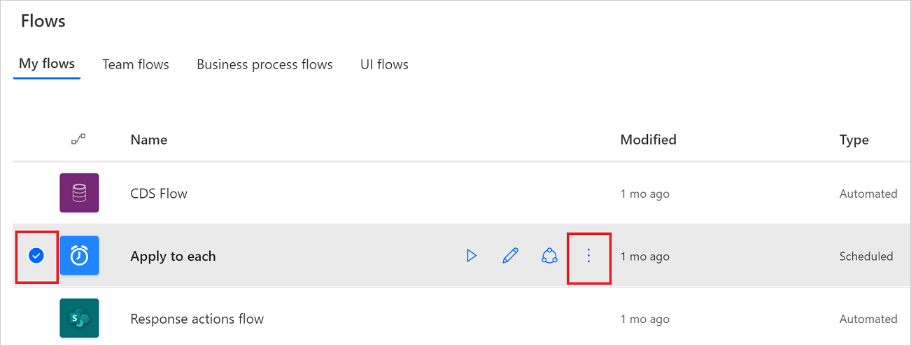
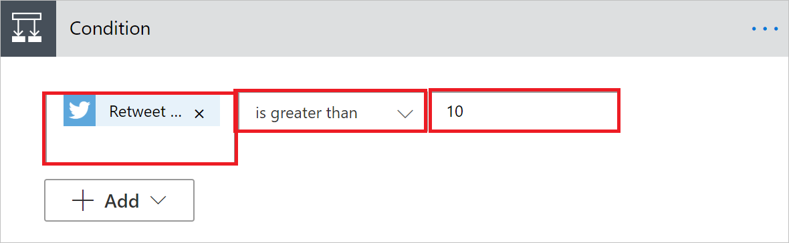
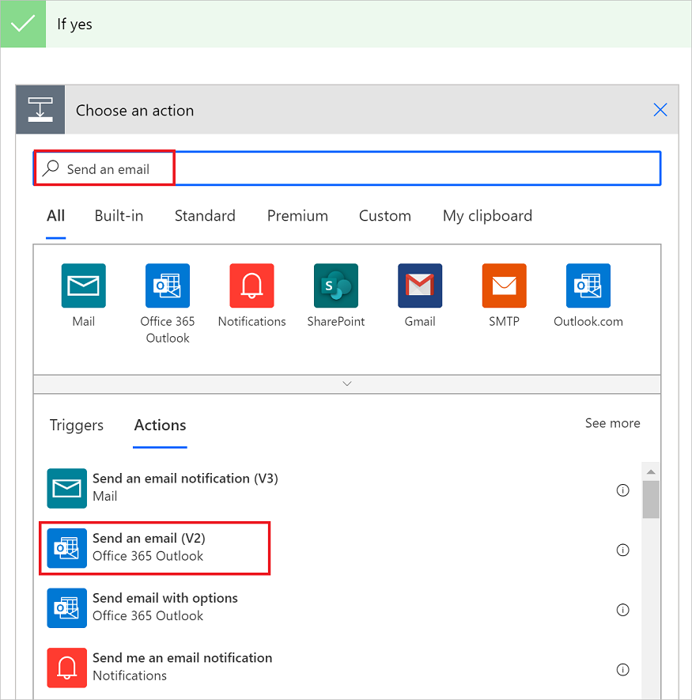
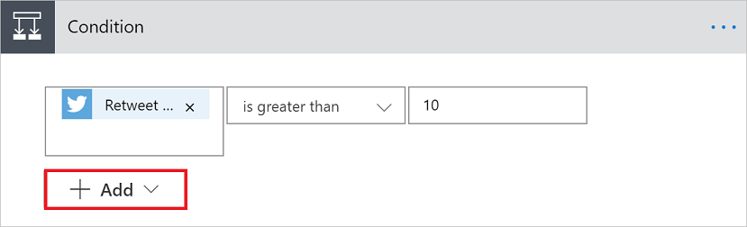

# Add a condition to a cloud flow

Use a *condition* to specify that a cloud flow performs one or more tasks only if a condition is true or false. For example, you can use a condition that indicates that you'll get an email only if a tweet that contains a keyword is retweeted at least 10 times.

Here's a video tutorial about conditions.

>[!VIDEO https://learn-video.azurefd.net/vod/player?id=88a0f2a6-9ce6-4c8a-85dd-f00318da92b5]
## Prerequisites

[Create a cloud flow](get-started-logic-template.md) from a template. This tutorial [uses this template](https://make.microsoft.com/galleries/public/templates/e78571e5c70e4806a18eeacba5a897c8/) as the example.

## Add a condition

This tutorial uses an example with a Twitter trigger and a SharePoint action.

1. Sign into [Power Automate](https://make.microsoft.com).

1. On the left pane, select **My flows**.

1. On the list of flows, select the flow you want to edit by placing a check mark in the circle and then selecting **More commands** (the three dots).

  >[!div class="mx-imgBorder"]
  >

4. Select **Edit**.

1. Under the last action, select **New step** > **Condition**.

1. On the **Condition** card, select an empty area in box on the left.

    The **Dynamic content** list opens.

1. Select the **Retweet count** parameter to add it to the box.

1. In the box in the middle of the **Condition** card, select **is greater than or equal to**.

1. In the box on the right, enter **10**.

    >[!div class="mx-imgBorder"]
    >

    Now that you've configured the condition, continue with the following steps to send an email if the **Retweet count** is more than 10.

1. Select **Add an action** on the **If yes** send of the condition. 
1. Enter **Send an email** into the search box, and then select **Send an email (V2)**.

   >[!div class="mx-imgBorder"]
   >

1. Configure the **Send an email (V2)** card to your liking, indicating the contents of the email that the flow sends if the **Retweet count** is greater than 10.

   You can also configure the **If no** side of the condition if you'd like to take an when the **Retweet count** is less than 10.

1. Save the flow.

>[!TIP]
>You can create complex conditions by using the **Add** button on the condition card.

   >[!div class="mx-imgBorder"]
   >

Learn about all the available [expressions](/azure/logic-apps/logic-apps-workflow-definition-language).

## Next step

Learn how to [use expressions](use-expressions-in-conditions.md) in conditions in advanced mode.

[!INCLUDE[footer-include](includes/footer-banner.md)]
