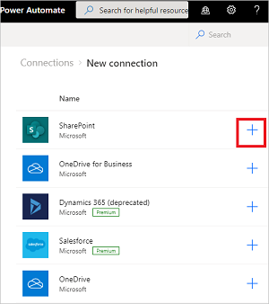
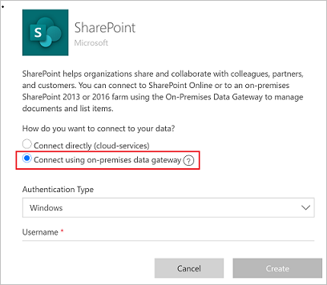
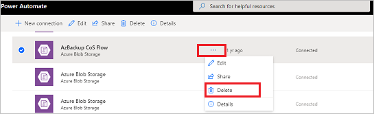
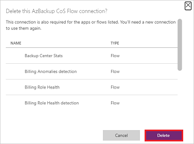

# Manage connections in Power Automate

Power Automate uses *connections* to make it easy for you to access your data while building flows. Power Automate includes commonly used connections, including SharePoint, SQL Server, Microsoft 365, OneDrive for Business, Salesforce, Excel, Dropbox, Twitter, and more. Connections are shared with Power Apps, so when you create a connection in one service, the connection shows up in the other service.

You can use connections to perform these tasks:

- Update a SharePoint list.
- Get data from an Excel workbook in your OneDrive for Business or Dropbox account.
- Send email in Microsoft 365.
- Send a tweet.

You can create a connection in multiple scenarios, including:

- Creating a [flow from a template](./get-started-logic-template.md).

- Creating a [flow from a blank](./get-started-logic-flow.md), or updating an existing flow.

- Creating a connection in [Power Automate](https://flow.microsoft.com/).

>[!TIP]
> For detailed information about using SharePoint with Power Automate, see the [SharePoint documentation](https://docs.microsoft.com/sharepoint/dev/business-apps/power-automate/sharepoint-connector-actions-triggers).

## Add a connection

1. In [Power Automate](https://flow.microsoft.com/), sign in with your work or organization account.

1. On the left pane, select **Data** > **Connections**.

   

1. At the top of the page, select **New connection**.

1. In the list of available connections, choose the connection that you want to
    set up (such as SharePoint) by selecting the plus sign (**+**).

   

1. Follow the steps to enter your credentials to configure the connection.

   > [!TIP]
   > You can find all the connections that you've created under **Data** > **Connections**.

## Connect to your data through an on-premises data gateway

Some connectors, such as the SharePoint connector, support the on-premises data gateway. To create a connection that uses a gateway:

1. Follow the steps earlier in this topic to [add a connection](#add-a-connection).

1. In the list of available connections, select **SharePoint**.

1. Select the **Connect using on-premises data gateway** option.

   

1. Provide the connection's credentials, and then select the gateway that you want to use. More information: [Manage gateways](./gateway-manage.md) and [Understand gateways](./gateway-reference.md)

> [!NOTE]
> After the connection is configured, it's listed in **Connections**.

## Delete a connection

1. Go to **Data** > **Connections**, and select the connection that you want to delete.

1. Select **…** to view more commands, and then select **Delete**.

   

1. Select **Delete** to confirm that you would like to delete the connection.

   

When you delete a connection, it's removed from both Power Apps and Power Automate.

## Update a connection

You can update a connection that isn't working because your account details or your password changed.

1. Go to **Data** > **Connections**, and then select the **Fix connection** link for the connection that you want to update.

   

1. When prompted, update your connection with new credentials.

When you update a connection, it's updated for both Power Apps and Power Automate.

## Troubleshoot a connection

Depending on your organization's policies, you might need to use the same account for signing in to Power Automate and creating a connection to SharePoint, Microsoft 365, or OneDrive for Business.

For example, you might sign in to Power Automate with *yourname@outlook.com* but be blocked when you try to connect to SharePoint with *yourname@contoso.com*. You can instead sign in to Power Automate with *yourname@contoso.com* and you'll be able to connect to SharePoint.

[!INCLUDE[footer-include](includes/footer-banner.md)]