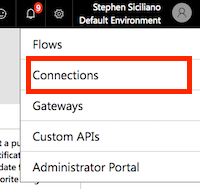
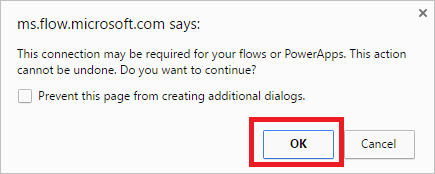
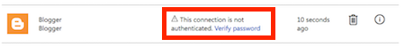

<properties
    pageTitle="Learn to connect to your data using connections and on-premises data gateways| Microsoft Flow"
    description="Add or manage connections to SharePoint, SQL Server, OneDrive for Business, Salesforce, Office 365, OneDrive, Dropbox, Twitter, Google Drive, and more"
    services=""
    suite="flow"
    documentationCenter="na"
    authors="stepsic-microsoft-com"
    manager="erikre"
    editor=""
    tags=""/>

<tags
   ms.service="flow"
   ms.devlang="na"
   ms.topic="article"
   ms.tgt_pltfrm="na"
   ms.workload="na"
   ms.date="02/15/2017"
   ms.author="stepsic"/>

# Manage connections in Microsoft Flow

Connections in Microsoft Flow allow you to easily access your data while building flows. Flow includes commonly used connections, including SharePoint, SQL, Office 365, OneDrive for Business, Salesforce, Excel, Dropbox, Twitter, and more. Connections are shared with Microsoft PowerApps, so when you create a connection in PowerApps, it shows up in Microsoft Flow, and vice versa.

For example, you can use connections to:

- Update a list on a SharePoint site.
- Get Excel data from your OneDrive for Business or Dropbox account.
- Connect to Office 365 and send email.
- Create a Twitter connection to send a tweet.

You can create connections in Microsoft Flow in multiple scenarios, such as:

- Creating a [flow from a template](get-started-logic-template.md)
- Creating a [flow from blank](get-started-logic-flow.md) or updating an existing flow
- Creating a connection in the [Microsoft Flow portal][1] directly

This topic shows you how to manage connections in the [Microsoft Flow portal][1].

### What you need to get started

- Sign in to the [Microsoft Flow portal][1].

## Add a connection to Microsoft Flow
1. In the [Microsoft Flow portal][1], sign in with your work or organization account.

1. Select the **Settings** menu at the top-right of the screen.

1. Select **Connections**.

	

1. Select **Create connection**.

1. In the list of **Available connections**, select the connection that you want to set up, such as SharePoint.
2. Select the **Create connection** button and then enter your credentials to set up the connection.

When the connection is set up, it's listed in **My connections**.

## Connect to your data through an on-premises data gateway

As of this writing, SQL Server and SharePoint Server support the on-premises data gateway. To create a connection that uses a gateway:

1. Follow the steps earlier in this topic to add a connection.

1. In the list of **Available connections**, select **SQL Server**, and then select the **Connect via on-premise data gateway** checkbox as shown here.

    

>[AZURE.IMPORTANT] Data gateways only support HTTP traffic; they do not support HTTPS traffic.

1. Provide the connection's credentials, and then select the gateway that you want to use. For more information, see [Manage gateways](gateway-manage.md) and [Understand gateways](gateway-reference.md).

	When the connection is set up, it's listed in **My connections**.

## Delete a connection
1. Go to the **My connections** page, and select the trash can icon for the connection you wish to delete.

	

1. Select the **OK** button to confirm you would like to delete the connection.

	

When you delete a connection, it's removed from both Microsoft PowerApps and Microsoft Flow.

## Update a connection

If a connection is not working because your account details or password have changed, you can update it.

1. Go to the **My connections** page, and then select the **Verify password** link for the connection that you want to update.

	

1. When prompted, update your connection with new credentials.

When you update a connection, it's updated for both Microsoft PowerApps and Microsoft Flow.

## Troubleshooting connections

If, while logged in as one account, you are unable to create a new connection to a service that is owned by your organization, such as SharePoint, Office 365 or OneDrive for Business with a different set of credentials, your organization may have configured a policy that requires you to sign in to Microsoft Flow with the same account as connecting to services. 

For example, if you log in to Microsoft Flow with *yourname@outlook.com*, but you try to connect to SharePoint with *yourname@contoso.com*, and you are blocked, you can instead log in to Microsoft Flow with *yourname@contoso.com* and you will be able to connect to SharePoint.

<!--Reference links in article-->
[1]: https://flow.microsoft.com
