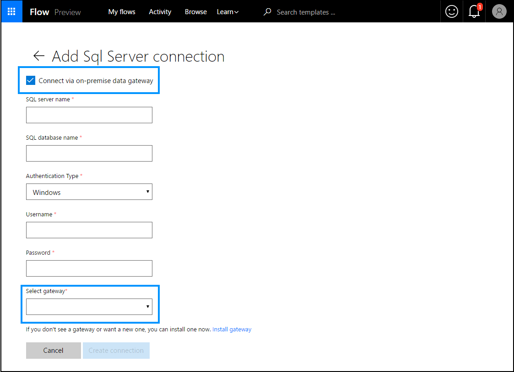

# Manage connections in Power Automate

If you create a connection in Power Automate, you can easily access your data while building a flow. Power Automate includes commonly used connections, including SharePoint, SQL Server, Office 365, OneDrive for Business, Salesforce, Excel, Dropbox, Twitter, and more. Connections are shared with Power Apps, so when you create a connection in one product, the connection shows up in the other.

For example, you can use a connection to perform these tasks:

* Update a SharePoint list.
* Get data from an Excel file in your OneDrive for Business or Dropbox account.
* Send email in Office 365.
* Send a tweet.

You can create a connection in multiple scenarios, such as these:

* Create a [flow from a template](get-started-logic-template.md)
* Create a [flow from blank](get-started-logic-flow.md) or updating an existing flow
* Create a connection in [Power Automate][1] directly

[!INCLUDE [sharepoint-detailed-docs](includes/sharepoint-detailed-docs.md)]

## Add a connection

1. Sign into [Power Automate][1].
2. IN the left-side navigation pane, select **Data > Connections**.

3. On the top menu bar, select **+ New connection**.
4. In the list of **Available connections**, select the connection that you want to set up, such as SharePoint.
5. Select the **Create connection** button, and then enter your credentials to set up the connection.

When the connection is set up, it's listed in **My connections**.

## Connect to your data through an on-premises data gateway

As of this writing, SQL Server and SharePoint Server support the on-premises data gateway. To create a connection that uses a gateway:

1. Follow the steps earlier in this topic to add a connection.
1. In the list of **Available connections**, select **SQL Server**, and then select the **Connect via on-premise data gateway** check box.

    

   > [!IMPORTANT]
   > Microsoft SharePoint data gateways support HTTP traffic but not HTTPS traffic.
1. Provide the connection's credentials, and then select the gateway that you want to use.

    For more information, see [Manage gateways](gateway-manage.md) and [Understand gateways](gateway-reference.md).

    When the connection is set up, it's listed in **My connections**.

## Delete a connection

1. Go to the **My connections** page, and then select the trash-can icon for the connection you want to delete.
1. Select **OK** to confirm that you would like to delete the connection.

When you delete a connection, it's removed from both Power Apps and Power Automate.

## Update a connection

You can update a connection that isn't working because your account details or your password changed.

1. On the **My connections** page, select the **Verify password** link for the connection that you want to update.
1. When prompted, update your connection with new credentials.

When you update a connection, it's updated for both Power Apps and Power Automate.

## Troubleshoot a connection

Depending on your organization's policies, you might need to use the same account for signing in to Power Automate and creating a connection to SharePoint, Office 365 or OneDrive for Business.

For example, you might sign in to Power Automate with *yourname@outlook.com* but be blocked when you try to connect to SharePoint with *yourname@contoso.com*. You can instead sign in to Power Automate with *yourname@contoso.com* and you'll be able to connect to SharePoint.

<!--Reference links in article-->
[1]: https://flow.microsoft.com
