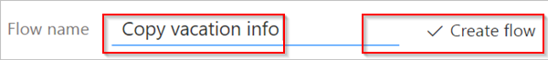

<properties
    pageTitle="Create an approval flow that requires everyone to approve| Microsoft Flow"
    description="Create an approval flow that requires everyone to approve or one person to reject a request."
    services=""
    suite="flow"
    documentationCenter="na"
    authors="msftman"
    manager="anneta"
    editor=""
    tags=""/>

<tags
    ms.service="flow"
    ms.devlang="na"
    ms.topic="article"
    ms.tgt_pltfrm="na"
    ms.workload="na"
    ms.date="09/22/2017"
    ms.author="deonhe"/>

# Create an approval flow that requires everyone to approve

This walkthrough shows you how to create an approval workflow that requires everyone to agree for a request to be approved, but any one person can reject the entire request.

You may create this type of approval workflow in an organization that requires a person's manager and the manager's manager to both agree to a vacation request for it to be approved. Additionally, either manager can decline the request without the other person's input.

## Prerequisites

- Access to [Microsoft Flow](https://flow.microsoft.com).
- A SharePoint Online [list](https://support.office.com/en-us/article/SharePoint-lists-I-An-introduction-f11cd5fe-bc87-4f9e-9bfe-bbd87a22a194). This walkthrough assumes you've already created a SharePoint Online list. See the [parallel approvals](parallel-modern-approvals.md) for an in depth example that details what your SharePoint list may look like.
- An Office 365 Outlook and Office 365 Users account.
- Familiarity with the basics of creating flows. You can review how to add [actions, triggers](multi-step-logic-flow.md#add-another-action), and [conditions](add-a-condition.md). The following steps assume that you know how to perform these actions.

>[AZURE.NOTE]While we use SharePoint Online and Office 365 Outlook in this walkthrough, you can use other services such as Zendesk, Salesforce, Gmail, or any of the more than [150 services](https://flow.microsoft.com/connectors/) that Microsoft Flow supports.

## Create the flow

>[AZURE.NOTE]If you haven't created a connection to SharePoint or Office 365 previously, follow the instructions when you're prompted to sign in.

To display the list of tokens, tap or click any input control, and then search for the token in the **Dynamic content** list that opens.

After you sign into [Microsoft Flow](https://flow.microsoft.com), perform the following steps to create your flow.

1. Select **My flows** > **Create from blank**
1. Add the **SharePoint - when an item is created or modified** trigger.
1. Enter the **Site Address** for the SharePoint site that hosts your list, and then select the list from the **List Name** box.
1. Add the **Office 365 Users - Get manager** action, and then add the **Created By Email** token to the **User (UPN)** box.

    The **Created By Email** token is located under the **When an item is created or modified** category of the **Dynamic content** list.
1. Add another **Office 365 Users - Get manager** action, and then add the **Email** token to the **User (UPN)** box.

    The **Email** token is located under the **Get manager** category of the **Dynamic content** list.

    You can also rename the **Get manager2** card to something meaningful like "Skip level manger".
1. Add the **Start an approval** action, and then select **Everyone from the assigned list** from the **Approval type** list.

1. Use the following table as a guide to complete the **Start an approval** card.

    Field|Description
    ----|------------
    Approval type|Use **Anyone from the assigned list** to indicate that anyone of the approvers can approve or reject the request. 
Use **Everyone from the assigned list** to indicate that a request is only approved if everyone agrees, and the request is denied if a single person rejects it.
    Title|The title of the approval request.
    Assigned to|The email addresses of the approvers.
    Details|Any additional information that's sent to the approvers listed in **Assigned to**.
    Item link|A URL to the approval item. This would be the link to the item in SharePoint, for example.
    Item link description|A text description of the **Item link**

    Here's an example of what the **Start an approval** card may look like:

    <!--  -->

1. Add the **Office 365 Outlook - Send an email** action, and then configure it to send an email with the results of the request.

    Here's an example of what the **Send an email** card might look like:

    <!--  -->

>[AZURE.NOTE]Any action that follows the **Start an approval** action is executed based on your selection in the **Approval type** list on the **Start an approval** card. The following table lists the behavior based on your selection.

Approval type|Behavior
-------------|------------
Anyone from the assigned list|Actions that follow the **Start an approval** action run after anyone of the approvers makes a decision.
Everyone from the assigned list|Actions that follow the **Start an approval** action run after some declines or everyone approves the request.

At the top of the page, enter a name for your flow in the **Flow name** box, and then select **Create flow** to save it.

<!--  -->

Congratulations!

If you followed along, your flow should resemble this image:

Now, whenever an item in your SharePoint list changes, your flow triggers and sends approval requests to all approvers that're listed in the **Assigned to** box of the **Start an approval** card. Your flow sends approval requests via the Microsoft Flow mobile app and via email. The person who creates the item in SharePoint gets an email that summarizes the results, clearly indicating if the request was approved or rejected.

## Learn more about approvals

- [Single approver modern approvals walkthrough](./modern-approvals.md)
- [Sequential approvals](./sequential-modern-approvals.md)
- [Parallel approvals](./sequential-modern-approvals.md)
