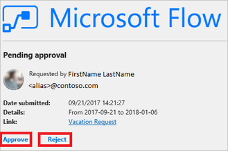

# Create an approval flow that requires everyone to approve

This tutorial shows you how to create an approval workflow that requires everyone (all assigned approvers) to agree for a vacation request to be approved, but any approver can reject the entire request.

This type of approval workflow is useful in an organization that requires a person's manager and the manager's manager, to both agree to a vacation request for it to be approved. However, either manager can decline the request without the other person's input.

> [!NOTE]
> While this tutorial highlights a vacation approval scenario, you can use this type of approval flow in any situation where multiple approvers are required to approve a request.

Here's a quick video tutorial about approvals.

>[!VIDEO https://learn-video.azurefd.net/vod/player?id=ac0eac35-a857-429a-9996-5ea92343872c]

## Prerequisites

* Access to [Power Automate](https://make.powerautomate.com), Microsoft Office 365 Outlook, and Microsoft Office 365 Users.
* A SharePoint [list](https://support.office.com/article/SharePoint-lists-I-An-introduction-f11cd5fe-bc87-4f9e-9bfe-bbd87a22a194).

    This tutorial assumes you've created a SharePoint list that's used to request vacations. See the [parallel approvals](parallel-modern-approvals.md) tutorial for an in-depth example that details what your SharePoint list might look like.

    [!INCLUDE [sharepoint-detailed-docs](includes/sharepoint-detailed-docs.md)]

* Familiarity with the basics of creating flows.

    You can review how to add [actions, triggers](work-with-triggers-actions.md), and [conditions](add-condition.md). The following steps assume that you know how to perform these actions.

> [!NOTE]
> While we use SharePoint and Office 365 Outlook in this tutorial, you can use other services such as Zendesk, Salesforce, Gmail, or any of the more than [200 services](https://make.powerautomate.com/connectors/) that Power Automate supports.

## Create the flow

This tutorial uses tokens. To display the list of tokens, select any input control, and then search for the token in the **Dynamic content** list that opens.

> [!NOTE]
> If you haven't created a connection to SharePoint or Office 365 previously, follow the instructions when you're prompted to sign in.

1. Sign in to [Power Automate](https://make.powerautomate.com).

1. On the top left of the screen, select **My flows** > **New** > **Automated-from blank**.

1. Name your flow, and then add the **SharePoint - When an item is created or modified** trigger.

1. Enter the **Site Address** for the SharePoint site that hosts your vacation request list, and then select a list from **List Name**.

1. Select **New step**, add another Office 365 **Get manager (V2)** action, and then add the **Mail** token to the **User (UPN)** box.

    The **Mail** token is located under the **Get manager (V2)** category of the **Dynamic content** list. This token dynamically provides access to the email address for the manager's manager.

    You can also rename the **Get manager (V2) 2** card to something meaningful like "Skip level manager".
1. Select **New step**, add the **Start and wait for an approval** action, and then select **Approve/Reject - Everyone must approve** from the **Approval type** list.

   > [!IMPORTANT]
   > If any approver rejects, the approval request is considered rejected for all approvers.
   >
   >
1. Use the following table as a guide to complete the **Start and wait for an approval** card.

   | Field | Description |
   | --- | --- |
   | Approval type |See the [approval types](#approval-types-and-their-behaviors). |
   |  Title |The title of the approval request. |
   |  Assigned to |The email addresses of the approvers. |
   |  Details |Any additional information that you want sent to the approvers listed in the **Assigned to** field. |
   |  Item link |A URL to the approval item. In this example, this is a link to the item in SharePoint. |
   |  Item link description |A text description for the **Item link**. |

   > [!TIP]
   > The **Start and wait for an approval** action provides several tokens, including **Responses** and **Outcome**. Use these tokens in your flow to provide rich reporting of the results from a run of an approval request flow.
   >
   >

    The **Start and wait for an approval** card is a template for the approval request that's sent to approvers. Configure it in a way that's useful for your organization. Here's an example.

    

    When a cloud flow with the **Start and wait for an approval** action is configured with **Approve/Reject - Everyone must approve**, it waits until all **Assigned to** approve or at least one **Assigned to** rejects the approval request.

    >[!TIP]
    >Add a **Condition** step if you want your flow to check the response of the approval request and perform different actions based on the **Outcome**. The **Outcome** is an array of **Approve** or **Reject** elements, based on the number of responses to the request. 

    Let's continue with the flow and send an email when a decision is made on the approval request.

1. Select **New Step**, search for "send an email", add the Office 365 Outlook **Send an email (V2)** action, and then configure the action to send an email with the results of the request to the person who wants to go on vacation.

    Here's an example of what the **Send an email (V2)** card might look like.

    

> [!NOTE]
> Any action that follows the **Start and wait for an approval** action runs based on your selection in the **Approval type** list on the **Start and wait for an approval** card. The following table lists the behavior based on your selection.
>
>

### Approval types and their behaviors

| Approval type | Behavior |
| --- | --- |
| Approve/Reject - Everyone must approve | Approval or rejection is needed by **all** approvers to complete the request. 
 The actions that follow the **Start and wait for an approval** action run after **all** of the approvers approve, or when a single rejection is done.|
| Approve/Reject - First to respond | Approval or rejection by any approver completes the request.  
 The actions that follow the **Start and wait for an approval** action run after any one of the approvers decides.|
| Custom responses - Wait for all responses | All approvers must respond to complete the process. |
| Custom responses - Wait for one response | A response from any approver completes the process. |

At the top of the screen, select **Save** to save your flow.

Congratulations, your flow is complete! If you followed along, your flow resembles this image.

Now, whenever an item is added to your SharePoint list, or if an item changes, your flow triggers and sends approval requests to all approvers whom are listed in the **Assigned to** box of the **Start and wait for an approval** card. Your flow sends approval requests via the Power Automate mobile app and via email. The person who creates the item in SharePoint gets an email that summarizes the results, clearly indicating if the request was approved or rejected.

Here's an example of the approval request that's sent to each approver.

Here's an example of what a response and a response summary may look like after your flow runs.

## Related information

* [Single approver modern approvals](modern-approvals.md)
* [Sequential modern approvals](sequential-modern-approvals.md)
* [Parallel modern approvals](parallel-modern-approvals.md)
* [Approvals and Dataverse](common-data-model-approve.md)
* [Approve requests on the go](mobile-approvals.md)

[!INCLUDE[footer-include](includes/footer-banner.md)]
