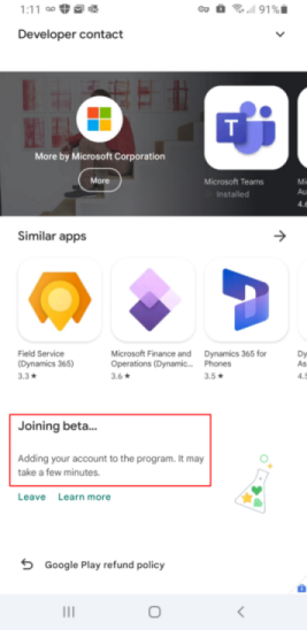
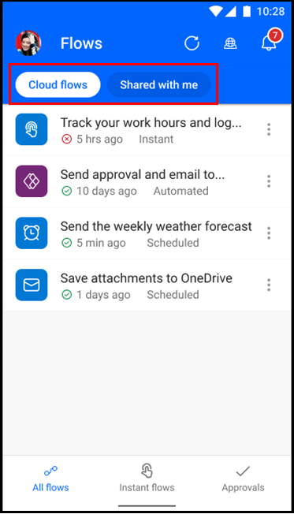
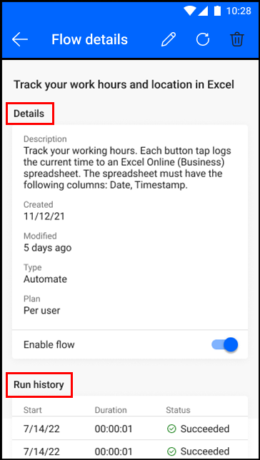
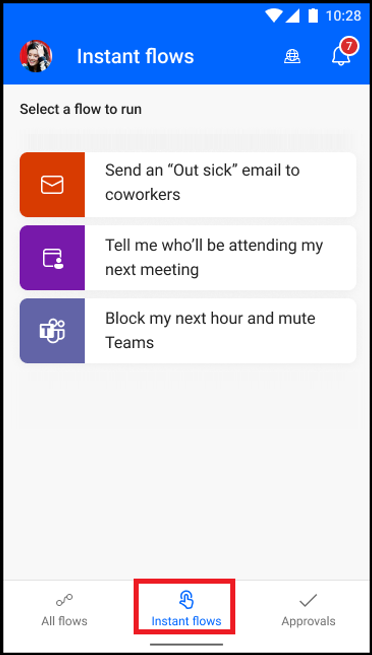
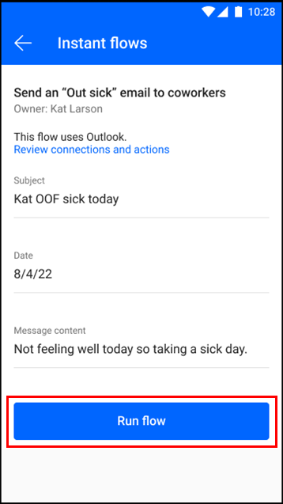
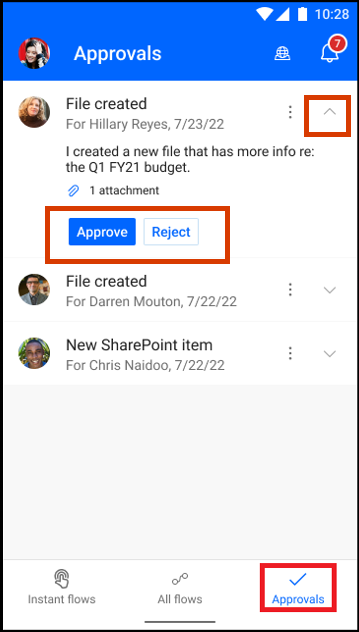
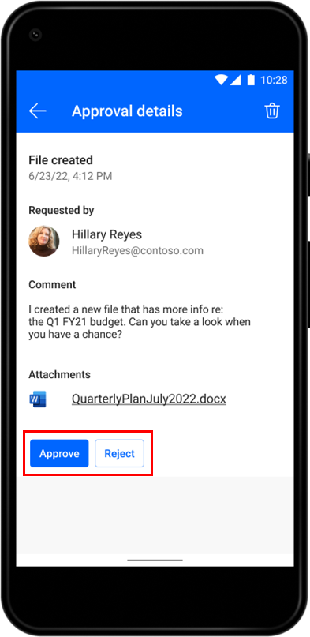
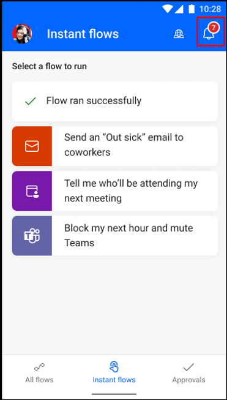
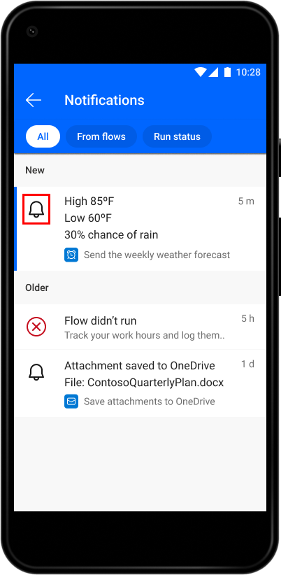
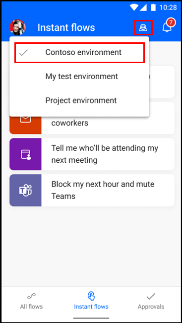

# Use the beta version of Power Automate mobile for Android (preview)

[!INCLUDE[cc-beta-prerelease-disclaimer](includes/cc-beta-prerelease-disclaimer.md)]

Experience the same familiar look and feel of the Power Automate portal with the beta version of Power Automate mobile for Android. If you've used the previous mobile version, you'll notice some improvements, such as quicker response times and easier navigation.

> [!IMPORTANT]
> - This is a preview feature.
> - [!INCLUDE[cc_preview_features_definition](includes/cc-preview-features-definition.md)]
> - This article only applies to the beta version of the Power Automate mobile app for Android devices. If you want to use the Power Automate mobile app versions generally available across different platforms, refer to the previous articles in this section in the table of contents.

## Install the beta version

Before you can install the beta version, the Power Automate app must be installed on your device.

To download the beta version:

1. Tap **Play Store**. Depending on the version of your device, the icon might be named Google Play Store.

1. In the search bar at the top, enter **power automate**.

1. Tap **Power Automate** to open the app page.

1. Swipe to the bottom of the page until you reach the **Join the beta** heading.

1. Tap **Join**.  

## View a list of your cloud flows

You can view the flows that you've created as well as flows shared with you. This includes non-solution and solution-aware flows.

You can view details of each individual flow, such as the flow description, run history, and connections. You can also turn the flow on or off.

## Run instant flows

The instant flows feature allows you to easily run repetitive tasks from any place, at any time with your mobile device. Running instant cloud flows are automated, which saves you time. You might also encounter fewer errors than if you performed the tasks manually.

If you've used the previous Power Automate mobile version, you know instant flows as button flows.

To run an instant flow, tap the flow you would like to run from the I**Instant flows** screen, then tap **Run flow**. Some flows might require you to fill in parameters before running the flow.

For quick and easy access to your instant flows, you have the option to create a widget as a shortcut on your mobile device’s home screen.

## Manage approvals

The approvals feature allows you to manage your approval requests while you’re away from your desk. 

You can approve or reject a request directly from the **Approvals** screen. Alternatively, to view more details of an approval request, tap the verticle (**…**) next to a request and select **Details**.

In the following example, you can see the additional details, comments, and attachments. Select **Approve** or **Reject**.

## Send and receive push notifications

The notifications feature allows you to send and receive push notifications. To get to the **Notifications** screen, tap the bell icon in the app header.

When you tap the bell icon, you'll see a list of recent notifications and flow alerts. If you've used the previous Power Automate mobile app version, you know this as Activity Feed.

## Change environments

You might have different environments set up depending on the purpose of your work (for example, testing, projects, and customers). You can easily change your environment so that you can access your flows, approvals, notifications, and more, based on the environment you're in.

## Limitations

- Downloading the preview version of the app will overwrite the existing version of the Power Automate mobile app if you already have it downloaded on your mobile device.

- This feature is being rolled out and may not be available for you yet.

- The beta version doesn't support geofencing (location-based trigger). 

- The beta version doesn't support flow creation and editing in this version; customers told us that they prefer to create and edit in the portal. If you need to create or edit on the go, you can log in to Power Automate on your mobile’s browser.

## Provide feedback  

These changes are based directly on your feedback, so we would love to hear what you think of this new beta version of Power Automate mobile for Android! You can leave a review and rating in the [Google Play Store](https://play.google.com/store/apps/details?id=com.microsoft.flow). To provide feedback, go to the Power Automate app page, and under **Private feedback to developer**, tap **Write feedback**. Rate the app and describe your experience. Optionally, you can also provide any feedback. We appreciate your response!

> [!NOTE]
>
>You can discontinue your role as a beta tester at any time. In the Play Store, find and open the Power Automate app, scroll to the bottom, and tap **Leave** below the **You're a beta tester** heading. If you want to use the version that's in general availability (GA) status, you'll need to uninstall the beta version and install Power Automate (GA). To learn more, go to the [Google Play Help](https://support.google.com/googleplay/answer/7003180?hl=en).]