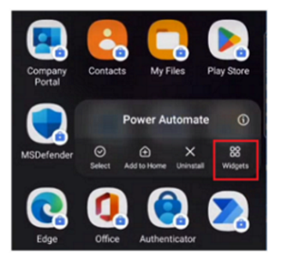
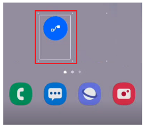
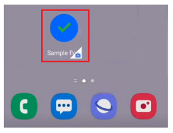

# Use the Power Automate mobile app for Android

Experience the same familiar look and feel of the Power Automate portal with the Power Automate mobile app for Android. If you've used the previous mobile app version, you'll notice some improvements, such as quicker response times and easier navigation.

## Install the mobile app

If you're not signed up for Power Automate, [sign up for free](sign-up-sign-in.md). Then choose the download link or scan the QR code to download the Power Automate mobile app.

| Android |
| :---:   |
|    |
|   |

> [!NOTE]
> - You can sign in with either Azure Active Directory (AAD) or your Microsoft account (MSA).
> - The new version of the app is currently being rolled out and may not be available for you yet.

## View a list of your cloud flows

You can view the flows that you've created as well as flows shared with you. This includes non-solution, solution-aware, and shared flows.

You can view details of each individual flow, such as the flow description, most recent run history, and connections. You can also turn the flow on or off.

## Run instant flows

The instant flows feature allows you to easily run repetitive tasks automatically from any place, at any time with your mobile device. You might encounter fewer errors than if you performed these tasks manually.

If you've used the previous Power Automate mobile app version, you know instant flows as button flows.

To run an instant flow, tap the flow you would like to run from the **Instant flows** screen, then tap **Run flow**. Some flows might require you to fill in parameters before running the flow.

## Create widgets

Widgets make accessing and running instant flows effortless. For quick and easy access to your instant flows, you have the option to create a widget as a shortcut on your mobile device’s home screen. Widgets allow you to trigger instant flows straight from your mobile's home screen without having to open the Power Automate app. If your instant flow requires inputs, the flow will open in the app so you can fill in the required fields before triggering the flow.

To create a widget:

1. Select Power Automate mobile app settings.
1. Select **Widgets**.

    

1. Choose the location for the widget.

    

    > [!NOTE]
    > If you haven't previously signed into the app before creating a widget, the app will be opened to allow you to sign in. Once you are signed in, you can create a widget and run your flow straight from your home screen.

1. Select the flow to run when prompted.

1. Use the widget to run the flow directly using the widget when needed, without opening the Power Automate mobile app.

      

> [!NOTE]
> You can't run [solution-aware flows](overview-solution-flows.md) using a widget.

## Manage approvals

The approvals feature allows you to manage your approval requests while you’re away from your desk. 

You can approve or reject a request directly from the **Approvals** screen. Alternatively, to view more details of an approval request, tap the vertical (**…**) next to a request and select **Details**.

In the following example, you can see the additional details, comments, and attachments. Select **Approve** or **Reject**.

## Send and receive push notifications

The notifications feature allows you to send and receive push notifications. To get to the **Notifications** screen, tap the bell icon in the app header.

When you tap the bell icon, you'll see a list of recent notifications and flow alerts. If you've used the previous Power Automate mobile app version, you know this as Activity Feed.

## Change environments

You might have different environments set up depending on the purpose of your work (for example, testing, projects, and customers). You can easily change your environment so that you can access your flows, approvals, notifications, and more, based on the environment you're in.

## Limitations

Following are the known limitations for the mobile app for Android:

- Geofencing (location-based trigger) isn't supported. This was formerly a preview feature and was never generally available.

- Flow creation and editing aren't supported. Customers told us that they prefer to create and edit in the web portal when building or changing flows. If you’re on the go and need to create or edit, you can log into Power Automate on your mobile’s browser.
