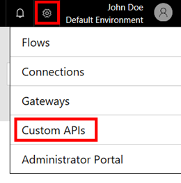
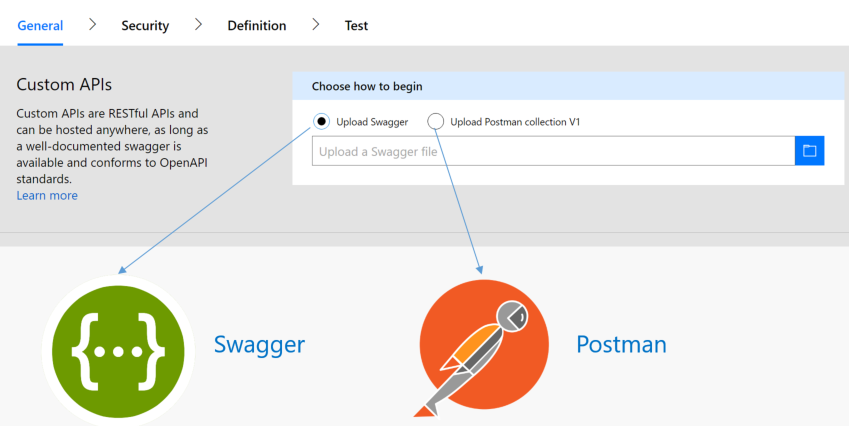
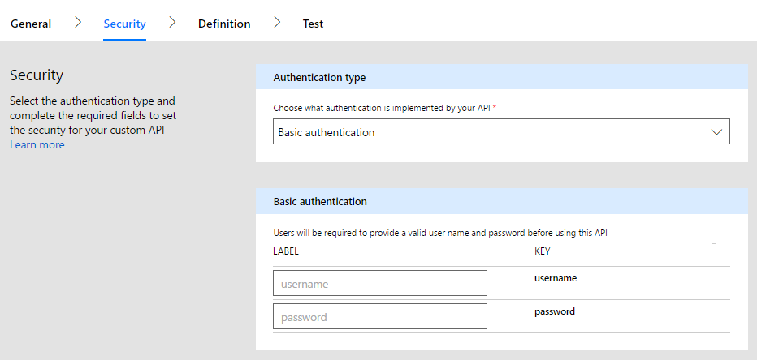
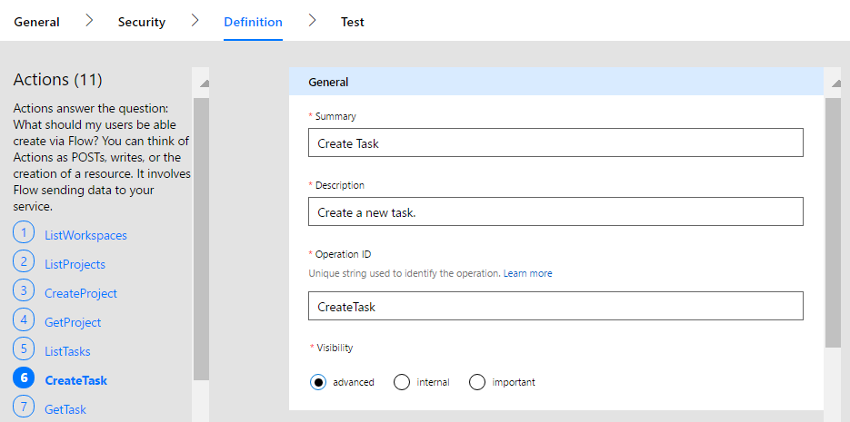

# Build a connector using custom connector Tools

The general process to build the functionality of a connector involves multipile steps.

In the [Microsoft Flow web app](https://ms.flow.microsoft.com/en-us/), click the **Settings** button at the upper right of the page (it looks like a gear). Then click **custom connectors**.

## Describe your API

Custom connectors are described using [OpenAPI](https://swagger.io/), an open standard for defining the interface of an HTTP API. You can start building using an existing OpenAPI(JSON) file. Alternately, you can import a [Postman Collection](https://www.getpostman.com/docs/collections) which auto generates theOpenAPI for you. 

If you start from either of these data sources, the meta data fields in the wizard will be auto-populated for you. You can edit these at any time.  

## Security

Pick the authentication type supported by your service and provide additional details to enable the identity flow. 

[Learn more](https://ms.flow.microsoft.com/en-us/documentation/register-custom-api/) about the Security setup for your custom connector.

## Build Triggers and Actions

To build the triggers and actions for your connector, switch to the **Definition** tab. 

Using the wizard, you can add new operations or edit the schema and response for existing ones. The **general** properties for each operation enable you to control the end-user experience for your connector. Learn more about the different types of operations using the links below:
- [Triggers](https://ms.flow.microsoft.com/en-us/documentation/customapi-webhooks/)
- [Actions](https://ms.flow.microsoft.com/en-us/documentation/register-custom-api/)

To implement advance functionality, refer to the [swagger extensions guide](https://ms.flow.microsoft.com/en-us/documentation/customapi-how-to-swagger/). 

Finally, click on **Create API** to register the custom connector.

For additional features not available in custom connector, please contact [condevhelp@microsoft.com](mailto:condevhelp@microsoft.com).

## Test

Prior to submission, test your custom connector in multiple ways: 

- Using the custom connector [Testing wizard](https://flow.microsoft.com/en-us/blog/new-updates-custom-api/) in Flow, you can call each operation associated with your connector to verify its functionality and the response schema.

- In the Flow designer, you can visually build flows using your custom connector. This method of testing gives you visibility into the user interfacing functionality and features of your integration. 

