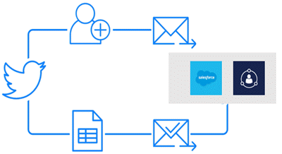
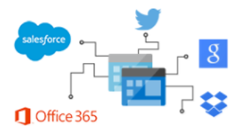
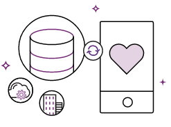
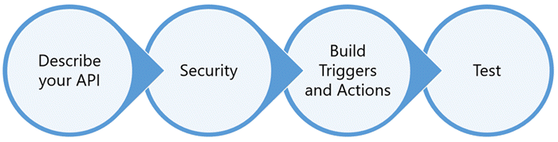

# API Connector Certification Overview

An **API connector** is a OpenAPI based wrapper around a REST API that allows the underlying service to talk to [Microsoft Flow](https://ms.flow.microsoft.com/en-us/), [PowerApps](https://powerapps.microsoft.com/en-us/) and [Logic Apps](https://azure.microsoft.com/en-us/services/logic-apps/). It provides a way for users to connect their accounts and leverage a set of pre-built **triggers** and **actions** to build their apps and workflows.

**Independent software vendors (ISVs)** and **SaaS service owners** can build API connectors to enable a wide range of business and productivity scenarios for their users. A connector helps them to go beyond a definite set of integrations and increase the reach, discoverability and usage of their service.

#### Microsoft Flow
Through Flow, users can automate tasks and build workflows in conjunction with other social and business applications. 

The possible workflows span across a wide variety of possibilities, for example:
- Send email, text and push notifications 
- Copy files between data sources
- Automatically collect and organize business data
- Streamline approvals and send instant alerts

#### Logic Apps

Logic Apps is the workflow engine for Flow. It enables pro-developers to visually create or programmatically configure workflows in Azure. A connector in Logic Apps can enable users to automate EAI, Business to business (B2B) and Business to consumer (B2C) scenarios while reaping the benefits of source control, testing, support, and operations. 

#### PowerApps
PowerApps enables users to build **cloud connected** and **cross platform** business apps using clicks and minimal code. 

Through PowerApps, users can build simple apps for line of business scenarios, that read and write data to multiple cloud sources. Some examples of such apps include survey forms, timesheets, expense reporting, etc. Users can securely publish and share these apps to mobile or web for use within their organization.

## Requirements

To build and submit an API connector, your service must meet the following requirements:
- Business user or pro developer scenario that fits well with Flow, PowerApps and Logic Apps
- Publicly available service with stable REST APIs

## Build using custom connector Tools

The first step to building a connector is to build a fully functional **custom connector**. A custom connector operates like a connector but it is limited in availability to its author and specific users within the author's tenant.

The general process to build a custom connector involves multipile steps.

[Learn more](api-connector-dev.md) about how to develop a custom connector.
 
## Submit for Certification

As part of our 3rd party certification process, Microsoft will review the custom connector before publishing as a Connector.

This process validates the functionality of your custom connector in Flow and PowerApps, and checks for technical and content compliance.

[Learn more](api-connector-submission.md) about the process to submit your connector for publishing.

## Support

For onboarding and development support, please email [condevhelp@microsoft.com](mailto:condevhelp@microsoft.com). This is actively monitored and managed. Developer queries and incidents will quickly find their way to the appropriate team.
