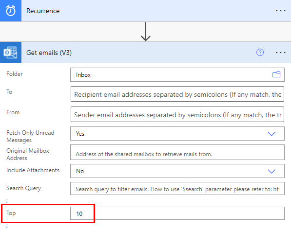

# Use the apply to each action to process a list of items periodically <!--Note from Sweeny: Capitalize the first word of labels and terms that appear in UI. In this case, change apply to Apply-->

Many triggers can immediately start a cloud flow based on an event such as when a new email arrives in your inbox. These triggers are great, but sometimes you want to run a cloud flow that queries a data source on a predefined schedule, taking certain actions based on the properties of the items in the data source. To do this, your flow can be started on a schedule (such as once per day) and use a loop action such as **Apply to each** to process a list of items. For example, you could use **Apply to each** to update records from a database or list of items from Microsoft SharePoint.

Watch this video for a demo of the **Apply to each** action. <!--Note from Sweeny: Can we reupload this video with a better cover image?-->

> [!VIDEO https://www.microsoft.com/videoplayer/embed/RWL7EL] 

In this tutorial, we'll create a cloud flow that runs every 15 minutes and does the following:

1. Gets the last 10 unread messages in your Microsoft 365 Outlook Inbox.
2. Checks each of the 10 messages to confirm if any have **meet now** in the subject. <!--Note from Sweeny: Changed the verb form here-->
3. Checks if the email is from your boss or was sent with high importance.
4. Sends a push notification and marks as read, any email that has **meet now** in the subject and is either from your boss or was sent with high importance.

This diagram shows the details of the flow we'll create.

>[!div class="mx-imgBorder"]
>

## Prerequisites
Here are the requirements for successfully performing the steps in this tutorial.

* An account that's registered to use [Power Automate](https://flow.microsoft.com).
* A Microsoft 365 Outlook account.
* The Power Automate mobile app for [Android](https://aka.ms/flowmobiledocsandroid), [iOS](https://aka.ms/flowmobiledocsios), or [Windows Phone](https://aka.ms/flowmobilewindows).
* Connections to Microsoft 365 Outlook and the push notification service.

[!INCLUDE [sharepoint-detailed-docs](includes/sharepoint-detailed-docs.md)]

## Create a cloud flow
1. Sign in to [Power Automate](https://flow.microsoft.com).
1. Select **My flows** > **New flow** > **Scheduled cloud flow**.
1. In the **Flow name** field, enter a name for your flow.
1. In the **Starting** fields, select the date and time to indicate when the flow should start running.
1. In the **Repeat every** fields, set the schedule to run the flow. In this example, type 15 and select **Minute** from the dropdown list to run the flow every 15 minutes. 
1. Select **Create**.

    >[!div class="mx-imgBorder"]   
    > 

1. Select **+ New step**.
1. In the **Search** field, type **outlook** to find all connectors and actions related to Microsoft Outlook.
1. Select the **Get emails (V3)** action. The **Get emails (V3)** card opens. <!--Note from Sweeny: Combine both sentences to "Select the **Get emails (V3)** action to open the **Get emails (V3)** card -->
1. Configure the **Get emails (V3)** card to select the top 10 unread emails from the **Inbox** folder.
   
   Don't include attachments because they won't be used in the flow.
   
    >[!div class="mx-imgBorder"]  
    >
   
    > [!NOTE]
    > So far, you've created a simple flow that gets some emails from your inbox. These emails will be returned in an array. The **Apply to each** action requires an array, so this is exactly what's needed.

## Add actions and conditions
1. Select **+ New step** > **Built-in** > **Apply to each** action.
1. Select the field and then select **value** from the **Dynamic content** list to place it in the **Select an output from previous steps** field on the **Apply to each** card. This pulls in the body of the emails to be used in the **Apply to each** action. <!--Note from Sweeny: Corrected the spelling of Dynamic here-->

    >[!div class="mx-imgBorder"]
    >

1. Select **+ New step** > **Control** > **Condition**.
1. Configure the **Condition** card to search the subject of each email for the words "meet now".

    * Select the first field and then select **Subject** in the **Dynamic content** list.
    * In the dropdown list of operators in the second field, select **contains**.
    * In the third field, enter **meet now**.

    >[!div class="mx-imgBorder"]
    >

1. In the **If yes** branch, select **Add an action** > **Condition**. This opens the **Condition 2** card.
1. Configure the **Condition 2** card to search each email with "meet now" in the subject with high importance.

    * Select the first field and then select **Importance** in the **Dynamic content** list.
    * (If not already selected) In the dropdown list of operators in the second field, select **is equal to**.
    * In the third field, enter **high**.

1. In the **If yes** branch, select **Add an action**. This opens the **Choose an action** card, where you'll define what happens if the search condition (the **meet now** email was sent with high importance) is true.
1. Search for **notification**, and then select the **Send me a mobile notification** action.

    >[!div class="mx-imgBorder"]
    >

1. On the **Send me a mobile notification** card in the **Text** field, enter the details for the push notification that will be sent if the subject of an email contains "meet now" and the **Importance** is **high**.

    >[!div class="mx-imgBorder"]
    >

1. Select the **If no** branch to select the recipients.
    * Select **Add an action**, and then type **get manager** in the search field.
    * In the **Actions** list, select **Get manager (V2)**.
    * In the **Get Manager (V2)** card, select the **User (UPN)** field.
    * In the **Dynamic content** list, select **To**.

    >[!div class="mx-imgBorder"]
    > dynamic content")

1. In the **If no** branch, select **Add an action**.
1. From the **Actions** list, select **Condition**. This opens the **Condition 3** card.
1. Configure the card to check if the email sender's email address (the **From** token) is the same as your boss' email address (the **Email** token).

    * Select the first field and then select **From** in the **Dynamic content** list.
    * In the dropdown list of operators in the second field, select **contains**.
    * In the third field, enter **mail**.

    >[!div class="mx-imgBorder"]
    >

1. Under the **If yes** section of the **Condition 3** card, select **Add an action**.

Next, you'll define what should happen if the search condition (the email was sent from your boss) is true.

1. Search for **notification**, and then select the **Send me a mobile notification** action.

    >[!div class="mx-imgBorder"]
    >

1. On the **Send me a mobile notification 2** card, provide the details for the push notification that will be sent if the email is from your boss.
1. Select **Add an action**.

    >[!div class="mx-imgBorder"]
    >

1. Add the **Mark as read or unread (V3)** action.
1. Add the **Message Id** token to the **Mark as read or unread (V3)** card. The **Message Id** is the Id of the message that will be marked as read.
1. Select **Enter custom value** from the **Mark as** list on the **Mark as read or unread (V3)** card.
1. In the **Dynamic content** list, select **Is Read**.

    >[!div class="mx-imgBorder"]
    >
1. On the toolbar at the top, select **Save** to save your flow.

## Run the flow

1. Send yourself a high-importance email that includes **meet now** in the subject. Alternatively, you can have someone in your organization send you such an email.
1. Confirm the email is in your inbox and it's unread.
1. Sign into [Power Automate](https://flow.microsoft.com).
1. Select **My flows**. A list of your flows displays.
1. Place a check in the circle for the flow you just created to select it.
1. Select the **Run** icon to the right of the flow name.

    >[!div class="mx-imgBorder"]
    >

1. On the panel to the right, select **Run flow**.
1. When the run flow has successfully started, select **Done**.
1. Select the flow run in which you're interested to view the results.

    >[!div class="mx-imgBorder"]
    >

## View results of the run
Now that you've run the flow successfully, you should receive the push notification on your mobile device.
   
> [!NOTE]
> If you don't receive the push notification, confirm that your mobile device has a working data connection.

[!INCLUDE[footer-include](includes/footer-banner.md)]
