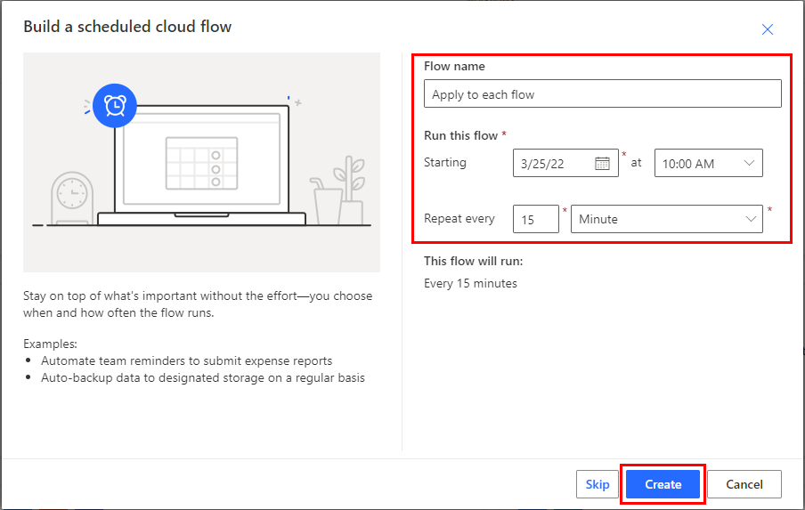

# Use the apply to each action in Power Automate to process a list of items periodically

Many triggers can immediately start a cloud flow based on an event such as when a new email arrives in your inbox. These triggers are great, but sometimes you want to run a cloud flow that queries a data source on a predefined schedule, taking certain actions based on the properties of the items in the data source. To do this, your flow can be started on a schedule (such as once per day) and use a loop action such as **Apply to each** to process a list of items. For example, you could use **Apply to each** to update records from a database or list of items from Microsoft SharePoint.

Watch this video for a demo of the **Apply to each** action.

> [!VIDEO https://www.microsoft.com/videoplayer/embed/RWL7EL]

In this walk-through, we'll create a cloud flow that runs every 15 minutes and does the following:

1. Gets the last 10 unread messages in your Office 365 Outlook Inbox.
2. Checks each of the 10 messages to confirm if any has **meet now** in the subject.
3. Checks if the email is from your boss or was sent with high importance.
4. Sends a push notification and marks as read, any email that has **meet now** in the subject and is either from your boss or was sent with high importance.

This diagram shows the details of the flow we'll create:

## Prerequisites
Here are the requirements for successfully performing the steps in this walk-through:

* An account that's registered to use [Power Automate](https://flow.microsoft.com).
* An Office 365 Outlook account.
* The Power Automate mobile app for [Android](https://aka.ms/flowmobiledocsandroid), [iOS](https://aka.ms/flowmobiledocsios), or [Windows Phone](https://aka.ms/flowmobilewindows).
* Connections to Office 365 Outlook and the push notification service.

[!INCLUDE [sharepoint-detailed-docs](includes/sharepoint-detailed-docs.md)]

## Create a cloud flow
1. Sign into [Power Automate](https://flow.microsoft.com).
1. Select **My flows** > **New** > **Scheduled-from blank**
1. Provide a name for your flow in **Flow name** on the **Build a scheduled flow** screen. 
1. Set the schedule to run every 15 minutes. 
1. Select the **Create** 
   
     

1. Select **+ New step**, and then type **outlook** into the search box to find all connectors and actions related to Microsoft Outlook.
1. Select the **Get emails (V3)** action:
1. The **Get emails (V3)** card opens. Configure the **Get emails (V3)** card to select the top 10 unread emails from the Inbox folder. Don't include attachments because they won't be used in the flow:
   
    
   
   > [!NOTE]
   > So far, you've created a simple flow that gets some emails from your inbox. These emails will be returned in an array; the **Apply to each** action requires an array, so this is exactly what's needed.

## Add actions and conditions
1. Select **New step** > **Built-in** > **Apply to each** action.
1. Insert the **value** token into the **Select an output from previous steps** field on the **Apply to each** card. This pulls in the body of the emails to be used in the **Apply to each** action:
   
    
1. Select **New step** > **Control** > **Condition**.
1. Configure the **Condition** card to search the subject of each email for the words "meet now":
   
   * Insert the **Subject** token into the first field of the **Condition** card.
   * Select **contains** in the list of operators.
   * Enter **meet now** into the third field.
     
     
1. Select **Add an action** > **Condition** from the **If yes** branch. This opens the **Condition 2** card; configure that card like this:
   
   * Insert the **Importance** token into the first field.
   * Select **is equal to** in the list of operators.
   * Enter **high** into the field on the right side.
     
1. Select **Add an action** under the **If yes** section.     
   This opens the **Choose an action** card, where you'll define what happens if the search condition (the **meet now** email was sent with high importance) is true.
1. Search for **notification**, and then select the **Send me a mobile notification** action:
   
    
1. On the **Send me a mobile notification** card, provide the details for the push notification that will be sent if the subject of an email contains "meet now" and the **Importance** is **high**.
   
    

1. Going back to the **Condition 2** card, on the **If no** branch:
    
    * Select **Add an action**, and then type **get manager** into the search box.
    * Select the **Get manager (V2)** action from the search results list.
    * Enter the **To** token into the **User (UPN)** box of the **Get Manager (V2)** card.
      
      
1. Select **Add an action** from the **If no** branch.
1. Select **Condition** from the **Choose an action** card. This opens the **Condition 3** card; configure the card to check if the email sender's email address (the From token) is the same as your boss' email address (the Email token):
    
    * Insert the **From** token into the first box.
    * Select **contains** in the list of operators.
    * Enter **mail** token into the rightmost box.
      
      
1. Select **Add an action** under the **If yes** section of the **Condition 3** card.
    
Next, you'll define what should happen if the search condition (the email was sent from your boss) is true:

1. Search for **notification**, and then select the **Send me a mobile notification** action:
    
     
1. On the **Send me a mobile notification 2** card, provide the details for the push notification that will be sent if the email is from your boss, and then select **Add an action**:
    
     
1. Add the **Mark as read or unread (V2)** action.
1. Add the **Message Id** token to the **Mark as read or unread (V2)** card. You may need to select **See more** to find the **Message Id** token. The **Message Id** is the Id of the message that will be marked as read.
1. Select **Read** from the **Mark as** list on the **Mark as read or unread (V2)** card.
    
     
1. Select **Save** to save your flow.

## Run the flow
1. Send yourself a high-importance email that includes **meet now** in the subject (or have someone in your organization send you such an email).
1. Confirm the email is in your inbox and it's unread.
1. Sign into Power Automate, select **My flows**.
   
    A list of your flows displays. 
    
1. Select the flow you just created, and then select **Run**.

   

1. Select **Flow Runs Page**, and then select the flow run in which you are interested to view the results.
   
    

## View results of the run
Now that you've run the flow successfully, you should receive the push notification on your mobile device.
   
> [!NOTE]
> If you don't receive the push notification, confirm that your mobile device has a working data connection.
 

[!INCLUDE[footer-include](includes/footer-banner.md)]
