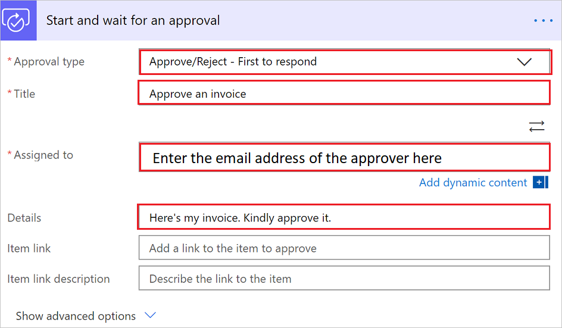
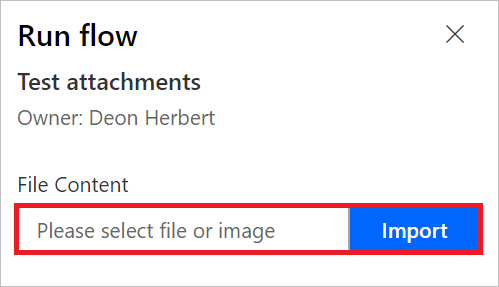
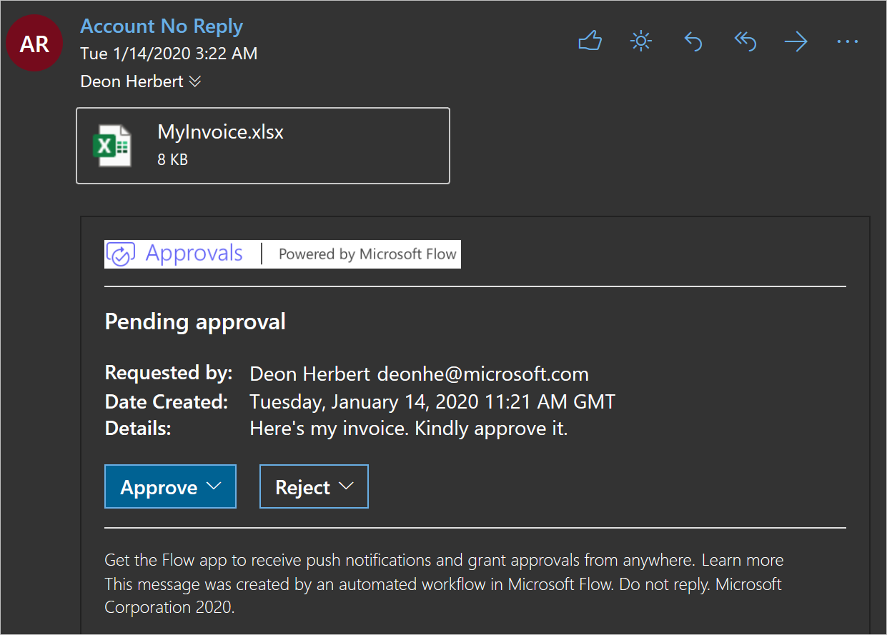

# Create approval flows with attachments

Sometimes, you need to get a file approved for business purposes. Fortunately, you can use Power Automate approvals to do this task. For example, let's say you are an accountant and you want to get approval for an invoice, you could create an instant flow that lets you send the file for approval by simply tapping a button and selecting the file to send.

In this article, you’ll learn how to create an approval flow that sends an attachment that the approver needs to review before deciding if the request should be approved.

## Create the flow

1. Sign into Power Automate.
1. Select **My flows** > **New** > **Instant-from blank**.

    

1. Give your cloud flow a name > search for, and then select **Manually trigger a cloud flow**, and then select **Create**.

    

1. Select the **Manually trigger a cloud flow** trigger > **Add an input** > **File**.

     The previous steps configure your flow so that when it runs, it requests a file from the user to trigger your flow.

1. Select **New step**
1. Search for **Approvals** and then select **Start and wait for an approval**.
1. Select **Approve/reject - First to respond** in the **Approval type** list of the **Start and wait for an approval** card.
1. Provide the following information on the **Start and wait for an approval** card:

   - **Title** - This is a short description that tells the approver what the request is about.
   - **Assigned to** - The person to whom the request is sent.
   - **Details** - This text shows up in the approval request.

     

1. Select **Show advanced options** to reveal the fields in which you'll provide information about the file attached to the request.
1. Provide a file name in **Attachments Name - 1**

   >[!TIP]
   >You must include the file extension that matches the file type that's uploaded.

1. Provide the contents for the file that will be sent to the approver in the **Attachments Content - 1** box. 

   An easy way to do this is to use the **File Content** item from the list of dynamic content that's displayed when you select the **Attachments Content - 1** box.

     

1. Select **Save** to save your flow.

## Test your flow

You can test your flow by selecting **Test** and then uploading an .xlsx file.

1. Select **Test**.
1. Select **I'll perform the trigger action**.

     

1. Select **Test** > **Continue** to start the test.
1. Select **Import**.

     
1. Find the file, select it, and then select **Open** to upload the file or image you're sending for approval.

1. Select **Run flow**.

   You'll see that the test run starts.

     

1. Select **Flow Runs Page** to monitor the status of the test.

## Approve the request

The person to whom you send the approval request receives an email, similar to this image, where they can view the attachment and then **Approve** or **Reject** the request:

>[!TIP]
>Approvers can review requests in the approvals center as well.

## Learn more

In most approval flows, you'd want to notify the person who requests the approval of the decision. Follow the [modern approvals article](modern-approvals.md#add-an-email-action-for-approvals) to learn how to add a **condition** to an approval flow to take specific actions based on the **outcome** of the request.

[!INCLUDE[footer-include](includes/footer-banner.md)]