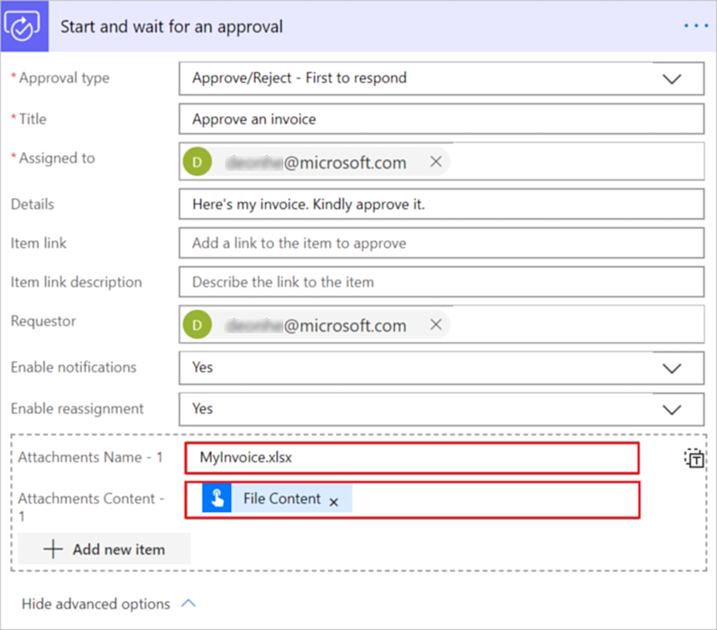

# Create approval flows with attachments

Sometimes, you need to get a file approved for business purposes. Fortunately, you can use Power Automate approvals to do this task. For example, let's say you are an accountant and you want to get approval for an invoice. You could create an instant flow that lets you send the file for approval by tapping a button and selecting the file to send.

In this article, you learn how to create an approval flow that sends an attachment that the approver needs to review before deciding if the request should be approved.

## Create the flow

1. Sign in to [Power Automate](https://make.powerautomate.com).

1. Select **My flows** > **New** > **Instant-from blank**.

1. Name your cloud flow > search for, and then select **Manually trigger a cloud flow**, and then select **Create**.

1. Select the **Manually trigger a cloud flow** trigger > **Add an input** > **File**.

     The previous steps configure your flow so that when it runs, it requests a file from the user to trigger your flow.

1. Select **New step**.

1. Search for **Approvals** and then select **Start and wait for an approval**.

1. Select **Approve/reject - First to respond** in the **Approval type** list of the **Start and wait for an approval** card.

1. Provide the following information on the **Start and wait for an approval** card:

   - **Title** - This is a short description that tells the approver what the request is about.
   - **Assigned to** - The person to whom the request is sent.
   - **Details** - This text shows up in the approval request.

1. Select **Show advanced options** to reveal the fields in which you'll provide information about the file attached to the request.

1. Provide a file name in **Attachments Name - 1**

    Include the file extension that matches the file type that's uploaded.

1. in the **Attachments Content - 1** field, provide the contents for the file that will be sent to the approver.

    > [!NOTE]
    > The file content needs to be binary encoded. In most cases, this is handled correctly within the flow. However, if the attachement appears to be corrupted in the email, check to make sure the file content is binary encoded.

    An easy way to do this is to use the **File Content** item from the list of dynamic content that appears when you select the **Attachments Content - 1** field.

     

1. Select **Save** to save your flow.

## Test your flow

You can test your flow by selecting **Test** and then uploading an .xlsx file.

1. Select **Test**.

1. Select **I'll perform the trigger action**.

1. To start the test, select **Test** > **Continue**.

1. Select **Import**.

1. Find the file, select it, and then select **Open** to upload the file or image you're sending for approval.

1. Select **Run flow**.

   The test run starts.

1. To monitor the status of the test, select **Flow Runs Page**.

## Approve the request

The person to whom you send the approval request receives an email where they can view the attachment and then approve or reject the request.

Approvers can also review requests in the approvals center.

## Add a condition to an approval flow

In most approval flows, you'd want to notify the person who requests the approval of the decision. To learn how to add a condition to an approval flow to take specific actions based on the outcome of the request, go to [Create and test an approval workflow](modern-approvals.md#add-an-email-action-for-approvals).

[!INCLUDE[footer-include](includes/footer-banner.md)]
