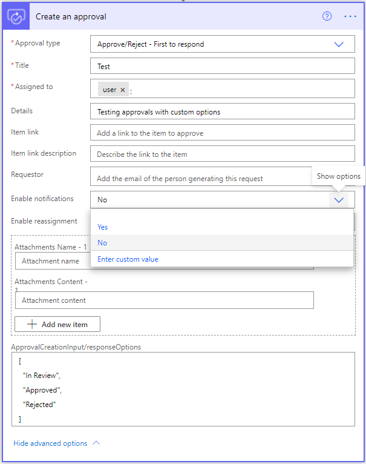

# Known issues

## Work with guest users

If you assign a guest user to an approval, that user can't view or act on the approval by default. The guest user must be assigned a valid Power Automate license (per user license or Microsoft 365-based user license) to view or respond to the approval.
  
## Adaptive cards mismatch in Microsoft Teams

There are multiple ways in which you can notify an approver when a flow runs. By default, all flows that handle approvals send an email notification. You can also send an adaptive card with the approval to users in Microsoft Teams. If the approver responds through the email notification or through the approval action center, the card in Microsoft Teams won't auto-update. This can lead to situations where there's a mismatch between the status shown on the adaptive card and that of the flow.

To avoid this, you can disable the default notification email sent to the user as part of approval creation.

## Abandoned approvals in the approval action center

As part of the flow, you can send an approval request to a user and wait for a response. An approval flow can wait for 28 days. If the wait time exceeds 28 days, that flow fails. This only impacts the flow itself, meaning that the approval continues to exist in the action center. This can lead to cases where there are abandoned approvals in the approval action center that have no flow waiting on them. The requestor or environment admin then needs to manually delete these approvals from the action center.

## Anchors

Anchor links aren't supported. Unexpected results occur if you use anchors.

## Data templating

Data templating isn't fully supported for adaptive cards in Power Automate. As a workaround, use actions like compose, filter, select, and apply to each to manually construct the card within your flows.

## Approvals with custom responses set to Everyone must approve

Approvals that rely on custom responses can fail if they're sent to many users with the type set to **Everyone must approve**. This failure is due to data size limitations of the results field.

## Update a Power Apps (V2) trigger to invoker connection

The Power Apps (V2) trigger supports both embedded and invoker connections. When you update the connections in your Power Apps (V2) trigger to invoker connections, you must refresh or remove and re-add the flow in the app and save the app.

To learn more, go to [Known issues with Power Apps (V2) trigger](/troubleshoot/power-platform/power-automate/known-issues-power-apps-v2-trigger).

## Split create and wait actions

It's possible to create flows with the approval connector where you use the *Create an approval* and *Wait for an approval* as independent actions. If a user immediately responds to an approval request before the flow reaches the wait action, it's possible for the flow to become stuck in the wait stage. To avoid getting the flow stuck, ensure that the create and wait actions are called close together within the flow. Alternately, change the status of the approval in Dataverse before you call the wait action.

## Use approval outcomes in loops

When you use approvals with *do until* loops, users need to account for all possible outcomes of a flow. If not, the flows could be stuck in infinite loops. For *basic* and *await all approvals*, the final states can be **Approved**, **Rejected**, or **Canceled**. Custom approvals are based on what the user chooses to have as the options for the approval. Use a condition or switch statement with approval flow instead of *do until* loops.

## View details of an approval

To view details of an approval, select an individual approval to open it. Formerly, you could also view the details in the **Details** column on the **Received** tab of the Approvals list view, but this column is now removed.

## Issues with email notifications

Here's an explanation of the process for sending an approval email notification, and a description of the possible email notification statuses and troubleshooting.

Sending approval email notifications is a two-step process:

1. Power Automate places a request for the email to be sent.
1. The email goes into a queue.

### Reply to an approval email

When you reply to an approval email notification, you must add your intended recipient(s) to the **To:** line. Previously, the person who sent you the approval request would be automatically added to the **To:** line when you selected **Reply**, but now it must be done manually.

### Email status definitions

Status|Description
------|------------
Pending|Power Automate is requesting that the notification is sent.
Requested| Power Automate successfully placed the request for the notification to be sent, but the request is still being processed.
Sent| The email notification was correctly sent.
Failed| The email notification was correctly placed in the queue, but there was an error sending it.

### Missing emails

If the status of your email notification is **Sent** but you don't see the email notification, try the following options:

- Refresh your inbox and verify that you have an active Internet connection.
- Confirm that the email address is correct for the intended recipient.
- Review your email settings and verify if there are any filters or blocked addresses that may prevent you from seeing the notification.
- Check your spam or promotions folder.

### Troubleshoot failed requests

If the status of your email notification is **Failed**, you can try the following options:

- Make another request to the same recipients.
- Raise a ticket to Microsoft Support, detailing the issue.
