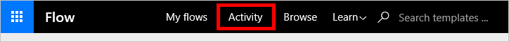

<properties
    pageTitle="Billing and Metering Questions | Microsoft Flow"
    description="Answers to frequently asked questions regarding billing and metering in Microsoft Flow"
    services=""
    suite="flow"
    documentationCenter="na"
    authors="camsoper"
    manager="aftowen"
    editor=""
    tags=""/>

<tags
   ms.service="flow"
   ms.devlang="na"
   ms.topic="article"
   ms.tgt_pltfrm="na"
   ms.workload="na"
   ms.date="10/21/2016"
   ms.author="casoper"/>

# Billing and metering questions

This article answers frequently asked questions regarding billing and metering in Microsoft Flow.

## Where can I find out what pricing plans are available?

Pricing information for Microsoft Flow can be found [here](https://flow.microsoft.com/pricing/).

## Where can I find out what my plan is?

Information about your current plan can be found [here](https://flow.microsoft.com/pricing/).

## How do I switch plans?

You can switch plans by clicking **Learn** in the top navigation menu and then selecting **Pricing**.

## How do I know how much I've used?

Logs of your runs, along with notifications and failures, can be found by clicking **Activity**.

Additionally, if you are on a free plan or a trial plan, your current usage against your plan can be found by clicking the **Settings** menu in the top navigation bar.   

For customers with plans other than free or trial runs are pooled across all users in the company. We are currently working on features to expose available quota and usage across the company.

## What happens if my usage exceeds the limits?

Microsoft Flow may start throttling any runs triggered after your usage exceeds the limits of your plan.

## Where can I find more information regarding the usage limits?
Please check the **FAQ** section on the [pricing page](https://flow.microsoft.com/pricing/).

## What happens if I try to execute runs too frequently? 

Runs are queued until they are able to be executed according to your plan.  For example, if you are on the free plan, your flows may only be run every 15 minutes.  Flows triggered more frequently than that will queue until the current 15-minute period expires, at which time all queued flows will run.  Checks for new data do not count as runs.

## What counts as a run?

Whenever a flow is triggered, whether by an automatic trigger or by manually starting it, this is considered a run.

## Are there differences between Microsoft Accounts and work or school accounts for billing?

Yes. If you sign in with a Microsoft Account (such as accounts that end in @outlook.com or @gmail.com), then you will only be able to use the free plan. To take advantage of the features of the paid plan, you will need to sign in with a work or school email ID.

## I'm trying to upgrade, but I'm told my account is not eligible

To updgrade, you must use your work or school account. If you do not have an email from your work or school that you can use then you can create a new Office 365 trial following the instructions in this [Power BI article](https://powerbi.microsoft.com/documentation/powerbi-admin-signing-up-for-power-bi-with-a-new-office-365-trial/).

## Why did I run out of runs when my flow only ran a few times?

Certain flows may run more frequently than you expect. For example, a flow that sends you a push notification when your manager emails you will run every time you get a new email. This is because there is a condition inside the flow to check if your manager sent it -- but even if this condition isn't met the flow is still counted as ran.

You can work around this issue by putting all the filtering you need into the trigger. In the example above, expand the Advanced Options menu and specify your manager's email address in the From field.

## Other limits and caveats

- Microsoft Flow accounts may have up to 50 flows each.
- Microsoft Flow accounts may have up to 15 custom APIs.
- Microsoft Flow accounts may have up to 20 connections per API and 100 connections total.
- Gateways can be installed onlyn in the default environment.   
- Certain external connectors, such as Twitter, implement connection throttling to control quality of service.  When throttling is in effect, your flows will fail.  You can see the details of this throttling by clicking on the flow run history and selecting that failed run.
