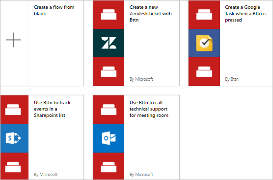
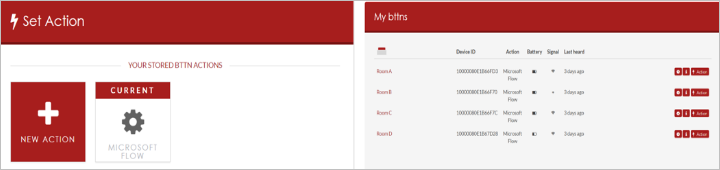
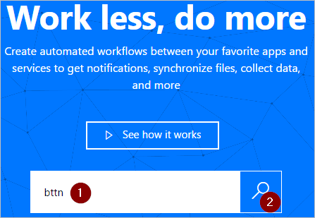
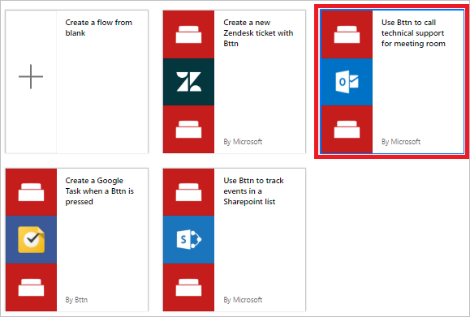
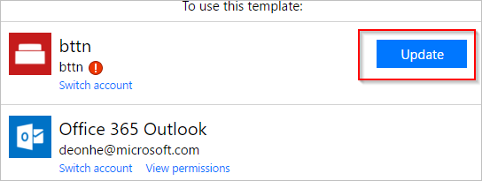
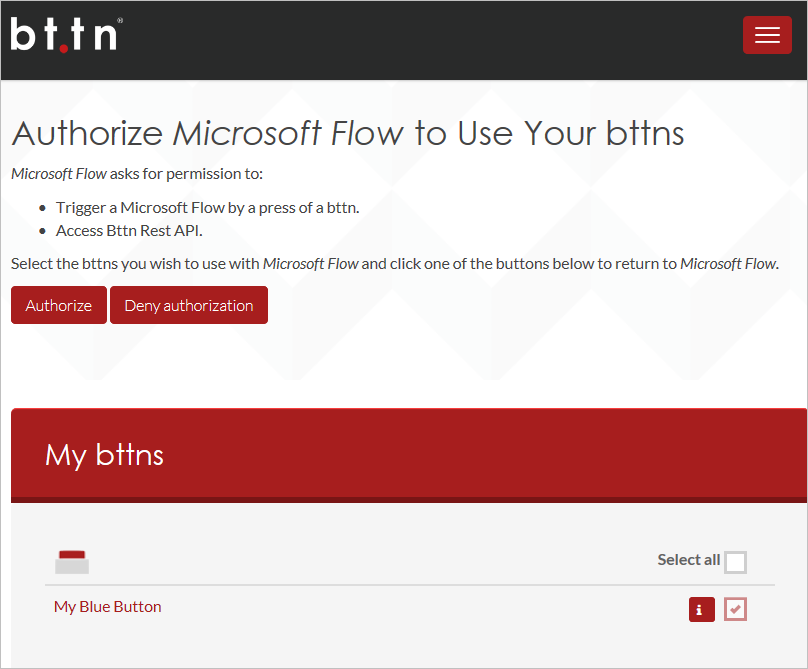
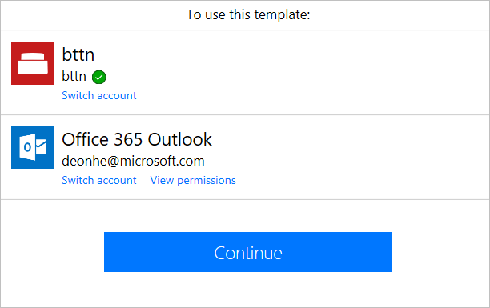
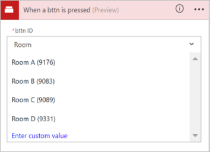
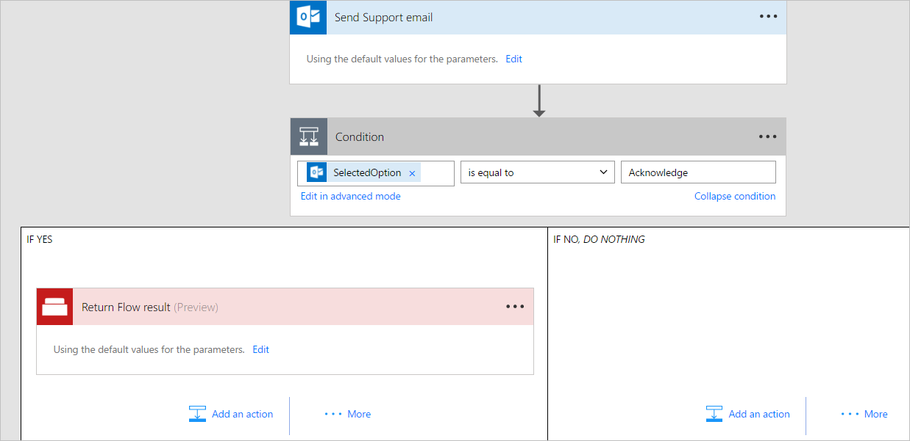
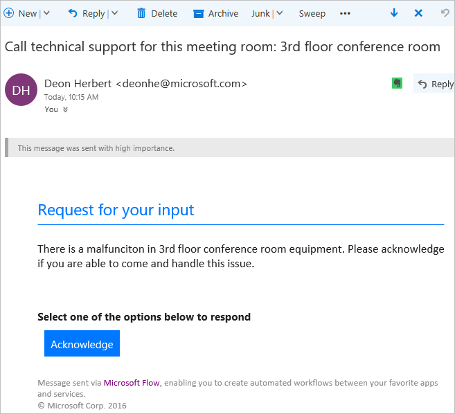

# Run your flows with bttns from The Button Corporation (preview)

Trigger your flows by pressing a bttn (a physical button made by [The Button Corporation](https://my.bt.tn/)). For example, you can press a bttn that triggers a cloud flow to perform these tasks:

* contacts your helpdesk with location information
* sends an email to your team
* blocks your calendar
* reorders supplies

> [!IMPORTANT]
> You must [register](https://my.bt.tn/) your bttn before you can use it in a cloud flow.
> 
> [!TIP]
> Configure all bttn properties such as name, location, and email address on the [bttn website](https://my.bt.tn/) before you create your flow.

## Prerequisites

* Access to [Power Automate](https://make.powerautomate.com)

* At least one [registered bttn](https://my.bt.tn/)

## Create a cloud flow that's triggered from a bttn
In this walkthrough, we use a helpdesk template to create a cloud flow that you can trigger with a single press of a [bttn](https://my.bt.tn/). When the flow runs, it generates a support request and then sends it to the helpdesk. The support request provides the helpdesk with the location of the room where help is needed. This walkthrough demonstrates how to create this flow from a template, but you can use the blank template, which gives you full control over all aspects of your flow.

You can use any of these templates to quickly create flows for your bttn and connect to Zendesk, Google, and SharePoint, among others:

Tip: For the purposes of this walkthrough, give your bttn a name that represents a conference room in a typical office building.

The settings for your bttn should resemble this example (from the bttn website):

Now that you've registered and configured your bttn, let's get started creating our flow.

### Sign in and select a template
1. Sign into [Power Automate](https://make.powerautomate.com).
   
    
   
    Note: As an alternative, you can create flows in the Power Automate mobile app for [Android](https://aka.ms/flowmobiledocsandroid), [iOS](https://aka.ms/flowmobiledocsios), or [Windows Phone](https://aka.ms/flowmobilewindows).
2. Enter **bttn** into the search box, and then select the search icon.
   
    
   
    After you select the search icon, all templates that you can use with bttns appear.
3. Select the **Use Bttn to call technical support for meeting room** template.
   
    

### Authorize Power Automate to connect to your bttn
1. If prompted, sign into the bttn and the Office 365 Outlook services, which will enable the **Continue** button.
   
    
2. When you sign into the bttn service, authorize Power Automate to use your bttns.
   
    **Important**: If you don't authorize Power Automate to use your bttns, you can't see or connect to them from Power Automate.
   
    
3. After you sign into both services, select **Continue**.
   
    

### Select the bttn that triggers the flow
1. In the **When a bttn is pressed** card, open the list of bttn IDs, and then select the bttn that you want to use.
   
    
   
    Your flow should now resemble this example.
   
    
2. Give your flow a name, and then select **Create flow** to save it.
   
    

## Test your flow and confirm results
1. Press the button on your bttn.
2. View your flow's run history to confirm that it ran successfully.
   
    You can check run history on the Power Automate website or on your mobile device.
   
    Note: The run status is set to **running** until someone selects **Acknowledge** in the support-request email.
3. You can also confirm that the email was sent to the support team.
   
    If you've followed along, the support email looks similar to this example:
   
    

## Troubleshooting

* If your flow wasn't triggered, sign into The Button Corporation's site and confirm whether the button activity (presses) are being recorded.

* You can also drill into the run activity on the Power Automate site and check for error messages.

[!INCLUDE[footer-include](includes/footer-banner.md)]
