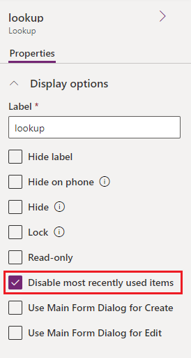

# Business process flows overview

You can help ensure that people enter data consistently and follow the same steps every time they work with a customer by creating a business process flow. For example, you might want to create a business process flow to have everyone handle customer service requests the same way, or to require that people get approval for an invoice before submitting an order. Business process flows use the same underlying technology as other processes, but the capabilities that they provide are different from other features that use processes. To learn how to create or edit a business process flow, go to [Create a business process flow](create-business-process-flow.md).  
  
 [Watch a short video about business process flows.](https://go.microsoft.com/fwlink/p/?linkid=842226)  
  
## Why business process flows are used
  
Business process flows provide a guide for people to get work done. They provide a streamlined user experience that leads people through the processes their organization defines for interactions that need to be advanced to a conclusion of some kind. This user experience can be tailored so that people with different security roles can have an experience that best suits the work they do.  
  
 Use business process flows to define a set of steps for people to follow to take them to a desired outcome. These steps provide a visual indicator that tells people where they are in the business process. Business process flows reduce the need for training because new users don’t have to focus on which table they should be using. They can let the process guide them. You can configure business process flows to support common sales methodologies that can help your sales groups achieve better results. For service groups, business process flows can help new staff get up-to-speed more quickly and avoid mistakes that could result in unsatisfied customers.  
  
## What business process flows can do

 With business process flows, you define a set of *stages* and *steps* that are then displayed in a control at the top of the form.  

:::image type="content" source="media/business-process-stages.png" alt-text="Business process with stages" lightbox="media/business-process-stages.png":::
  
Each stage contains a group of steps. Each step represents a column where data can be entered. You can advance to the next stage by using the **Next Stage** button. In model-driven apps, you can work with a business process flow stage inside the stage flyout or you can pin it to the side pane. Business process flows don't support expanding the stage flyout to the side pane on mobile devices.

You can make a step *required* so that people must enter data for a corresponding column before they can proceed to the next stage. This is commonly called "stage-gating." If you're adding a business-required or system-required column to a business process flow stage, we recommend that you add this column to your form as well. 
  
Business process flows appear relatively simple compared to other types of processes because they don't provide any conditional business logic or automation beyond providing the streamlined experience for data entry and controlling entry into stages. However, when you combine them with other processes and customizations, they can play an important role in saving people time, reducing training costs, and increasing user adoption.  

> [!NOTE]
> If any stage, including the current stage, has required columns (except hidden columns), you must fill in the columns on those stages *before* you save the form or move to a new stage. Disabled columns will still block stage navigation if they are empty and required. Required steps bound to a Two Option (Yes/No) column must have **Yes** (true) as their value, otherwise they are considered empty and block stage navigation. Note that this behavior is different than how business required fields are handled on a form, where **No** is not considered an empty value.

### Business process flows integrated with other customizations

 When you or your user enters data using business process flows, the data changes are also applied to form columns so that any automation provided by business rules or form scripts can be applied immediately. Steps can be added that set values for columns that aren't present in the form and these columns are added to the `Xrm.Page` object model used for form scripts. Any workflows that are initiated by changes to columns included in a business process flow are applied when the data in the form is saved. If the automation is applied by a real-time workflow, the changes are immediately visible to the user when the data in the form is refreshed after the row is saved.  
  
 Although the business process flow control in the form doesn't provide any direct client-side programmability, changes applied by business rules or form scripts are automatically applied to business process flow controls. If you hide a column on a form, that column is also hidden in the business process flow control. If you set a value by using business rules or form scripts, that value is set within the business process flow.  
  
### Concurrent process flows
  
Concurrent business process flows let customizers configure multiple business processes and associate them with the same starting row. Users can switch between multiple business processes running concurrently, and resume their work at the stage in the process that they were on.  
  
### System business process flows
  
When your Power Platform environment has the **Enable Dynamics 365 apps** setting on, the following business process flows are included. To understand how business process flows work, review these system business process flows:  
  
- Lead to Opportunity Sales Process
- Phone to Case Process
- Sales Process  
  
## Multiple tables in business process flows

You can use a business process flow for a single table or span multiple tables. For example, you can have a process that begins with an opportunity, then continues to a quote, an order, and then an invoice, before finally returning to close the opportunity.  
  
You can design business process flows that tie together the rows for up to five different tables into a single process so that people using the app can focus on the flow of their process rather than on which table they're working in. They can more easily navigate between related table rows.  
  
## Multiple business process flows are available per table

Not every user in an organization follows the same process and different conditions might require that a different process be applied. You can have up to 10 active business process flows per table to provide appropriate processes for different situations.  
  
### Control which business process flow is applied

You can associate business process flows with security roles so that only people with those security roles can view or use them. You can also set the order of the business process flows so that you can control which business process flow is set by default. This works in the same way that multiple forms for a table are defined.  
  
When someone creates a new table row, the list of available active business process definition is filtered by the user’s security role. The first activated business process definition available for the user’s security role according to the process order list is the one applied by default. If more than one active business process definitions are available, users can load another from the **Switch Process** dialog. Whenever processes are switched, the one currently rendered goes to the background and is replaced by the selected one, but it maintains its state and can be switched back. Each row can have multiple process instances associated (each for a different business process flow definition, up to a total of 10). On form load, only one business process flow is rendered. When any user applies a different process, that process can only load by default for that particular user.  
  
To make sure a business process is loaded by default for all users (behavior equivalent to "pinning" the process), a custom client API script (web resource) can be added on form load that specifically loads an existing business process instance based on the business process definition ID.

## Business process flow considerations

 You can define business process flows only for those tables that support them. You also need to be aware of the limits for the number of processes, stages, and steps that can be added.  
  
### Business process flows that call a workflow

 You can call on-demand workflows from inside a business process flow. You configure this from the business process flow designer by dragging a workflow component to a process stage or to the **Global Workflows** section.  
  
 When you include a workflow that you want to trigger on **Stage Exit** of a stage in your business process flow, and that stage is  the last stage in the flow, the designer gives the impression that the workflow is triggered when that stage is completed. However, the workflow isn't triggered because a stage transition doesn't take place. You don't receive a warning or error preventing you from including the workflow on the stage. When a user interacts with the business process flow, finishing or abandoning the process doesn't result in a stage transition, and therefore the workflow isn't triggered. Consider the following examples:  
  
- You create a business process flow with two stages. S1 connects to S2, with a workflow on stage S2 and sets the trigger to **Stage Exit**.  
  
- You create a business process flow with three stages, S1 connect to S2, then S2 branches to S3. You include a workflow on S2 and set the trigger to **Stage Exit**.  
  
The workflow doesn't trigger in either case. To work around this issue, add a global workflow and add the workflow you want to trigger to it so that the workflow is triggered for the business process rather than a stage of the process. You can set the trigger for a global workflow to **Process Abandoned** or **Process Completed** to cause the workflow to trigger when a user abandons or completes the business process.  
  
### Tables that can use business process flows

All custom tables can use business process flows. The following standard tables can also use business process flows. Some tables require a Dynamics 365 app, such as Dynamics 365 for Sales or Dynamics 365 for Customer Service.  
  
- Account  
- Appointment  
- Campaign  
- Campaign Activity  
- Campaign Response  
- Competitor  
- Contact  
- Email  
- Entitlement  
- Fax  
- Case  
- Invoice  
- Lead  
- Letter  
- Marketing List  
- Opportunity  
- Phone Call  
- Product  
- Price List Item  
- Quote  
- Recurring Appointment  
- Sales Literature  
- Social Activity  
- Order  
- User  
- Task  
- Team  

To enable a custom table for business process flows, select the **Business process flows (columns will be created)** check box in the table definition. You can’t undo this action.  
  
> [!NOTE]
> If you navigate to the business process flow stage that contains the `Social Activity` table and choose the **Next Stage** button, you’ll see the **Create** option. When you choose **Create**, the **Social Activity** form loads. However, because `Social Activity` isn’t valid for `Create` from the app user interface, you won’t be able to save the form and you’ll see the error message: “Unexpected error.”  

### Maximum number of processes, stages, and steps

To ensure acceptable performance and the usability of the user interface, there are some limitations you should be aware of when you use business process flows:  
  
- There can be no more than 10 activated business process flow processes per table.  
- Each process can contain no more than 30 stages.  
- Multi-table processes can contain no more than five tables.
  
## Business process flow table customization support

Business process flow tables can appear in the system so that table row data can be made available in grids, views, charts, and dashboards.

### Use business process flow table rows with grids, views, charts, and dashboards

With business process flows available as a table, you can use advanced finds, views, charts, and dashboards sourced from business process flow data for a given table, such as a lead or opportunity. System administrators and customizers can create custom business process flow grids, views, charts, and dashboards similar to those created with any other table.

To access a default business process flow view, go to [Power Apps](https://make.powerapps.com), select **Solutions**, open the solution you want, select **Objects** > **Tables**, and open the process table that you want, such as **Lead To Opportunity Sales Process** table. Select **Views**, and then select the view that you want.

Several default views are available that you can view as a chart, such as the **Active Opportunity Sales Process** view.

### Interact with the business process flow table from a workflow

You can also interact with business process flow tables from a workflow. For example, you can create a workflow for the **Business Process Flow** table row to change the **Active Stage** when a column on the **Opportunity** table row is updated. For more information about how to do this, go to [Automate business process flow stages using workflows](https://blogs.msdn.microsoft.com/crminthefield/2017/12/18/automate-business-process-flow-stages-using-workflows).

### Run business process flows offline

You can use business process flows offline if the following conditions are met:

- The business process flow is used from a Power Apps app.
- The Power Apps app is enabled for offline use.
- The business process flow has a single table.

Specifically, the three commands that are available for a business process flow when the Power Apps app is offline are:

- Next stage
- Previous stage
- Set Active stage

### Lookup column in a business process flow stage

Recent rows are visible in a lookup column for a model-driven app. To prevent the most recently used items from showing up in the lookup, follow these steps:

1. While in the form designer with a table form for a table used in a business process flow, select your lookup column data step from the **Tree view** on the left navigation pane.
1. Check **Disable most recently used items**.

   

1. Save and then publish.

### Limitations of using business process flow tables

- Currently, you can’t create custom forms for tables based on a business process flow.

- If a solution includes a business process flow table, the business process flow table must be manually added to the solution before you export it. Otherwise, the business process flow table won't be included in the solution package. To learn more, go to [create and edit tables](/power-apps/maker/data-platform/create-edit-entities-solution-explorer).

- Adding the process table to a model-driven app might result in limited functionality. To learn more, go to [creating and editing business process flows](./create-business-process-flow.md). 

- The name of a business process flow doesn't change after the flow is created for a form. If you change the name in the business process flow definition, new business process flows display the updated name, but older ones display the original name. The name doesn't translate after it's set. If the flow creator's language settings was set to Spanish when the business process flow instance was created, the name will be in Spanish for all users, even if the flow creator changed their language later.

## Related information

- [Get started with Power Apps](/power-apps/maker/canvas-apps/intro-maker-portal)
- [Get started with Power Apps](/power-apps/maker/canvas-apps/intro-maker-portal) 
- [Whitepaper: Process Enablement with Dynamics 365](https://download.microsoft.com/download/C/3/B/C3B46E35-9445-43B9-800B-474E022EE352/Process%20Enablement%20with%20Microsoft%20Dynamics%20CRM%202013.pdf) 

[!INCLUDE[footer-include](includes/footer-banner.md)]
