# Introducing button flows with user input

Create a button flow to run routine tasks by simply tapping a button. Customize your flow by allowing the user to provide specific details that will be used when the flow runs. This topic walks you through creating a button flow that takes input from the user and then running the button flow, highlighting how to provide the user input.

You can create a button flow in the Power Automate website or the mobile app for Power Automate. For this topic, you'll use the website.

### Prerequisites
* An account on the Power Automate website.

## Open the template
1. Sign in to the [Power Automate website](https://flow.microsoft.com), enter **Visual Studio** in the search box, and then click or tap the search icon to find all templates that relate to Visual Studio:
   
    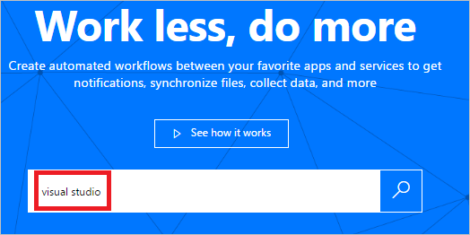  
2. Select the **Open a Priority 2 Bug in Visual Studio** template:
   
    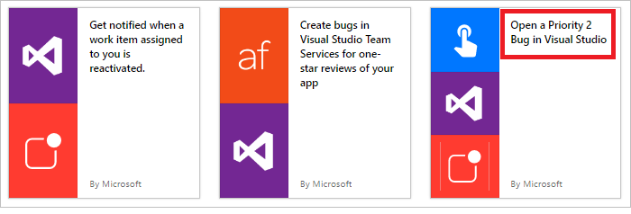  
3. Select **Use this template** button:
   
    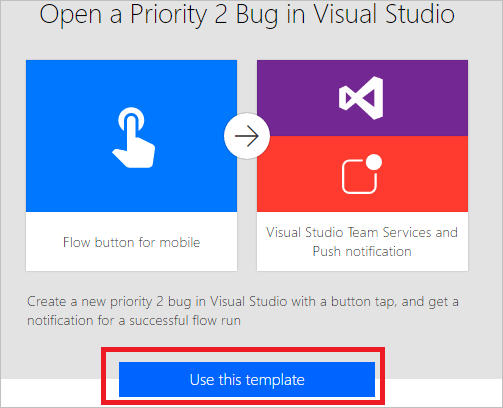  
   
    This template uses the Visual Studio Team Services (VSTS) and the Push notification services. You'll need to sign into these services if you don't have a connection to either of them. The **Sign in** button will appear only if you need to sign into a service.
4. After you sign into all required services, select the **Continue** button:
   
      
5. (optional) Change the name of the flow by typing a name of your choice into the box at the top of the portal:
   
    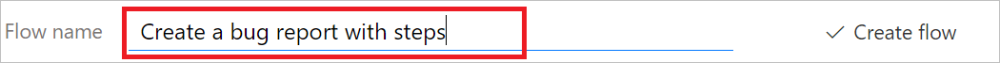

## Customize the user input
1. In the trigger card, select **Edit**:
   
      
2. Select the **+** icon to expand the page so that you can add custom input fields:
   
    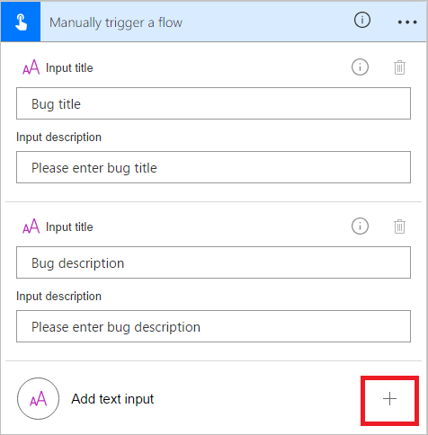
3. Enter the **Input title** and **Input description** for each custom field that you want to make available when someone runs your flow.  
   
    In this example, you'll create two custom input fields (**Bug repro steps** and **Bug severity**) so that anyone who uses this flow can enter the steps to reproduce the bug and rate the bug's severity:  
   
    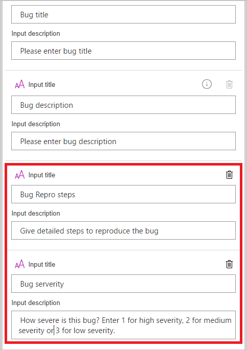

## Customize the bug
1. Tap the **Create a new work item** card's title bar:
   
      
2. Make the selections that are appropriate for your VSTS environment, and then select **Edit**:
   
    For example, connect to myinstance.visualstudio.com by typing **myinstance**.
   
    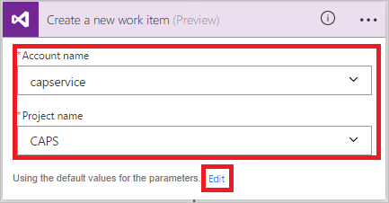  
3. Select **Show advanced options** to reveal the other fields for this card:
   
      
4. Place the cursor before the **Bug title** token, and then enter "Severity: " into the **Title** text field.
5. With the cursor still in the title text field, select the **Bug severity** token, and then enter " -- ".  
6. In the **Description** text field, place your cursor just after the **Bug description** token, and then press Enter to start a new line.
7. Place your cursor on the new line, and then select the **Bug Repro steps** token:
   
    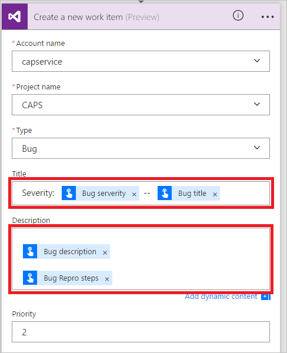

## Customize the push notification
1. Tap the title bar on the **Send a push notification** card to expand it.
2. In the list of dynamic content tokens, select **See more**, and then add the **URL** token in the **Link** text field.
3. In the **Link label** text field, add the **Id** token:
   
    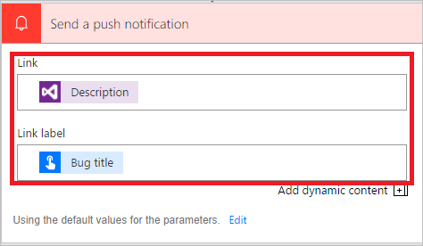  
4. Tap **Create flow** on the menu to create your flow:
    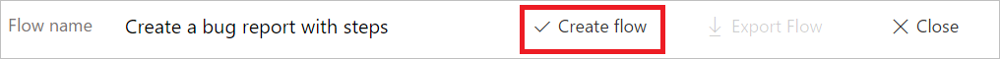  

## Run your flow
In this walk-through, you'll use the mobile app for Power Automate to run the button flow you just created. You'll provide all the user input that's needed to create a bug with a title, a description, repro steps, and a severity level.  

1. In the mobile app for Power Automate, tap the **Buttons** tab, and then tap the **Create bug report with steps** button.
   
    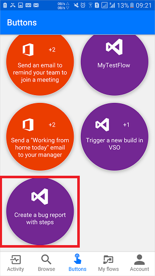  
2. Enter the title for the bug you are reporting, and then tap **Next**. For example:
   
    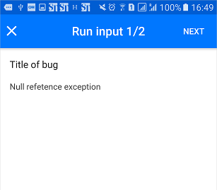  
3. Enter the description of the bug you are reporting, and then tap **Next**. For example:
   
    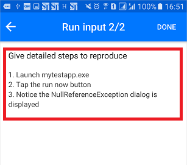  
4. Enter the steps to reproduce the bug you are reporting, and then tap **Next**. For example:
   
    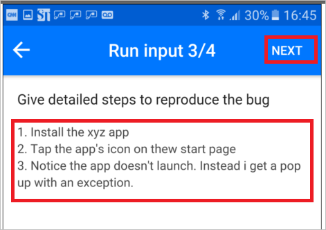  
5. Enter the severity of the bug you are reporting, and then tap **Done**:  
    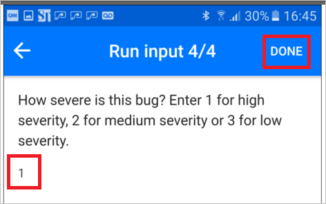  
   
    The flow runs.
6. (optional) Tap the **Activity** tab to show the results.
   
    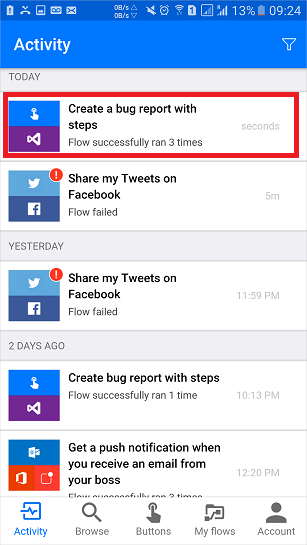  
7. (optional) Show the detailed results of the flow's run by tapping the **Create a new work item** step.
   
    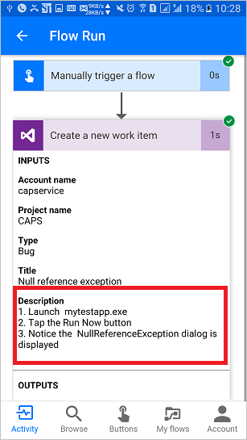

## Use different input types

Your button flows can also accept rich data types. Here's the list of data input types that button flows accept: 

- Text
- Drop-downs (like radio buttons)
- Email address
- File (for example, a photo on your phone)
- Yes or No check box
- Number
- Date (with a calendar picker)

To use these input types, add the **Manually trigger a cloud flow** trigger, and then add any of these types to your flow:

Additionally, you might want to designate some inputs as required and others as optional. Use the action menu (... at the right side) on each input field. There's a limit of five inputs per button.

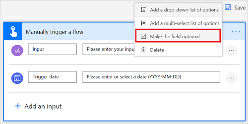

## Next steps
* [Share button flows](share-buttons.md)
* [Learn about button flows](introduction-to-button-flows.md)  
* [Learn about button flows with trigger tokens](introduction-to-button-trigger-tokens.md)  

[!INCLUDE[footer-include](includes/footer-banner.md)]