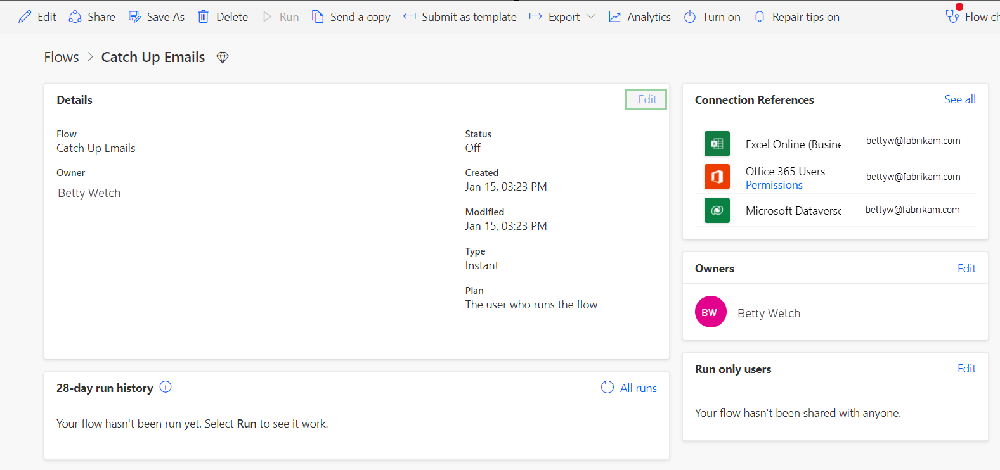
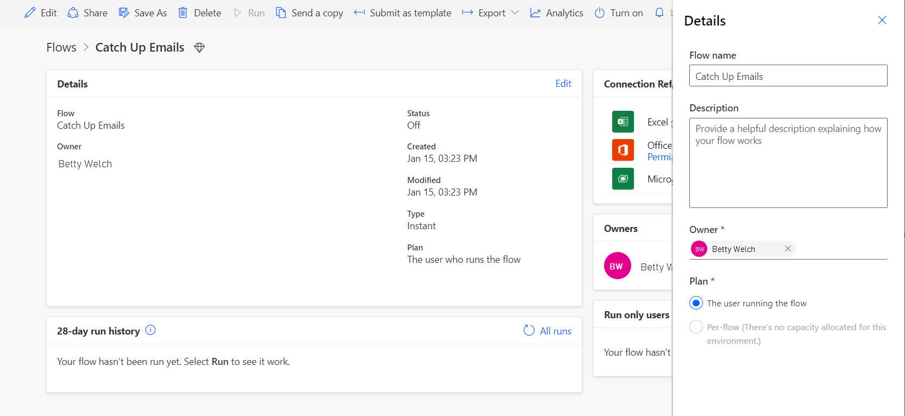
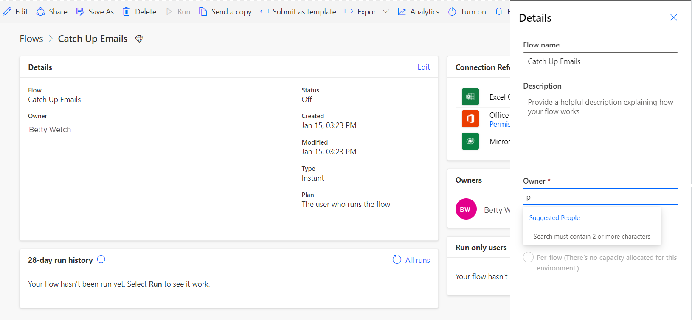
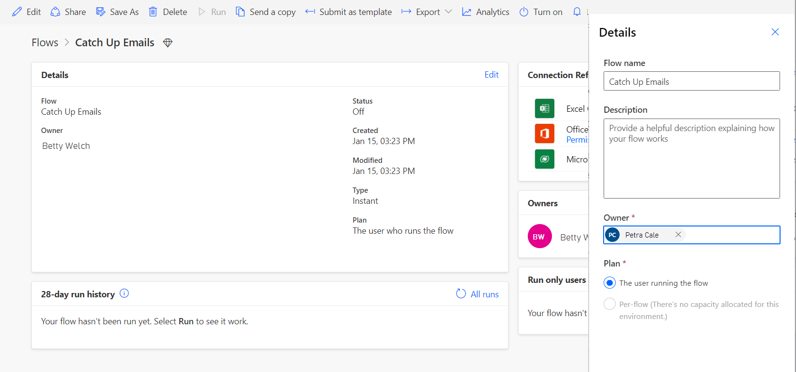
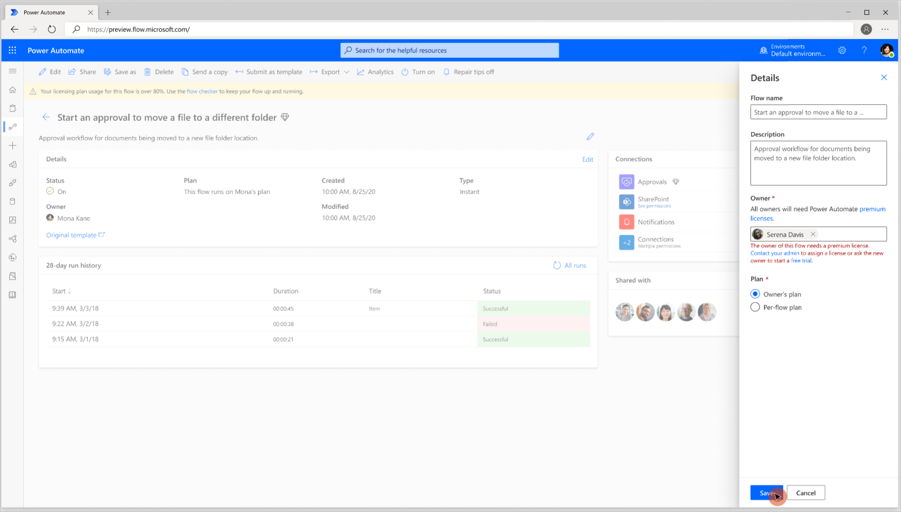
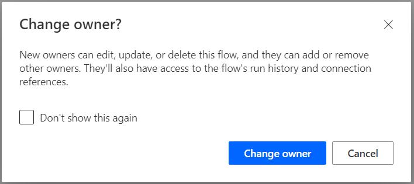
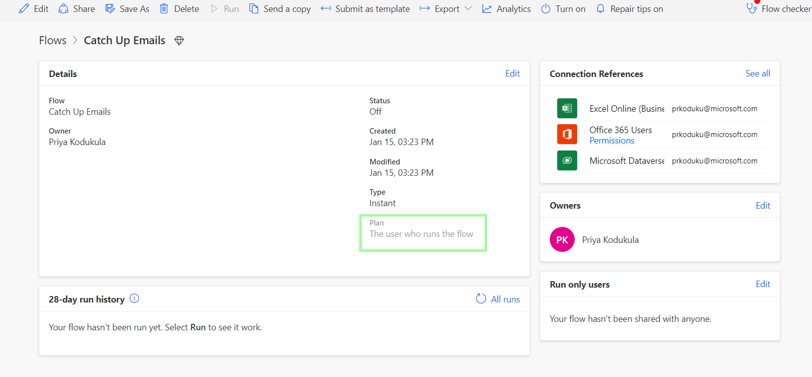
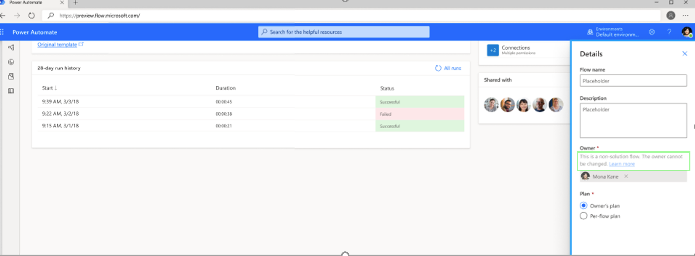

# Change the owner of cloud flow

Owners, co-owners, and admins can change the owner of a solution-aware flow to enable business continuity when the original owner isn't available.

You can change the owner to an individual (not a distribution list) or a service account. Make sure to evaluate if the new owner is properly [licensed](/power-platform/admin/power-automate-licensing/overview).

>[!NOTE]
>You cannot change the owner to a service principal.

Follow these steps to change the owner of a flow.

1. Select **Solutions** in the left navigation bar, and then select the solution that contains the flow you want to change.
1. Select the flow for which you're changing the owner.
1. Select **Edit** on the **Details** section.

   

1. In the **Owner** section, remove the current owner.

   

1. Enter the email address for the new owner.

   

   <!--  -->

   >[!WARNING]
   >If the flow uses premium features but the new owner doesn’t have a premium license, a warning is shown with the next steps.

   

The flow can still be assigned to the new owner. Once assigned, the new owner will have access to the run history, connection references and they can update the flow or reassign to other users.

If the flow is a **scheduled** or **automated** flow, once the owner is changed, the flow runs under the license of the new owner and uses their power platform request limits. This change can take up to 7 days to come into effect. If you need the new owner to take effect immediately, edit the flow and then save it to force the flow use the new owner’s license.

If the flow is a **manual** flow, the flow runs under the license of the user who runs the flow. The plan section shows whose license plan is used by the flow.

>[!NOTE]
>This change is limited to solution-aware flows. To change the owner of a non-solution-aware flow, the new owner must export, and then import the flow.

Check out this [video](https://www.youtube.com/watch?v=K7_xWJvEPUc) to learn how to export and import flows.

<!--  -->
