# Build an approval loop by using Power Automate and Dataverse

[!INCLUDE[cc-data-platform-banner](./includes/cc-data-platform-banner.md)]

Dataverse can give you a way to build flows that have information stored in a database independent of a cloud flow. The best example of this is with approvals. If you store the status of the approval in an table, your flow can work on top of it.

In this example, you'll create an approval process that starts when a user adds a file to Dropbox. When the file is added, information about it appears in an app, where a reviewer can approve or reject the change. When the reviewer approves or rejects the change, notification mail is sent, and rejected files are deleted from Dropbox.

By following the steps in this section, you'll build:

* a **custom table** that will contain information about each file added to Dropbox and whether the file's status is approved, rejected, or pending.
* a **flow** that adds information to the custom table when a file is added to Dropbox, sends mail when the file is approved or rejected, and deletes rejected files. These steps demonstrate how to build such a cloud flow from scratch, but you can create a similar flow from a template.
* an **app** in which a reviewer can approve or reject files added to Dropbox. You'll use Power Apps to generate this app automatically based on the columns in the custom table.

**Prerequisites**

* Sign up for [Power Automate](sign-up-sign-in.md) and [Power Apps](https://powerapps.microsoft.com/tutorials/signup-for-powerapps/).
* Create connections to Dropbox and Office 365 Outlook, as [Manage your connections](https://powerapps.microsoft.com/tutorials/add-manage-connections/) describes.

## Build the table
1. Sign in to [powerapps.com](https://make.powerapps.com).
2. If the left navigation bar doesn't appear by default, click or tap the icon with three horizontal lines in the upper-left corner.
   
    
3. In the left navigation bar, click or tap **Manage**, and then click or tap **Tables**.
   
    
4. If prompted, click or tap **Create my database**.
   
    
5. Near the upper-right corner, click or tap **New table**.
   
    
   
    If your browser window isn't maximized, this button might appear in a different place.
6. Under **Table name**, specify a name that doesn't contain spaces and that no other table in your database has.
   
    To follow this example exactly, specify **ReviewDropboxFiles**.
   
    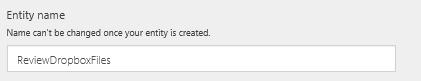
7. Under **Display name**, specify a friendly name.
   
    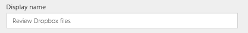
8. Click or tap **Next**.
   
    

## Add columns to the table
1. Near the upper-right corner, click or tap **Add column**.
   
    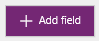
2. In the blank row that appears at the bottom of the list of columns, set the properties of an **Approver** column. (As you set these properties, you can switch to the next column by pressing Tab.)
   
   * In the **Display Name** column, type **Approver**.
   * In the **Name** column, type **ApproverEmail**.
   * In the **Type** column, click or tap the **Email** option.
   * In the **Required** column, select the checkbox.
     
     
3. In the next row, set the properties of a **Status** column:
   
   * In the **Display Name** column, type **Status**.
   * In the **Name** column, type **Status**.
   * In the **Type** column, click or tap the **Text** option.
   * In the **Properties** column, leave the default value.
   * In the **Required** column, select the checkbox.
     
     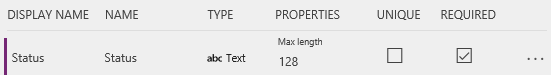
4. In the next row, set the properties of a **FileID** column:
   
   * In the **Display Name** column, type **File identifier**.
   * In the **Name** column, type **FileID**.
   * In the **Type** column, click or tap the **Text** option.
   * In the **Properties** column, leave the default value.
   * In the **Unique** column, select the checkbox.
   * In the **Required** column, select the checkbox.
     
     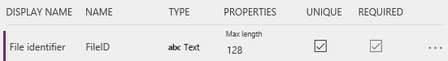
5. Near the right edge, click or tap the ellipsis (...) for the **FileID** column, and then click or tap **Set as Title column**.
   
    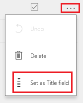
6. Near the lower-left corner, click or tap **Create**.
   
    
7. (optional) When the list of tables reappears, maximize your browser window if it isn't already maximized, and then click or tap the **Type** column header. The list is sorted with the custom tables, such as the one you just created, appearing at the top.

## Sign in and create a cloud flow
1. Open the [Power Automate portal](https://flow.microsoft.com).
2. Maximize your browser window if it isn't already maximized, and then click or tap **Sign in** near the upper-right corner.
   
    
3. In the top right menu you select the environment that you created the database in powerapps.com.
   
    **Note**: if you do not select the same environment then you will not see your table.
4. Near the upper-left corner, click or tap **My flows**.
   
    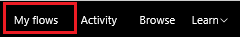
5. Near the upper-right corner, click or tap **Create new flow**.
   
    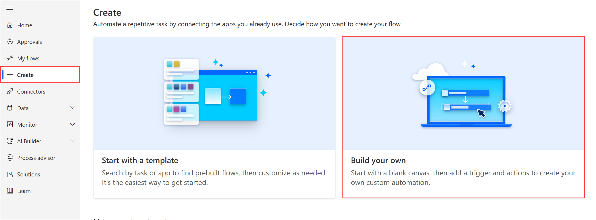

## Start when a file is added
1. In the box that contains **Search for more triggers**, type or paste **Dropbox**, and then click or tap **Dropbox - when a file is created**.
   
    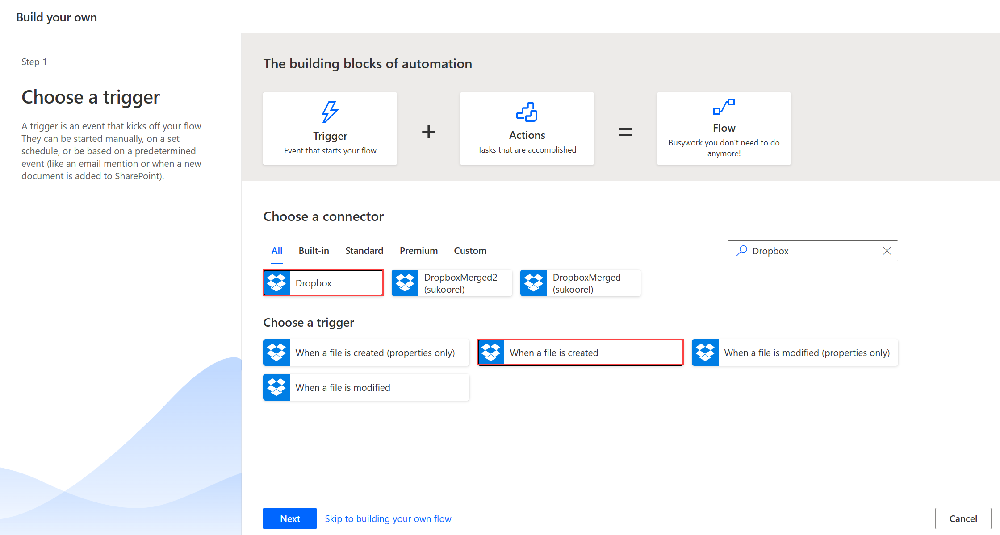
2. Under **Folder**, click or tap the folder icon, and then browse to the folder where files will be added.
   
    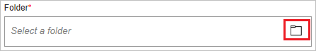

## Add data to the table
1. Click or tap **New step**, and then click or tap **Add an action**.
   
    
2. In the box that contains **Search for more actions**, type or paste **Dataverse**, and then click or tap **Dataverse - Create object**.
   
    
3. Under **The table**, type or paste **Review**, and then click or tap **Review Dropbox files**.
   
    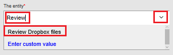
4. Under **Title**, click or tap in the box, and then click or tap **File name** in the list of parameter tokens to add that token to the column.
   
    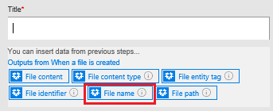
5. Under **Approver**, type or paste the email address of the person who will review the files.
   
    **Note**: To make testing the flow easier, specify your own address. You can change it later, when the flow is ready for actual use.
   
    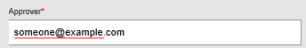
6. Under **Status**, type or paste **Pending**.
   
    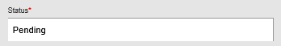
7. Under **File Identifier**, click or tap in the box, and then click or tap **File identifier** in the list of parameter tokens to add that token to the column.
   
    

## Check whether the file has been reviewed
1. Under the **Create object** action, click or tap **New step**, click or tap **More**, and then click or tap **Add a do until**.
   
    
2. In the upper-left corner of the **Do until** action, click or tap in the box that contains **Choose a value**.
   
    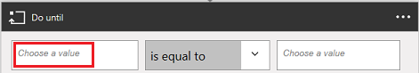
   
    **Note**: If your browser window isn't maximized, click or tap in the upper box that contains **Choose a value**.
3. Under **Outputs from Create object**, click or tap **Status** to add that parameter token to the column.
   
    
4. Open the list near the center of the **Do until** action, and then click or tap **is not equal to**.
   
    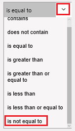
5. In the upper-right corner of the **Do until** action, type or paste **Pending** in the box that contains **Choose a value**.
   
    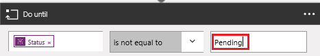
   
    **Note**: If your browser window isn't maximized, click or tap in the lower box that contains **Choose a value**.
6. Near the bottom of the **Do until** action, click or tap **Add an action**.
   
    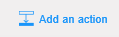
7. In the box that contains **Search for more actions**, type **Dataverse**, and then click or tap **Microsoft Dataverse - Get object**.
   
    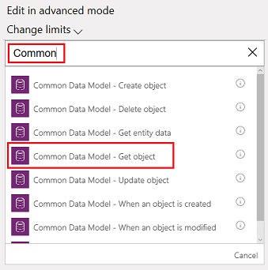
8. Under **The namespace**, click or tap your database.
9. Under **The table**, type or paste **Review**, and then click or tap **Review Dropbox files**.
   
    
10. Under **Object id**, click or tap in the box, and then click or tap the **File identifier** parameter token to add it to the column.
    
     

## Check whether the item has been approved
1. Under the **Do-Until** action, click or tap **New step**, and then click or tap **Add a condition**.
   
    
2. In the upper-left corner of the condition, click or tap in the box that contains **Choose a value**.
   
    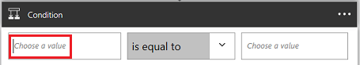
   
    **Note**: If your browser window isn't maximized, click or tap in the upper box that contains **Choose a value**.
3. Under **Outputs from Get object**, click or tap the **Status** parameter token to add it to the column.
   
    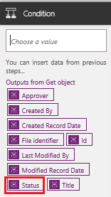
4. In the upper-right corner of the condition, type or paste **Approved** in the box that contains **Choose a value**.
   
    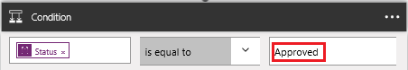
   
    **Note**: If your browser window isn't maximized, type or paste **Approved** in the lower box that contains **Choose a value**.

## Send notification mail
1. Under **If yes, do nothing**, click or tap **Add an action**.
   
    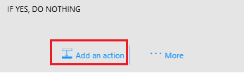
2. In the box that contains **Search for more actions**, type or paste **send mail**, and then click or tap **Office 365 Outlook - Send an email**.
   
    
3. Under **To**, type or paste the address of the person whom you want to notify when an item is accepted.
   
    **Note**: To make testing the flow easier, specify your own address. You can change it when the flow is ready for actual use.
   
    
4. Under **Subject**, click or tap in the box, and then click or tap the **File name** parameter token to add it to the column.
   
    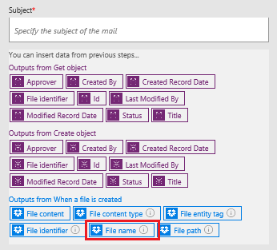
5. Under **Body**, type or paste **The item has been approved.**
   
    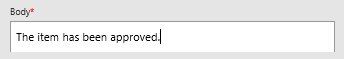
6. Under **If no, do nothing**, repeat steps 1-5 in this procedure except specify the body of the email message as **The item has been rejected.**
   
    

## Delete rejected files
1. Under the fields for the rejection mail, click or tap **Add an action**.
   
    
2. In the box that contains **Search for more actions**, type or paste **Dropbox**, and then click or tap **Dropbox - Delete file**.
   
    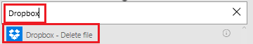
3. Under **File**, click or tap in the box, and then click or tap the **File identifier** token parameter to add it to the column.
   
    

## Save the flow
1. At the top of the screen, type or paste a name for the flow that you're creating, and then click or tap **Create Flow**.
   
    
2. Click or tap **Close** and then click or tap **Done**.
3. In Dropbox, add at least two files to the folder that you specified: one to test approval and one to test rejection.

## Build the app
1. Sign in to [powerapps.com](https://make.powerapps.com), and then click or tap **New app** near the bottom of the left navigation bar.
   
    
2. In the dialog box that appears, click or tap the option to open either Power Apps Studio for Windows or Power Apps Studio for the web.
3. If you opened Power Apps Studio for Windows, click or tap **New** in the left navigation bar.
4. Under **Create an app from your data**, click or tap **Phone layout** in the **Microsoft Dataverse** tile.
   
    
5. In the **Search** box, type or paste **Review**.
   
    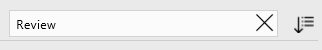
6. Under **Choose an table**, click or tap **Review Dropbox Files**.
   
    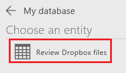
7. Near the lower-right corner, click or tap **Connect**.
   
    
8. If the opening screen of intro tour appears, take the tour to get familiar with Power Apps (or click or tap **Skip**).
   
    
   
    You can always take the tour later by clicking or tapping the question-mark icon near the upper-left corner and then clicking or tapping **Take the intro tour**.
9. (optional) Near the bottom of the screen, drag the slider to increase the zoom so the app is easier to see.
   
    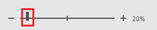

## Customize the app
1. In the right navigation bar, click or tap the layout that includes a header and a description.
   
    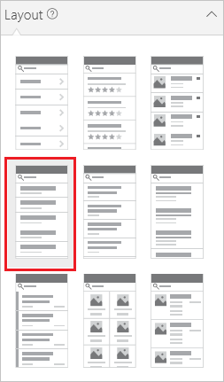
2. On the **BrowseScreen**, click or tap just under the search bar to select the larger text-box control.
   
    
3. In the right-hand pane, open the lower list by clicking or tapping its down arrow.
   
    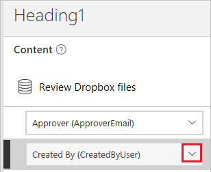
4. In the lower list, click or tap **Title** so show the file name of the added files.
   
    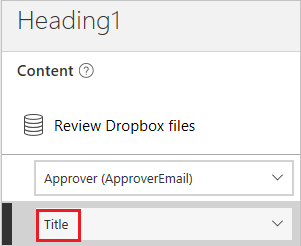
5. In the right-hand pane, open the upper list, and then click or tap **Status** to show the status of each file.
   
    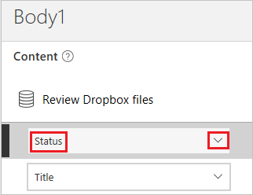

## Test the overall solution
1. In Power Apps, open Preview mode by clicking or tapping the play button near the upper-left corner.
   
    
2. For the first file in the list, click or tap the arrow to show details about that file.
   
    
3. In the upper-right corner, click or tap the pencil icon to change details about the file.
   
    
4. In the **Status** box, type or paste **Approved**.
   
    
5. In the upper-right corner, click or tap the checkmark icon to save your changes and return to the details screen.
   
    
   
    In a few minutes, you'll receive email stating that the file was approved.
6. In the upper-right corner, click or tap the back button to return to the browse screen.
   
    
7. For the other file in the list, click or tap the arrow to show details about that file.
   
    
8. In the upper-right corner, click or tap the pencil icon to change details about the file.
   
    
9. In the **Status** box, type or paste **Rejected** (or anything except **Approved**, including **Aproved** or **Approoved**).
   
    
10. In the upper-right corner, click or tap the checkmark icon to save your changes and return to the details screen.
    
     
    
     In a few minutes, you'll receive email stating that the file was rejected, and the file will be deleted from Dropbox.

[!INCLUDE[footer-include](includes/footer-banner.md)]