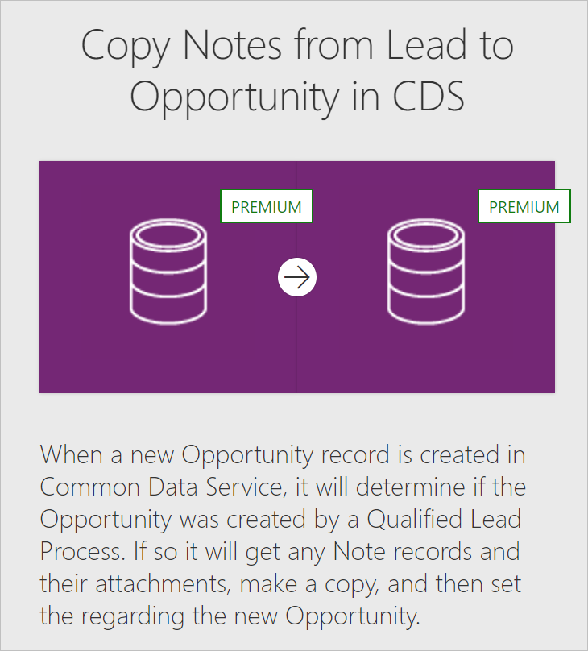
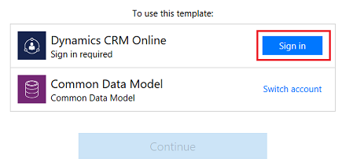
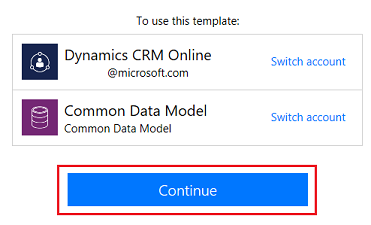

# Create a flow that uses Common Data Service

Improve operational efficiency with a unified view of business data by creating a flow that uses [Common Data Service](https://powerapps.microsoft.com/tutorials/data-platform-intro/). 

Deploy this secure business database that comprises of well-formed standard business entities (such as sales, purchase, customer service, and productivity) in your organization. Store organizational data in one or more [custom entities](https://powerapps.microsoft.com/tutorials/data-platform-create-entity/), which offer several benefits over external data sources such as Microsoft Excel and Salesforce.

For example, you can leverage Common Data Service within Power Automate in these key ways:

* Create a flow to import data, export data, or take action on top of data (such as sending a notification). Note that this approach isn't a full synchronization service; it simply allows you to move data in or out on a per-entity basis. For detailed steps, see the procedures later in this topic.
* Instead of [creating an approval loop through email](wait-for-approvals.md), create a flow that stores approval state in an entity, and build a custom app in which users can approve or reject items. For detailed steps, see [Build an approval loop with Common Data Service](common-data-model-approve.md).

**Prerequisites**

* Sign up for [Power Automate](https://flow.microsoft.com) and [Power Apps](https://make.powerapps.com).
  
    If you have trouble, verify whether [Power Automate](sign-up-sign-in.md) and [Power Apps](https://powerapps.microsoft.com/tutorials/signup-for-powerapps/) supports the type of account that you have and your organization hasn't blocked signup.
* If you haven't used Common Data Service before, open the **Entities** tab of [Power Apps](https://web.powerapps.com/#/entities), and then select **Create my database**.

## Sign in to your environment

1. Browse to [Power Automate](https://flow.microsoft.com), and then select **Sign in** in the upper-right corner.
   
    
2. In the top right menu you select the environment in which you created the database in powerapps.com.
   
    >[!IMPORTANT]
    >If you don't select the same environment, you won't see your entities.
   
    

## Open a template

1. In the **Search for a template by app, task, or industry** box at the top of the screen, enter **common**, and then press **enter**.
   
    
2. In the list of templates, select the template that imports data from the source you want into the entity (or *object*) that you want.
   
    For example, click or tap the template that copies contact information from Dynamics 365 into Common Data Service.
   
    
3. Select **Use this template**.
   
    
4. If you haven't already created a connection from Power Automate to Dynamics 365, click or tap **Sign in**, and then provide your credentials if prompted.
   
    
5. Click or tap **Continue**.
   
    

## Build your flow
1. In the first card, specify the event that will trigger the flow.
   
    For example, you're building a flow that will copy new contacts from an instance of Dynamics 365 to Common Data Service. Under **When a record is created**, specify the instance by clicking or tapping the down arrow and then clicking or tapping an option in the list that appears.
   
    
2. (optional) Near the top of the screen, specify a different name for the flow that you're creating.
   
    **Note**: If your browser window isn't maximized, the UI might look slightly different.
   
    
3. Click or tap **Create flow**.
   
    **Note**: If your browser window isn't maximized, only the checkmark may appear.
   
    

Now, whenever that object is created in the source system, it will be imported into Common Data Service. If you can't find a template that does what you need, you can [build a flow from scratch](get-started-logic-flow.md) that operates on top of Common Data Service.

You can take actions on changes in the database. For example, you can send notification mail whenever data changes.

