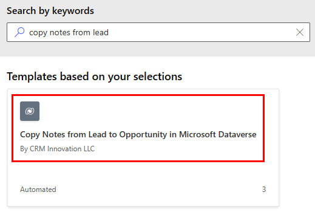
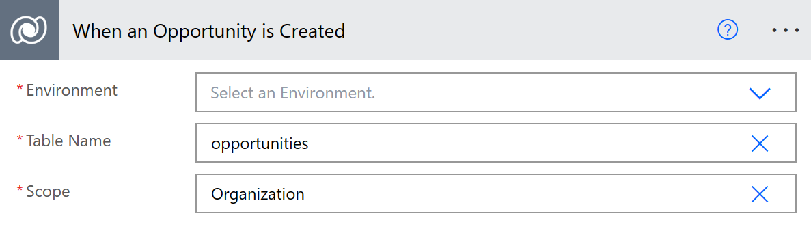
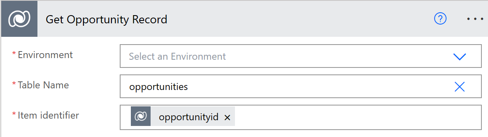
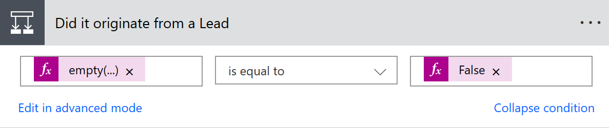

# Create a cloud flow that uses Microsoft Dataverse

Improve operational efficiency with a unified view of business data by creating flows that use [Dataverse](https://powerapps.microsoft.com/tutorials/data-platform-intro/).

For example, you can use Dataverse within Power Automate in these key ways:

* Create a cloud flow to import data, export data, or take action (such as sending a notification) when data  changes. For detailed steps, see the procedures later in this topic.
* Instead of [creating an approval loop through email](wait-for-approvals.md), create a cloud flow that stores approval state in a table, and then build a custom app in which users can approve or reject items. For detailed steps, see [Build an approval loop with Dataverse](common-data-model-approve.md).

In this article, you will create a cloud flow that sends an email notification when a *Qualified Lead Process* creates a new *Opportunity* in Dataverse. The notification includes the *Notes* from the *Lead*.

## Prerequisites

* Sign up for [Power Automate](https://flow.microsoft.com) and [Power Apps](https://make.powerapps.com).
  
    If you have trouble, verify whether [Power Automate](sign-up-sign-in.md) and [Power Apps](https://powerapps.microsoft.com/tutorials/signup-for-powerapps/) supports the type of account that you have and your organization hasn't blocked signup.
* If you haven't used Dataverse before, create a [Dataverse environment with a database](/power-platform/admin/create-environment#create-an-environment-with-a-database) in the Power Platform admin center.

## Sign in to your environment

1. Sign in to [Power Automate](https://flow.microsoft.com).
1. In the top right menu, select the environment where you created the Dataverse table. 

    >[!IMPORTANT]
    >If you don't select the same environment, you won't see your Dataverse tables.

## Use a template

1. In the left-side navigation pane, select **Templates**, and then search for **Copy Notes from Lead to Opportunity**.
1. You could use any template that performs a task in Dataverse that you want to automate. In this example, select the template that copies notes from Lead to Opportunity in Dataverse.

    

1. If you haven't already created a connection, select **Sign in**, and then provide your credentials as needed.

1. Select **Continue**.

   You'll now see the template and its connections. In the following steps, you will customize this template.

## Customize your flow template

1. On the **When an Opportunity is created** card, select the **Environment**, **Table Name**, and **Scope** that you want to use.
   
   For more information on scope, see [Trigger flows&mdash;scope](/power-automate/dataverse/create-update-delete-trigger#scope).
   
    

1. Complete the **Get Opportunity row** card, per your requirements.
   
    

1. Configure the **Originate from a Lead** card. 
   
    

1. Complete the **Get Lead** and the **List Notes for the Lead** cards on the **If yes** side of the decision branch. 

   

1. Expand the **Apply to each** card, and then  delete the **Copy Lead Note to New Note** card.

1. Select **Add an action**, search for **notification**, and then select **Send me an email notification**.

   

1. Configure the notification card to send you an email notification with the details of the notes for the lead.

   

>[!TIP]
>If you can't find a template that does what you need, you can [build a cloud flow from scratch](get-started-logic-flow.md) that operates on top of Dataverse.

[!INCLUDE[footer-include](includes/footer-banner.md)]
