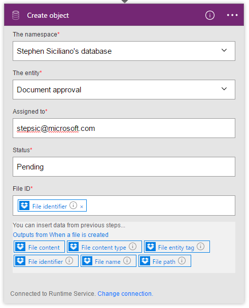
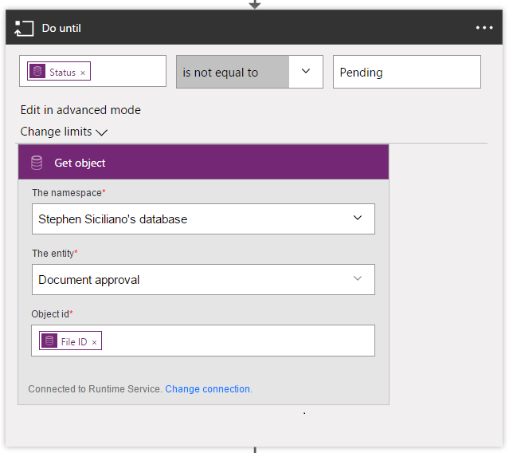
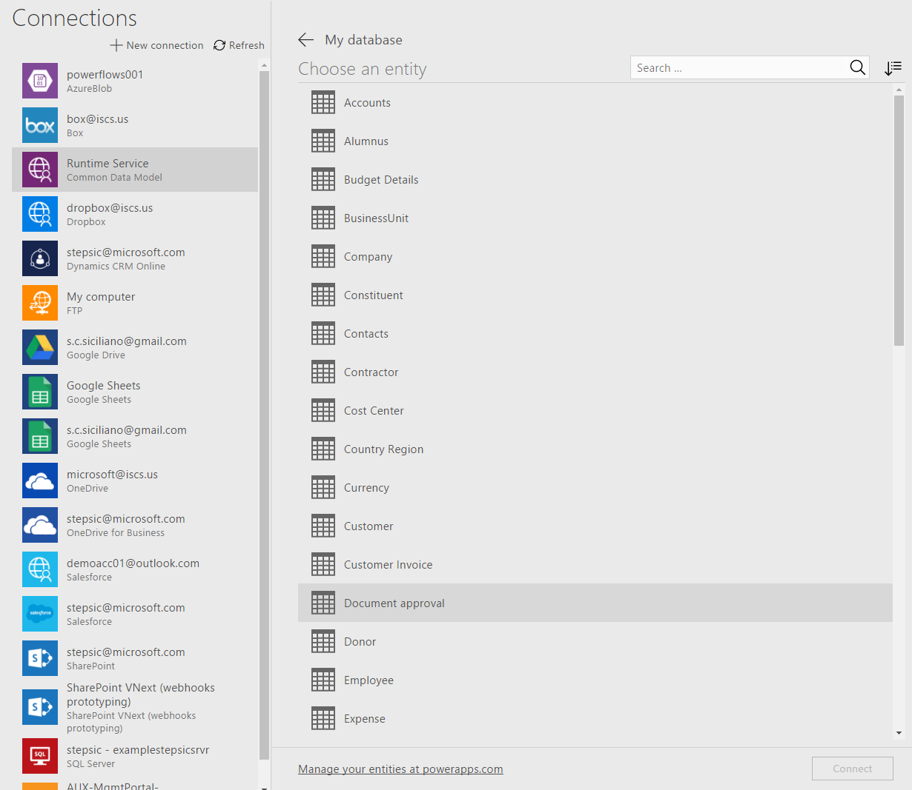

<properties
    pageTitle="Microsoft Common Data Model| Microsoft Flow"
    description="Use the Microsoft Common Data Model inside of Microsoft Flow to import or export data, or build approvals."
    services=""
    suite="flow"
    documentationCenter="na"
    authors="stepsic-microsoft-com"
    manager="erikre"
    editor=""
    tags=""/>

<tags
   ms.service="flow"
   ms.devlang="na"
   ms.topic="article"
   ms.tgt_pltfrm="na"
   ms.workload="na"
   ms.date="08/05/2016"
   ms.author="stepsic"/>

# Use the Microsoft Common Data Model in a flow
[Microsoft Common Data Model](https://powerapps.microsoft.com/tutorials/data-platform-intro/) is a secure business database, comprising of well-formed standard business entities that can be deployed for use in your organization. With the Common Data Model, you can improve operational efficiency with a unified view of business data. The Common Data Model provides standard entities common across most industry domains – Sales, Purchase, Customer Service, Productivity among others. You can also store organizational data in one or more [custom entities](https://powerapps.microsoft.com/tutorials/data-platform-create-entity/), which offer several benefits over external data sources such as Microsoft Excel and Salesforce.

Microsoft Flow and the Microsoft Common Data model work well together in two key ways:

1. If you already use the [Common Data Model to build a PowerApp](https://powerapps.microsoft.com/tutorials/data-platform-create-app/), you can use flows to import that data, to export that data, or take action on top of it (such as sending a notification).

1. You can also use the Common Data Model as a store for state in flows. A very common example is approvals. Today, we support [approvals via email](wait-for-approvals.md), but if you want to use a different mechanism, such as your custom application, we don't have an easy way to do this. Now, with the Common Data Model to store the approval state, you can.

## Import new data into to the Common Data Model and take action

You can move data into the Common Data Model (or out) by creating a flow. You can either use a template or create from scratch. Note that this is not a full synchronization service - it simply allows you to move data in or out on a per-entity basis.

1. Before you get started at Microsoft Flow you will need to create the database at PowerApps.com. [Select the Entities tab in the PowerApps portal](https://web.powerapps.com/#/entities) and then select **Create my database**.

1. Next, in the [Microsoft Flow portal][1], sign in with your work or organization account.

1. Type **common data** into the search box at the top of the screen to find templates that can import data into the common data model.

	

1. In the list of templates, select the template for the data source you want to import from and the entity (or *object*) that you want to import.

1. Confirm that this template does what you want, and select **Use this template**.

1. Connect to the services that the template uses, you will need to enter your credentials to set up the connection.

	

1. In the first card (the *trigger*) you may need to fill out required settings. For example, for Dynamics CRM you will need to select the instance that you want to import data from.

1. Next, you'll need to select the Database that you set up in the first step in the **Create object** card for the Common Data Model. 

	

1. Finally, select **Create flow**

Now, whenever that object is created in the source system, it will be imported into the Common Data Model. If you can't find a template that does what you need, then you can also build a flow from scratch that operates on top of the common data model. [Go here to read more about how to create a flow from scratch](https://flow.microsoft.com/documentation/get-started-logic-flow/).

You can take actions on changes in the Common Data Model. For example, you can create a notification whenever there is a change in the data model.

## Building approvals in your application

The Microsoft Common Data Model can give you a way to build flows that have information stored in a database independent of a flow. The best example of this is with Approvals. You can use the Common Data Model to store the status of the Approval and then your flow can work on top of it.

In this example you will see how to build an approval on top of a file added to Dropbox *from scratch*. You can also use a template to set this up.

### Build the entity 

1. Before you get started at Microsoft Flow you will need to create the database at PowerApps.com. [Select the Entities tab in the PowerApps portal](https://web.powerapps.com/#/entities) and then select **Create my database**.

1. In the PowerApps portal you will have to create a *Custom entity* to store the approval data. Select **New entity** under **Entities** and provide the required details.

	

1. Now add some fields to the entity, such as **AssignedTo** and **Status**. For this flow we will also use the **FileID** field so we know which file is being approved.

	

### Build your flow

1. Next, go to the [Microsoft Flow portal][1], and select **Create a flow**.

1. Add a **When a file is created** trigger and select the folder that you want to watch.

	

1. Add an action **Create an Object** for the Common Data model, select the Database you created earlier, and select the **Approval** entity. 

	

1. Now you need to add a **Do-until** to check on the status of the Approval. 

	

1. Inside of the **Do-until** **Add an action** and select **Get Object**. This allows you to check the status. You need to pass the **FileID** into the **Object ID** field. Once you have added this step you can populate the condition in the Do-until card. 

	

1. Next, **Add a condition** below the **Do-until** card. For the condition get the **Status** and check to see if it's Approved or Rejected.

    

1. Inside this condition box you can add the two steps for Approval and Rejection. For example, on Rejection you can **Delete the file**.

	

### Build the app to do the approval

Now you have a flow that listens to the data and performs the approval, but you still need some way to perform the approval. You can do that inside of a PowerApp.

1. In the PowerApps portal select **New app**. 

1. Select **Common Data Model**.

	

1. Select the entity you created.

	

1. You should now have a PowerApp that you can use to do the approval. If you update the Status field now the flow should execute the correct logic. 

	

<!--Reference links in article-->
[1]: https://flow.microsoft.com
