<properties
    pageTitle="Microsoft Common Data Model| Microsoft Flow"
    description="Use the Microsoft Common Data Model inside of Microsoft Flow to import data, export data, or build approvals."
    services=""
    suite="flow"
    documentationCenter="na"
    authors="stepsic-microsoft-com"
    manager="erikre"
    editor=""
    tags=""/>

<tags
   ms.service="flow"
   ms.devlang="na"
   ms.topic="article"
   ms.tgt_pltfrm="na"
   ms.workload="na"
   ms.date="08/05/2016"
   ms.author="stepsic"/>

# Use the Microsoft Common Data Model in a flow #
The [Microsoft Common Data Model](https://powerapps.microsoft.com/tutorials/data-platform-intro/) is a secure business database that comprises well-formed standard business entities that you can deploy for use in your organization. With the Common Data Model, you can improve operational efficiency with a unified view of business data. The Common Data Model provides standard entities common across most industry domains – Sales, Purchase, Customer Service, and Productivity among others. You can also store organizational data in one or more [custom entities](https://powerapps.microsoft.com/tutorials/data-platform-create-entity/), which offer several benefits over external data sources such as Microsoft Excel and Salesforce.

Microsoft Flow and the Common Data Model work well together in two key ways:

1. If you already use the Common Data Model to [build an app in PowerApps](https://powerapps.microsoft.com/tutorials/data-platform-create-app/), you can use flows to import data, export data, or take action on top of data (such as sending a notification).

1. You can also use the Common Data Model to store state in flows. For example, you can [create an approval flow through email](wait-for-approvals.md), but you couldn't easily use a different mechanism, such as your custom application. Now, you can store approval state in the Common Data Model.

## Import data into the Common Data Model and take action ##
You can move data into or out of the Common Data Model by creating a flow either from a template or from scratch. Note that this approach isn't a full synchronization service - it simply allows you to move data in or out on a per-entity basis.

1. If you're new to the Common Data Model, [open the Entities tab](https://web.powerapps.com/#/entities) of powerapps.com, and then click or tap **Create my database**.

1. [Sign in](https://flow.microsoft.com) to the Microsoft Flow portal with your work or organization account.

1. In the **Search templates** box at the top of the screen, type **common data** to find templates that can import data into the Common Data Model.

	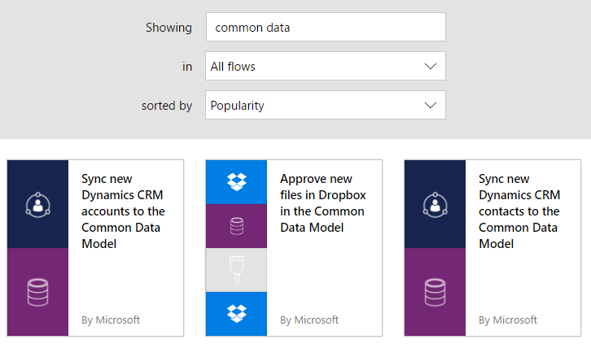

1. In the list of templates, click or tap the template for the data source from which you want to import data and the entity (or *object*) that you want to import.

1. If this template does what you want, click or tap **Use this template**.

1. To set up the connection, provide your credentials to connect to the services that the template uses, and then click or tap **Continue**.

	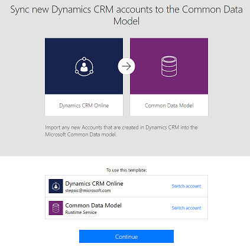

1. In the first card (the *trigger*), you may need to fill out required settings. For example, for Dynamics CRM, specify the instance from which you want to import data.

1. Next, you'll need to select the database that you set up in the first step in the **Create object** card for the Common Data Model.

	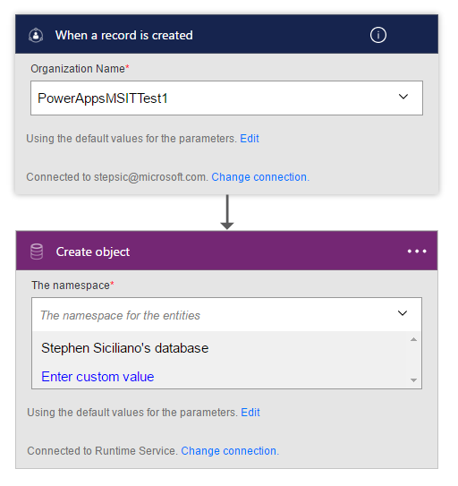

1. Click or tap **Create flow**.

Now, whenever that object is created in the source system, it will be imported into the Common Data Model. If you can't find a template that does what you need, you can [build a flow from scratch](get-started-logic-flow.md) that operates on top of the Common Data Model.

You can take actions on changes in the Common Data Model. For example, you can create a notification whenever the data model changes.

## Building approvals in your application ##
The Common Data Model can give you a way to build flows that have information stored in a database independent of a flow. The best example of this is with approvals. If you store the status of the approval in the Common Data Model, your flow can work on top of it.

In this example, you'll create an approval process that starts when a user adds a file to Dropbox. When the file is added, information about it appears in an app, where a reviewer can approve or reject the change. When the reviewer approves or rejects the change, mail notifies the user who added the file, and rejected files are deleted from Dropbox.

By following the steps in this section, you'll build:

- [a custom entity](common-data-model-intro.md#build-the-entity) that will contain information about each file added to Dropbox and whether the file's status is approved, rejected, or pending.

- [an app](common-data-model-intro.md#build-the-app) in which a reviewer can approve or reject files added to Dropbox. You'll use PowerApps to generate this app automatically based on the fields in the custom entity.

- [a flow](common-data-model-intro.md#build-the-flow) that adds information to the custom entity when a file is added, sends mail when the change is approved or rejected, and deletes rejected files. These steps demonstrate how to build such a flow from scratch, but you can create a similar flow from a template.

**Prerequisites**

- Create connections to Dropbox and Office 365 Outlook, as [Manage your connections](https://powerapps.microsoft.com/tutorials/add-manage-connections/) describes.

### Build the entity ###
1. In [powerapps.com](https://web.powerapps.com), click or tap **Manage** in the left navigation bar, and then click or tap **Entities**.

	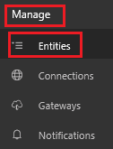

1. If prompted, click or tap **Create my database**.

1. Near the upper-right corner, click or tap **New entity**.

	

1. Under **Entity name**, specify a name that doesn't contain spaces and that no other entity in your database has.

	To follow this example exactly, specify **ReviewDropboxFiles**.

	

1. Under **Display name**, specify a friendly name.

	

1. Click or tap **Next**.

	

1. Near the upper-right corner, click or tap **Add field**.

	

1. In the blank row that appears at the bottom, set the properties of an **Approver** field:

	- In the **Display Name** column, type **Approver**.
	- In the **Name** column, type **ApproverEmail**.
	- In the **Type** column, click or tap the **Email** option.
	- In the **Required** column, select the checkbox.

	

1. In the blank row that appears at the bottom, set the properties of a **Status** field:

	- In the **Display Name** column, type **Status**.
	- In the **Name** column, type **Status**.
	- In the **Type** column, click or tap the **Text** option.
	- In the **Properties** column, leave the default value.
	- In the **Required** column, select the checkbox.

	

1. In the blank row that appears at the bottom, set the properties of a **FileID** field:

	- In the **Display Name** column, type **File identifier**.
	- In the **Name** column, type **FileID**.
	- In the **Type** column, click or tap the **Text** option.
	- In the **Properties** column, leave the default value.
	- In the **Unique** column, select the checkbox.
	- In the **Required** column, select the checkbox.

	

1. Near the right edge, click or tap the ellipsis (...) for the **FileID** field, and then click or tap **Set as Title field**.

	

1. Near the lower-left corner, click or tap **Create**.

	

### Build the flow ###

#### Sign in and create a flow ####
1.  Open the [Microsoft Flow portal](https://flow.microsoft.com), and then click or tap **Sign in** near the upper-left corner.

	

1. Near the upper-right corner, click or tap **My flows**.

	

1. Near the upper-left corner, click or tap **Create new flow**.

	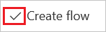

#### Start when a file is added ####
1. In the box that contains **Search for more triggers**, type or paste **Dropbox**, and then click or tap **Dropbox - when a file is created**.

	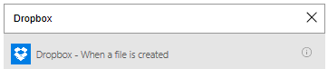

1. If prompted, click or tap **Sign in**, and then provide the credentials for your Dropbox account.

1. Under **Folder**, type a slash if files will be added to the root folder of the Dropbox account.

	

	**Note**: If files will be added to a different folder, click or tap the folder icon, and then browse to the folder you want.

#### Add data to the entity ####
1. Click or tap **New step**, and then click or tap **Add an action**.

	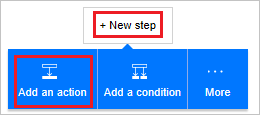

1. In the box that contains **Search for more actions**, type or paste **Common Data Model**, and then click or tap **Common Data Model - Create object**.

	

1. Under **The namespace**, click or tap the database that contains the custom entity that you created earlier.

1. Under **The entity**, type **Review**, and then click or tap **Review Dropbox files**.

	

1. Under **Title**, click or tap in the box, and then click or tap **File name** in the list of parameter tokens to add it to the field.

	

1. Under **Approver**, type or paste the e-mail address of the person who will review the files.

	**Note**: To make testing the flow easier, specify your own address. You can change it when the flow is ready for actual use.

	

1. Under **Status**, type or paste **Pending**.

	

1. Under **File identifier**, click or tap in the box, and then click or tap **File identifier** in the list of parameter tokens to add it to the field.

	

#### Check whether the file has been reviewed ####

1. Click or tap **New step**, click or tap **More**, and then click or tap **Add a do until**.

	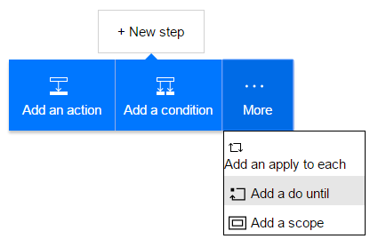

1. Click or tap in the box in the upper-left corner of the **Do until** action, and then click or tap the **Status** in the list of parameter tokens to add it to the field.

	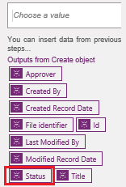

1. Open the list near the center of the **Do until** action, and then click or tap **is not equal to**.

	

1. Type or paste **Pending** in the box in the upper-right corner of the **Do until** action.

	

1. Near the bottom of the **Do until** action, click or tap **Add an action**.

	

1. In the box that contains **Search for more actions**, type **Common**, and then click or tap **Common Data Model - Get object**.

1. Under **The namespace**, click or tap your database.

1. Under **The entity**, type or paste **Review**, open the list, and then click or tap **Review Dropbox files**.

	

1. Under **Object id**, click or tap in the box, and then click or tap the **File identifier** parameter token to add it to the field.

	

#### Check whether the item has been approved ####

1. Click or tap **New step**, and then click or tap **Add a condition**.

1. Click or tap in the box in the upper-left corner of the condition, and then click or tap the **Status** parameter token to add it to the field.

	

1. In the box in the upper-right corner of the condition, type or paste **Approved**.

	

#### Send notification mail ####
1. Under **If yes, do nothing**, click or tap **Add an action**.

	

1. In the box that contain **Search for more actions**, type or paste **send mail**, and then click or tap **Office 365 Outlook - Send an email**.

	

1. Under **To**, type or paste the address of the person whom you want to notify when an item is accepted.

	**Note**: To make testing the flow easier, specify your own address. You can change it when the flow is ready for actual use.

	

1. Under **Subject**, click or tap in the box, and then click or tap the **File name** parameter token to add it to the field.

	

1. Under **Body**, type or paste **The item has been approved.**

	

1. Under **If no, do nothing**, repeat steps 1-5 in this procedure except specify the body of the email message as **The item has been rejected.**

	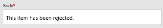

#### Delete rejected files ####
1. Under the fields for the rejection mail, click or tap **Add an action**.

	

1. In the box that contains **Search for more actions**, type or paste **Dropbox**, and then click or tap **Dropbox - Delete file**.

	

1. Under **File**, click or tap in the box, and then click or tap the **File identifier** token parameter to add it to the field.

	

#### Save the flow ####
1. At the bottom of the screen, type or paste a name for the flow that you're creating, and then click or tap **Create Flow**.

	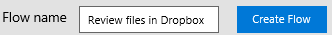

1. When prompted, click or tap **Done**.

	

### Add files to Dropbox ###
Add at least two files to your Dropbox account: one to test approval and one to test rejection.

### Build the app ###
1. In [powerapps.com](https://web.powerapps.com), click or tap **New app** near the bottom of the left navigation bar.

	

1. In the dialog box that appears, click or tap either option if you have PowerApps Studio for Windows. Otherwise, click or tap the option to open PowerApps Studio for the web.

1. If you opened PowerApps Studio for Windows, click or tap **New** in the left navigation bar.

1. Under **Create an app from your data**, click or tap **Phone layout** in the **Common Data Model** tile.

	

1. Near the upper-right corner, type or paste **Review** in the search bar.

	

1. Under **Choose an entity**, click or tap **ReviewDropboxFiles**.

	

1. Near the lower-right corner, click or tap **Connect**.

	

1. In the right navigation bar, click or tap the layout that includes a header and a description.

	

1. On the **BrowseScreen**, click or tap just under the search bar to select the text-box control.

	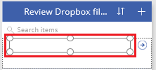

1. In the right-hand pane, click or tap **Title** in the highlighted list.
