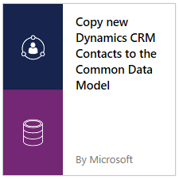
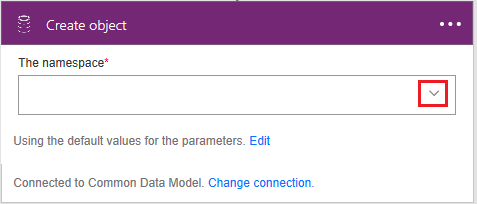

<properties
    pageTitle="Microsoft Common Data Model| Microsoft Flow"
    description="Use the Microsoft Common Data Model inside of Microsoft Flow to import data, export data, or build approvals."
    services=""
    suite="flow"
    documentationCenter="na"
    authors="stepsic-microsoft-com"
    manager="erikre"
    editor=""
    tags=""/>

<tags
   ms.service="flow"
   ms.devlang="na"
   ms.topic="article"
   ms.tgt_pltfrm="na"
   ms.workload="na"
   ms.date="08/05/2016"
   ms.author="stepsic"/>

# Use the Microsoft Common Data Model in a flow #
The [Microsoft Common Data Model](https://powerapps.microsoft.com/tutorials/data-platform-intro/) is a secure business database that comprises well-formed standard business entities that you can deploy for use in your organization. With the Common Data Model, you can improve operational efficiency with a unified view of business data. The Common Data Model provides standard entities common across most industry domains – Sales, Purchase, Customer Service, and Productivity among others. You can also store organizational data in one or more [custom entities](https://powerapps.microsoft.com/tutorials/data-platform-create-entity/), which offer several benefits over external data sources such as Microsoft Excel and Salesforce.

Microsoft Flow and the Common Data Model work well together in two key ways:

- If you already use the Common Data Model to [build an app in PowerApps](https://powerapps.microsoft.com/tutorials/data-platform-create-app/), you can use flows to import data, export data, or take action on top of data (such as sending a notification). Note that this approach isn't a full synchronization service; it simply allows you to move data in or out on a per-entity basis.

	For detailed steps, see the procedures later in this topic.

- As an alternative to [creating an approval loop through email](wait-for-approvals.md), you can now create a custom app in which users can approve or reject items. To store the approval state, you build a flow that updates an entity in the Common Data Model when the approval loop starts and ends.

	For detailed steps, see [Build an approval loop with the Common Data Model](common-data-model-approve.md).

## Open a template ##
1. If you haven't already, sign up for [Microsoft Flow](sign-up-sign-in.md) and [PowerApps](signup-for-powerapps.md).

1. If you're new to the Common Data Model, [open the Entities tab](https://web.powerapps.com/#/entities) of powerapps.com, and then click or tap **Create my database**.

1. Open the [Microsoft Flow portal](https://flow.microsoft.com), and then click or tap **Sign in** in the upper-right corner.

	**Note**: you might need to maximize your browser window to show the **Sign in** button.

	

1. In the **Search templates** box at the top of the screen, type or paste **common** and then press Return.

	

1. In the list of templates, click or tap the template that imports data from the source you want into the entity (or *object*) that you want.

	For example, click or tap the template that imports contact information from Dynamics CRM into the Common Data Model.

	

1. Click or tap **Use this template**.

	

1. If you haven't already created a connection from Microsoft Flow to Dynamics CRM, click or tap **Sign in**, and then provide your credentials.

	

1. Click or tap **Continue**.

	

## Build your flow ##

1. In the first card, specify the event that will trigger the flow.

	For example, you're building a flow that will copy new contacts from an instance of Dynamics CRM to the Common Data Model. Under **When a record is created**, specify the instance by clicking or tapping the down arrow and then clicking or tapping an option in the list that appears.

	

1. Under **Create object**, click or tap the down arrow, and then click or tap the database into which you want to import data.

	

1. (optional) Near the top of the screen, specify a different name for the flow that you're creating.

	**Note**: If your browser window isn't maximized, the UI might look slightly different.

	

1. Click or tap **Create flow**.

	**Note**: If your browser window isn't maximized, only the checkmark may appear.

	

Now, whenever that object is created in the source system, it will be imported into the Common Data Model. If you can't find a template that does what you need, you can [build a flow from scratch](get-started-logic-flow.md) that operates on top of the Common Data Model.

You can take actions on changes in the Common Data Model. For example, you can send notification mail whenever data changes.
