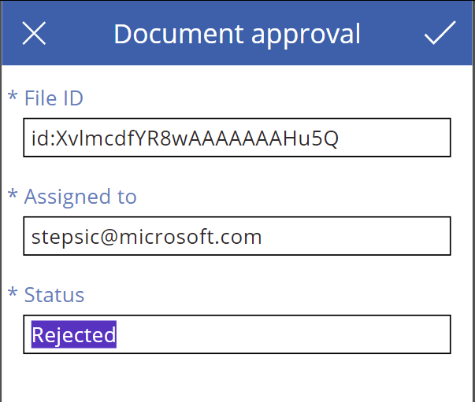

<properties
    pageTitle="Microsoft Common Data Model| Microsoft Flow"
    description="Use the Microsoft Common Data Model inside of Microsoft Flow to import data, export data, or build approvals."
    services=""
    suite="flow"
    documentationCenter="na"
    authors="stepsic-microsoft-com"
    manager="erikre"
    editor=""
    tags=""/>

<tags
   ms.service="flow"
   ms.devlang="na"
   ms.topic="article"
   ms.tgt_pltfrm="na"
   ms.workload="na"
   ms.date="08/05/2016"
   ms.author="stepsic"/>

# Use the Microsoft Common Data Model in a flow
The [Microsoft Common Data Model](https://powerapps.microsoft.com/tutorials/data-platform-intro/) is a secure business database that comprises well-formed standard business entities that you can deploy for use in your organization. With the Common Data Model, you can improve operational efficiency with a unified view of business data. The Common Data Model provides standard entities common across most industry domains – Sales, Purchase, Customer Service, and Productivity among others. You can also store organizational data in one or more [custom entities](https://powerapps.microsoft.com/tutorials/data-platform-create-entity/), which offer several benefits over external data sources such as Microsoft Excel and Salesforce.

Microsoft Flow and the Common Data Model work well together in two key ways:

1. If you already use the Common Data Model to [build an app in PowerApps](https://powerapps.microsoft.com/tutorials/data-platform-create-app/), you can use flows to import that data, export that data, or take action on top of it (such as sending a notification).

1. You can also use the Common Data Model as a store for state in flows. For example, you can [create an approval flow through email](wait-for-approvals.md), but you couldn't easily use a different mechanism, such as your custom application. Now, you can store approval state in the Common Data Model.

## Import data into the Common Data Model and take action ##
You can move data into or out of the Common Data Model by creating a flow either from a template or from scratch. Note that this approach isn't a full synchronization service - it simply allows you to move data in or out on a per-entity basis.

1. In powerapps.com, [open the Entities tab](https://web.powerapps.com/#/entities), and then click or tap **Create my database**.

1. In the [Microsoft Flow portal](https://flow.microsoft.com), sign in with your work or organization account.

1. At the top of the screen, type **common data** into the search box to find templates that can import data into the Common Data Model.

	

1. In the list of templates, click or tap the template for the data source from which you want to import data and the entity (or *object*) that you want to import.

1. If this template does what you want, click or tap **Use this template**.

1. To set up the connection, provide your credentials to connect to the services that the template uses.

	

1. In the first card (the *trigger*), you may need to fill out required settings. For example, for Dynamics CRM, specify the instance from which you want to import data.

1. Next, you'll need to select the database that you set up in the first step in the **Create object** card for the Common Data Model.

	

1. Click or tap **Create flow**.

Now, whenever that object is created in the source system, it will be imported into the Common Data Model. If you can't find a template that does what you need, you can [build a flow from scratch](get-started-logic-flow.md) that operates on top of the Common Data Model.

You can take actions on changes in the Common Data Model. For example, you can create a notification whenever the data model changes.

## Building approvals in your application ##
The Common Data Model can give you a way to build flows that have information stored in a database independent of a flow. The best example of this is with approvals. If you store the status of the approval in the Common Data Model, your flow can work on top of it.

In this example, you'll build an approval on top of a file added to Dropbox *from scratch*. You can also create this flow from a template.

### Build the entity ###
1. [Open the Entities tab of powerapps.com](https://web.powerapps.com/#/entities), and then click or tap **Create my database**.

1. Under **Entities**, click or tap **New entity** to create a *custom entity* in which you'll store the approval data, and provide the required details.

	

1. Add fields to the entity, such as **AssignedTo** and **Status**. For this flow, we'll also use the **FileID** field so that we know which file is being approved.

	

### Build your flow ###
1.  On the [Microsoft Flow portal](https://flow.microsoft.com), click or tap **Create a flow**.

1. Add a **When a file is created** trigger, and specify the folder that you want to watch.

	

1. Add a **Create an Object** action for the Common Data model, select the database that you created earlier, and select the **Approval** entity.

	

1. Add a **Do-until** to check on the status of the approval.

	

1. Inside of the **Do-until** **Add an action** and select **Get Object**. This allows you to check the status. You need to pass the **FileID** into the **Object ID** field. After you add this step, you can populate the condition in the Do-until card.

	

1. Next, **Add a condition** below the **Do-until** card. For the condition, get the **Status**, and check to see if it's Approved or Rejected.

    

1. Inside this condition box, you can add the two steps for Approval and Rejection. For example, on Rejection you can **Delete the file**.

	

### Build the app to do the approval  ###

Now you have a flow that listens to the data and performs the approval, but you still need some way to perform the approval. You can do that inside of an app that you create in PowerApps.

1. In [powerapps.com](https://web.powerapps.com), click or tap **New app**.

1. Under **Create an app from your data**, click or tap the **Common Data Model** tile.

	

1. Under **Choose an entity**, click or tap the entity that you created.

	

1. You should now have an app that you can use to do the approval. If you update the Status field now, the flow should execute the correct logic.

	
