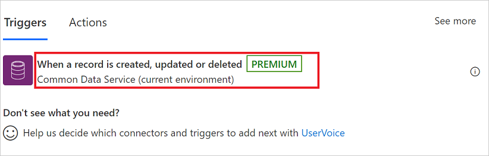
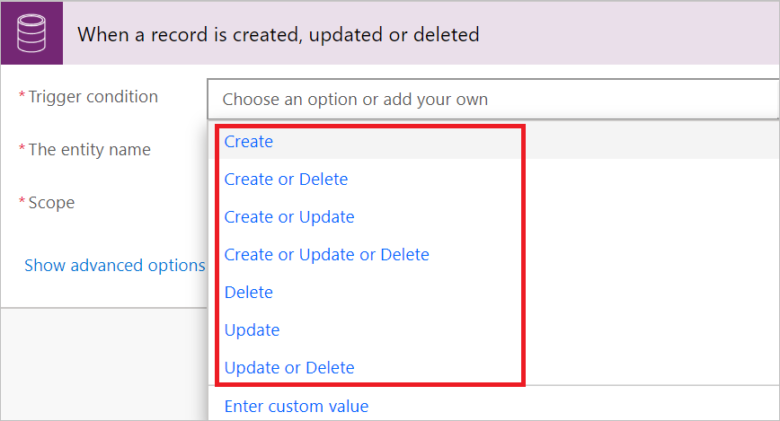
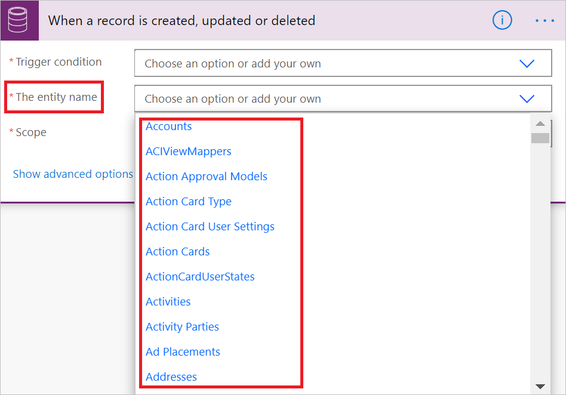
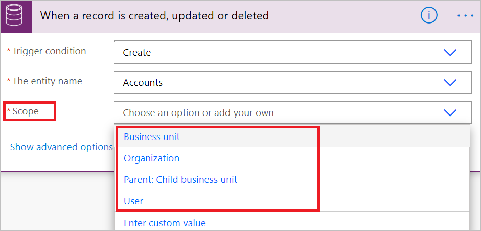
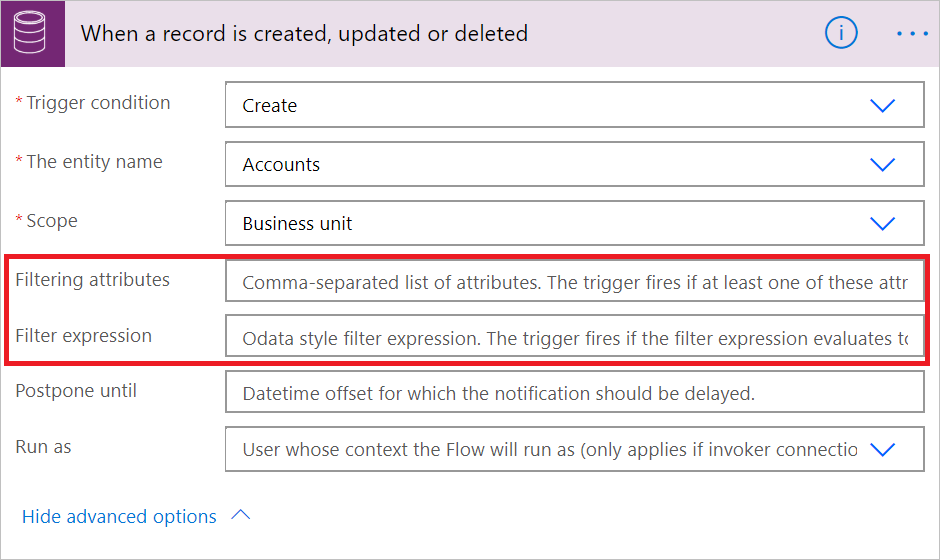
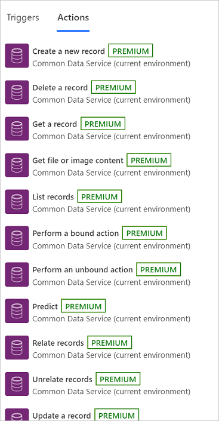
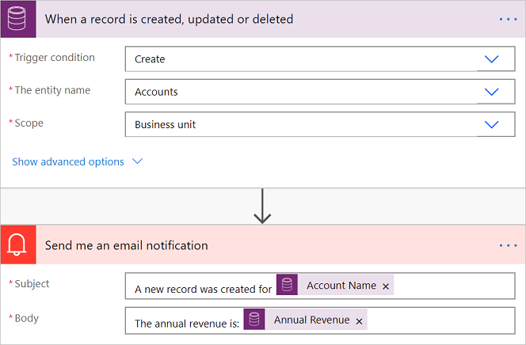

# Create an automated flow by using Microsoft Dataverse connector

[!INCLUDE[cc-data-platform-banner](./includes/cc-data-platform-banner.md)]

>[!IMPORTANT]
>There are three connectors available to connect to Dataverse. This article covers the recommended [Microsoft Dataverse connector](./connection-cds.md) for connecting to Dataverse. The [Microsoft Dataverse (legacy) connector](./connection-cds.md) and the [Dynamics 365 connector](/connectors/dynamicscrmonline/) are also available for use if you cannot use the recommended connector.

The flows you create can trigger when a Dataverse row is created, updated, or deleted.

Additionally, you can perform create, update, retrieve, and delete actions on rows within Dataverse.

## Initiate a cloud flow with Microsoft Dataverse connector

Use the **When a row is created, updated or deleted** trigger to initiate your flow:

   

After you select a trigger, you'll need to configure:

- A condition for the trigger.
- The name of the table.
- The scope for the trigger.

### Trigger condition

You can add any of these conditions to determine precisely when your flow is triggered.

   

### The table name

Select any of the numerous tables that are available to indicate the table on which your trigger operates.

   

### Scope

Use scopes to determine if your flow runs when you, someone in your business unit, or any user in your organization creates a row.

Here are the details on each scope.

|Scope|Trigger timing|
| --- | --- |
|Business Unit|Action is taken on a row owned by your business unit|
|Organization|Action is taken by anyone within the organization or database|
|Parent: Child business unit|Action is taken on a row owned by your business unit or a child business unit|
|User|Action is taken on a row owned by you|

Triggers that run when a row is updated can also use filtering columns. This ensures that the flow only runs when any of the defined columns are updated.

> [!IMPORTANT]
> Use filter columns to prevent your flow from unnecessarily running.

This flow triggers any time the first or last name of contact that the flow user owns is updated.

## Trigger privileges

To create a cloud flow that triggers based on create, update, or delete on a row, the user needs to have user level permissions for create, read, write, and delete on the **Callback Registration** table. Additionally, depending on the scopes defined, the user might need at least that level of read on the same table.  [Learn more](/power-platform/admin/database-security) about environment security.

## Write data into Dataverse

Use any of the following actions to write data into Dataverse:

Here's an example of a cloud flow that sends a notification with the name and the annual revenue each time an **account** is **created** by anyone in the business unit **scope**.

> 

## Advanced concepts

### Write data into customer, owner, and regarding columns

To write data into customer, owner, and regarding columns, two columns must be populated.

| Column category | Example settings |
| --- | --- |
| Regarding | Regarding = ID of the row (for example, account ID) and Regarding Type as selected from the list. |
| Customer | Represents the ID of the row and the customer type as selected from the list. |
| Owner | Represents the ID of the system user or team, and owner type as selected from the list. |

### Enable upsert behavior

You can leverage the **update a row** action to provide upsert actions, which updates the row if it already exists, or creates a new row. To invoke upsert, provide the table and a GUID key. If the row with the specified type and key exists, an update occurs. Otherwise, a row with the specified key is created.

### Trigger behavior

If you have a trigger registered on the update of a row, the flow runs for every *committed* update to the given row. The service invokes your flow asynchronously, and with the payload that it captures at the time the invocation occurs.

> [!NOTE]
> If you have two updates that happen within seconds of each other, the flow may be triggered more than once with the latest versioned content.

Flow runs may be delayed if there is a backlog of system jobs in your environment. If this delay occurs, your flow is triggered when the system job to start the flow runs.

[!INCLUDE[footer-include](includes/footer-banner.md)]