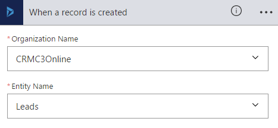
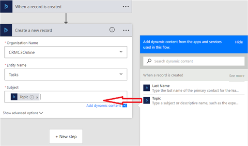
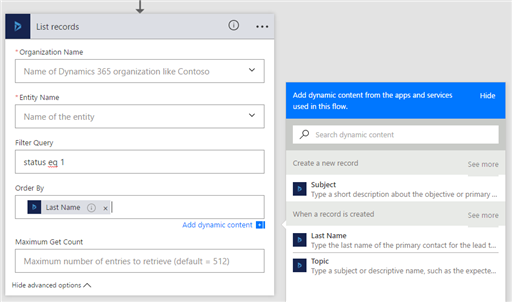

# Create a cloud flow by using Dynamics 365 (online)

[!INCLUDE[cc-data-platform-banner](./includes/cc-data-platform-banner.md)]

> [!IMPORTANT]
> Dynamics 365 apps such as Dynamics 365 Sales, Dynamics 365 Customer Service, Dynamics 365 column Service, Dynamics 365 Marketing, and Dynamics 365 Project Service Automation, use [Microsoft Dataverse](/powerapps/maker/common-data-service/data-platform-intro) as the data source.
>
> The [Dynamics 365 connector](/connectors/dynamicscrmonline/) is deprecated, but continues to work until removed. More information: [Dynamics 365 Connector is deprecated](/power-platform/important-changes-coming#dynamics-365-connector-is-deprecated).
> 
> Do not use the Dynamics 365 connector for new flows. Use the [Microsoft Dataverse connector](/connectors/commondataserviceforapps/) whenever you can. If the Microsoft Dataverse connector does not fit your needs, use the [Microsoft Dataverse (legacy) connector](/connectors/commondataservice/).
>
> The [Microsoft Dataverse connector](/connectors/commondataserviceforapps/) should be your first choice because it provides the most capability and best performance. However, it does not currently provide certain capabilities that the Dynamics 365 and Microsoft Dataverse connectors do, such as the ability to connect to multiple environments. The [Microsoft Dataverse (legacy)](/connectors/commondataservice/) provides the same capabilities as the Dynamics 365 connector, but also provides substantially improved reliability.

By using a Dynamics 365 connector, you can create flows that initiate when an event occurs in Dynamics 365, or some other service, which then performs an action in Dynamics 365, or some other service. 

In Power Automate, you can set up automated workflows between your favorite apps and services to synchronize files, get notifications, collect data, and more. For more information, see [Get started with Power Automate](getting-started.md).

> [!IMPORTANT] 
> To invoke a Power Automate trigger, the table used with the flow must have **Change Tracking** enabled. More information: [Enable change tracking to control data synchronization](/dynamics365/customer-engagement/admin/enable-change-tracking-control-data-synchronization) 

## Create a cloud flow from a template

You can create a cloud flow using one of the many templates available, such as these examples:

* When an object is created in Dynamics 365, create a list item in SharePoint.
* Create Dynamics 365 leads from an Excel table.
* Copy Dynamics 365 accounts to customers in Dynamics 365 for Operations.

To create a cloud flow from a template, follow these steps.

1. Sign in to the [Power Automate website](https://flow.microsoft.com/).
2. Click or tap **Services**, and then click or tap **Dynamics 365**.
3. Several templates are available. To get started, select the template that you want.

## Create a task from a lead

If a template isn’t available for what you need, create a cloud flow from scratch. This walkthrough shows you how to create a task in Dynamics 365 whenever a lead is created in Dynamics 365.

1. Sign in to the [Power Automate website](https://flow.microsoft.com/).
2. Click or tap **My flows**, and then click or tap **Create from blank**.
3. In the list of flow triggers, click or tap **Dynamics 365 - When a record is created (deprecated)**.
4. If prompted, sign in to Dynamics 365.
5. Under **Organization Name**, select the Dynamics 365 instance where you want the flow to listen.
6. Under **Table Name**, select the table that you want to listen to, which will act as a trigger initiating the flow.
   
     For this walkthrough, select **Leads**.
   
    
    > [IMPORTANT]
    > In order for the flow to trigger on the Dynamics 365 table, the table definition must have **Change Tracking** enabled. See [Enable change tracking to control data synchronization](/dynamics365/customer-engagement/admin/enable-change-tracking-control-data-synchronization)
    
7. Click or tap **New step**, and then click or tap **Add an action**.
8. Click or tap **Dynamics 365 – Create a new row**.
9. Under **Organization Name**, select the Dynamics 365 instance where you want the flow to create the row. Notice that it doesn’t have to be the same instance where the event is triggered from.
10. Under **Table Name**, select the table that will create a row when the event occurs.
    
     For this walkthrough, select **Tasks**.
11. A **Subject** box appears. When you click or tap it, a dynamic content pane appears where you can select either of these columns.
    
    * **Last Name**. If you select this column, the last name of the lead will be inserted in the **Subject** column of the task when it's created.
    * **Topic**. If you select this column, the **Topic** column for the lead will be inserted in the **Subject** column of the task when it's created.
    
    For this walkthrough, select **Topic**.
    
    
    
    > **Tip:** On the dynamic content pane, click or tap **See more** to display more columns that are associated with the table. For example, you can also populate the **Subject** column of the task with the **Company Name**, **Customer**, **Description**, or **Email** column of the lead.
    > 
    > 
12. Click or tap **Create flow**.

## Trigger based logic

Triggers like **When a row is added, modified or deleted**, **When an action is performed**, and **When a flow step is run from a business process flow** initiate your flow within a few minutes of the event occurring.  In rare cases, your flow can take up to 2 hours to trigger.

When the trigger occurs, the flow receives a notification, but the flow runs on data that exists at the time the action runs.  For example, if your flow triggers when a new row is created, and you update the row twice before the flow runs, your flow runs only once with the latest data.

## Specify advanced options

When you add a step to a cloud flow, you can click or tap **Show advanced options** to add a filter or order by query that controls how the data is filtered in the flow.

For example, you can use a filter query to retrieve only active contacts, and you can order them by last name. To do this, enter the OData filter query **statuscode eq 1** and select **Last Name** from the dynamic content pane. For more information about filter and order by queries, see [Query data > Filter results](/powerapps/developer/common-data-service/webapi/query-data-web-api#filter-results) and [Query data > Order results](/powerapps/developer/common-data-service/webapi/query-data-web-api#order-results).

  

### Best practices when using advanced options

When you add a value to a column, you must match the column type whether you type a value or select one from the dynamic content pane.

| Column type | How to use | Where to find | Name | Data type |
| --- | --- | --- | --- | --- |
| Text columns |Text columns require a single line of text or dynamic content that is a text type column. Examples include the **Category** and **Sub-Category** columns. |**Settings** > **Customizations** > **Customize the System** > **Tables** > **Task** > **Fields** |**category** |**Single Line of Text** |
| Integer columns |Some columns require integer or dynamic content that is an integer type column. Examples include **Percent Complete** and **Duration**. |**Settings** > **Customizations** > **Customize the System** > **Tables** > **Task** > **Fields** |**percentcomplete** |**Whole Number** |
| Date columns |Some columns require a date entered in mm/dd/yyyy format or dynamic content that is a date type column. Examples include **Created On**, **Start Date**, **Actual Start**, **Last on Hold Time**, **Actual End**, and **Due Date**. |**Settings** > **Customizations** > **Customize the System** > **Tables** > **Task** > **Fields** |**createdon** |**Date and Time** |
| Fields that require both a row ID and lookup type |Some columns that reference another table row require both the row ID and the lookup type. |**Settings** > **Customizations** > **Customize the System** > **Tables** > **Account** > **Fields** |**accountid** |**Primary Key** |
|Choice|Choice columns require a known integer value to be passed into this type of column.  In the Dynamics 365 customization area, you can view the choices backing integer column along with its respective label.|Settings > Customization > Customize the System > Tables> Account > Fields | Preferred Method of Contact| Whole Number|

### More examples of columns that require both a row ID and lookup type

Expanding on the previous table, here are more examples of columns that don't work with values selected from the dynamic content list. Instead, these columns require both a row ID and lookup type entered into the columns in Power Apps.

* **Owner** and **Owner Type**.
  
  * The **Owner** column must be a valid user or team row ID.
  * The **Owner Type** must be either **systemusers** or **teams**.
* **Customer** and **Customer Type**.
  
  * The **Customer** column must be a valid account or contact row ID.
  * The **Customer Type** must be either **accounts** or **contacts**.
* **Regarding** and **Regarding Type**.
  
  * The **Regarding** column must be a valid row ID, such as an account or contact row ID.
  * The **Regarding Type** must be the lookup type for the row, such as **accounts** or **contacts**.

This example adds an account row that corresponds to the row ID, adding it to the **Regarding** column of the task.

  

This example also assigns the task to a specific user based on the user's row ID.

  

To find a row's ID, see [Find the row ID](#find-the-rows-id) later in this topic.

> **Important:** Fields shouldn't contain a value if they have a description of "For internal use only." These columns include **Traversed path**, **Additional Parameters**, and **Time Zone Rule Version Number.**
> 
> 

## Find the row's ID

1. In the Dynamics 365 web application, open a row, such as an account row.
2. On the actions toolbar, click or tap **Pop Out**
    (or click or tap **EMAIL A LINK** to copy the full URL to your default email program).
   
    In the address bar of the web browser, the URL contains the row ID between the %7b and %7d encoding characters.
   
   

## Related topics

[Troubleshooting a cloud flow](fix-flow-failures.md)

[Flow in your organization Q&A](organization-q-and-a.md)

[Frequently asked questions](frequently-asked-questions.yml)

[!INCLUDE[footer-include](includes/footer-banner.md)]