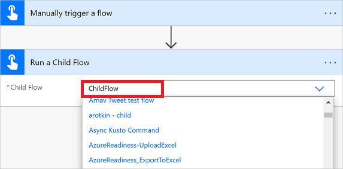
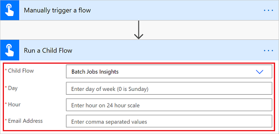

# Create child flows

Today, people build flows that need dozens or hundreds of steps. However, if you try to put all of these actions into a *single* flow, it can be difficult to navigate and maintain that flow.

Use child flows to easily manage flows and avoid flows with hundreds of steps. This approach is especially beneficial if you want to reuse tasks in multiple places in a cloud flow, or even across multiple flows.

Here's an example where you have a child flow that you want to create or update a contact in Dataverse based on that contact's name.

You need a solution with two flows.

- **Child flow**: This flow is nested inside the *parent* flow and contains the smaller tasks you want to run. You can have multiple child flows inside a parent flow.
- **Parent flow**: This flow can have any type of trigger and calls into the child flow.

> [!IMPORTANT]
> A child flow doesn't inherit Process license capacity from a parent flow's [flow group](flow-groups.md). To use the same shared capacity, explicitly add both the parent and child flow to the same flow group. Each flow counts separately toward the 25-flow limit.

## Create the child flow in a solution

1. Sign in to [Power Automate](https://make.powerautomate.com).
1. On the navigation pane, select **Solutions**, and then select an existing solution.

   Alternatively, you can create a solution if you don't want to use an existing solution.

1. Select **New** > **Automation** > **Cloud flow** > **Instant**.

   The **Build an instant cloud flow** screen appears.

1. Enter a name for your flow so that you can easily identify it later.
1. Select the **Manually trigger a flow** trigger.
1. Select **Create**.
1. Select **Add an input**.

    The input you define is passed to the child flow from the parent flow.

1. In this example, the child flow creates a contact, so it needs input fields for the **Contact name** and **Contact email**. Add a **ContactName** and a **ContactEmail** input to the **Manually trigger a flow** card.

1. Build the logic that you want the child flow to run. This logic can contain as many steps as you need.

   After your steps, you need to return data to the parent flow. In this case, you can use one of the following actions.

   - **Respond to a Power App or flow** (under the Power Apps connector).
   - **Response** (on the premium HTTP request/response connector).

1. As with the trigger, you can define as many outputs as you want the child flow to return to the parent flow. In the following screenshot, the child flow responds with the ID of the contact.

    :::image type="content" source="./media/call-child-flow/response-output.png" alt-text="Screenshot of a child flow response.":::

   You need to then test your child flow. You can manually trigger instant flows, so you can test it right inside of the designer. Try it out with a couple different inputs, and verify that the outputs are what you expect.

1. Lastly, if your flow uses anything other than built-in actions or the Microsoft Dataverse connector, you need to update the flow to use the connections **embedded** in the flow. To do this, go to the child flow's properties page, and then select **Edit** in the **Run only users** tile.

1. In the pane that appears, for each connection used in the flow, select **Use this connection (<_connection name>_)** instead of **Provided by run-only user**.

1. Select **Save**.

   > [!NOTE]
   > At this time, you can't pass connections from the parent flow to the child flow. If you don't do this, you receive an error that states that the name can't be used as a child workflow because child workflows only support embedded connections.

## Create the parent flow in a solution

1. Build the parent flow in the same solution where you created the child flow.

   Alternatively, you can bring an existing flow into that solution. The parent flow can have any type of trigger.

1. Find the place in your *parent flow* from which you want to call the child flow. Then, add the **Run a Child Flow** action, which is located under the **Flows** connector on the **Built-in** tab.

1. Pick the child flow that you created earlier.

   > [!NOTE]
   > You see the flows only to which you have access and are located in a solution. Child flows must also have the **Manually trigger a flow** trigger.

   

1. After you select your child flow, you see the _inputs_ that you defined in the child flow. After the child flow action, you can use any of the _outputs_ from that child flow.

   

   When the parent flow runs, it waits for the child flow to complete for the lifetime of the flow (one year for flows that use built-in connections and Dataverse or 30 days for all other flows).

1. Save and test this flow.

    When you export the solution that contains these two flows and import it into another environment, the new parent and child flows are automatically linked. There's no need to update URLs.

## Known issue

You should create the parent flow and all child flows directly in the same solution. If you import a flow into a solution, you might get unexpected results.

[!INCLUDE[footer-include](includes/footer-banner.md)]
