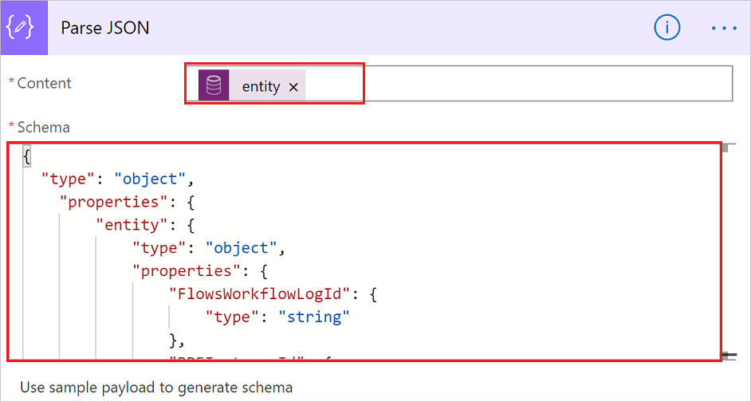

# Create instant flows in business process flows

You can run an **instant flow** to automate repetitive tasks, generate documents, track approvals, and more, from inside a stage in a business process.

## Add an instant flow as a step in a business process

Let's assume you sell printers and you use the **Lead to Opportunity Sales Process** to close deals. As part of this process, you’d like to have the team lead review and approve proposals that the sales team puts together in an earlier stage of the business process flow before sharing it with the customer.

To do this, you'll need to do two things:
1. Build an instant flow that requests review and approval of the proposal from the team.
1. Add the instant flow as a step in the **Lead to Opportunity Sales Process**.

> [!TIP]
> Only [solution-aware flows](./overview-solution-flows.md) can be added as a step in a business process. 

## Build an instant flow

1. In Power Automate, select **Solutions** in the navigation menu.
1. Select **Default Solution** from the list of solutions that appears. 
1. Select the **+ New** menu, and then select **Flow** from the list that appears.
1. Search for, and then select the **Microsoft Dataverse** connector.
1. Search for, and then select the **When a row is selected** trigger from the list of **Microsoft Dataverse** triggers.
1. Set **Environment** to **Default**, and then set **Table Name** to **Lead to Opportunity Sales Process**.
1. Add a text input column for the user to enter the link to the proposal.

   

   We'll need information from the business process flow instance to help provide context for the approval request so follow these steps to do this.

1. Add the **Parse JSON** action. 
1. Set **Content** to **table** by selecting it from the list of dynamic values for the **When a row is selected** trigger.
1. Paste the following content into the **Schema** column.

    ```json
    {
        "type": "object",
        "properties": {
        "entity": {
            "type": "object",
            "properties": {
                "FlowsWorkflowLogId": {
                    "type": "string"
                },
                "BPFInstanceId": {
                    "type": "string"
                },
                "BPFInstanceEntityName": {
                    "type": "string"
                },
                "BPFDefinitionId": {
                    "type": "string"
                },
                "BPFDefinitionEntityName": {
                    "type": "string"
                },
                "StepId": {
                    "type": "string"
                },
                "BPFDefinitionName": {
                    "type": "string"
                },
                "BPFInstanceName": {
                    "type": "string"
                },
                "BPFFlowStageLocalizedName": {
                    "type": "string"
                },
                "BPFFlowStageEntityName": {
                    "type": "string"
                },
                "BPFFlowStageEntityCollectionName": {
                    "type": "string"
                },
                "BPFFlowStageTableRowID": {
                    "type": "string"
                },
                "BPFActiveStageId": {
                    "type": "string"
                },
                "BPFActiveStageEntityName": {
                    "type": "string"
                },
                "BPFActiveStageLocalizedName": {
                    "type": "string"
                }
            }
          }
        }
   }
   ```

   Things should look like this now:

   

  1. Add the **Get row by ID** action from the **Microsoft Dataverse** connector.
  1. Set **Table Name** to **Lead to Opportunity Sales Process**, and **Row ID** to **BPFFlowStageTableRowID**.

     

     Now that we have the data, define the approval process by adding the **Start and wait for an approval (V2)** action, and then filling in the relevant information. Learn more about [approvals]( sequential-modern-approvals.md) if you are not familiar.

     > [!TIP]
     > - Use the dynamic content picker to add columns from the **Get row by ID** action to add relevant information to the approval request so that approvers can easily know what the request is about. 
     > - To provide further context regarding the active stage that the business process is in, add the **BPFActiveStageLocalizedName** column from the list of dynamic values.

     Your **Start and wait for an approval (V2)** card might look similar to this one:

      

1. Finally, save the flow and then turn it on.

## Add this flow as a step in the Lead to Opportunity Sales Process.

Now that you've created the instant flow, all that's needed is for you to add it to your business process flow. 

1. Open the **Lead to Opportunity Sales Process** in the business process flow designer. 
1. Drag and drop the **Flow Step (Preview)** from the list of **Components** onto the **Propose** stage.
1. Next, select the search icon in the **Select a Flow** column to list all flows that you can added to a business process flow.
1. Select a cloud flow from the list, and then save your changes by selecting the **Apply** button at the bottom of the properties pane.
1. Finally, select the **Update** button to make this business process flow with its new instant flow step available to your users.

## Flow step considerations
The status of your flow step might be **Processing** even after your flow successfully ran to completion, if you are not writing to the process log. In order to mark a cloud flow step as completed, add the **Update a row** action of the Microsoft Dataverse connector under the **If yes** path. Set the **Table** to **Process Logs**. Then set **Row ID** to **FlowsWorkflowLogId** by picking it from the list of dynamic values. Finally, set **Status Value** to **Succeeded** by selecting it from the dropdown. 

>[!NOTE]
>The user requires read access to the **System Jobs** table in Dataverse for the status to change from *Processing* to *Completed*.
