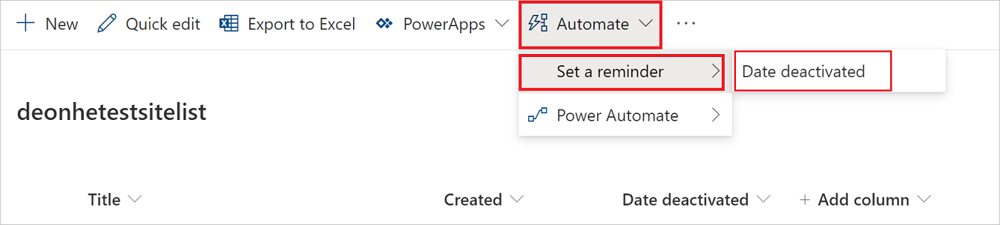
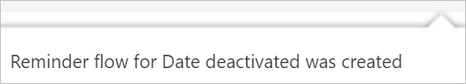

# SharePoint remind me

Lists created with Microsoft Lists and SharePoint libraries allow you to define custom metadata columns to track dates. With Power Automate's integration with SharePoint, you can easily create reminder flows, based on DateTime columns in SharePoint. With reminder flows, you receive a personal email alert a predetermined number of days in advance of a date on any document or item in SharePoint.

## Prerequisites

- Access to Microsoft SharePoint Online.
- A list, or library with a DateTime column.
- Access to Power Automate.

[!INCLUDE [sharepoint-detailed-docs](includes/sharepoint-detailed-docs.md)]

## Create a reminder flow

 1. [Create a list in Microsoft Lists](https://support.office.com/article/Create-a-list-in-SharePoint-0D397414-D95F-41EB-ADDD-5E6EFF41B083) with at least one DateTime column in the current view. 
 1. Select **Automate** > **Set a reminder** > **Date deactivated** (this is the column with the DateTime for the reminder).

    > [!div class="mx-imgBorder"]
    > 

1. Optionally, you might need to sign into the services that this Power Automate template uses.
     
1. Select **Continue**.

1. Provide a **Flow name** and the number of days prior to the DateTime column entry when you want to receive the reminder alert on the **Set a reminder** card.

    > [!div class="mx-imgBorder"]
    > 

1. On the **Set a reminder** card, select **Create**.

1. You'll receive the following message, indicating that the flow was created.

    > [!div class="mx-imgBorder"]
    > 
    

## Confirm reminders received

You'll receive a reminder via email, based on the **Remind me this many day(s) in advance** entry you made on the **Set a reminder** flow you created earlier. 

## Edit your flow

The reminder flow is like any other flow, so you can access and edit it through [Power Automate](https://flow.microsoft.com).

## More information

- Getting started with [Power Automate](https://flow.microsoft.com).
- Set a [reminder flow](https://support.office.com/article/set-a-reminder-flow-23c0e172-1fc1-4ac8-a9db-cd0b81d634d8) in SharePoint.

[!INCLUDE[footer-include](includes/footer-banner.md)]