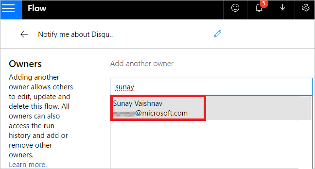
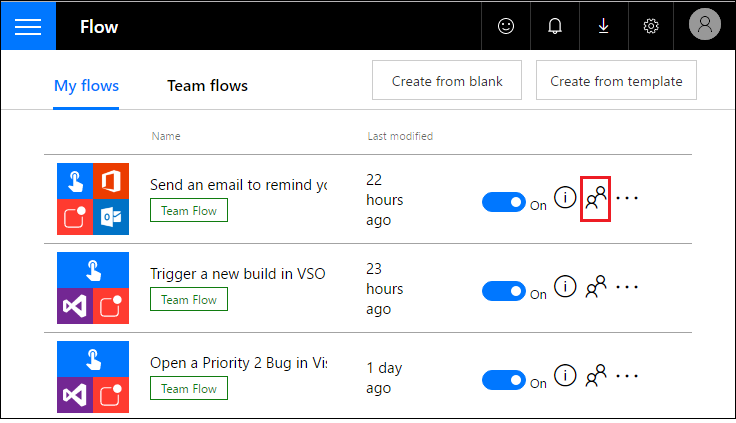
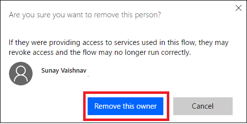
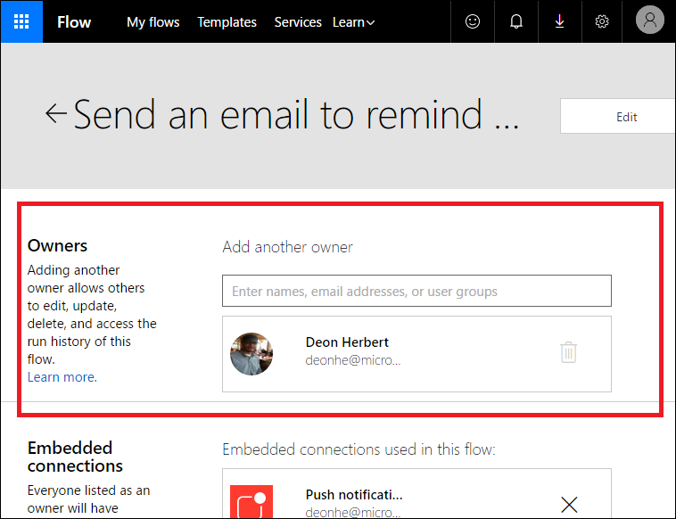

<properties
    pageTitle="Learn how to add other owners to a flow and create team flows | Microsoft Flow"
    description="Microsoft Flow makes it easy automate repetitive tasks. You can add users or groups as owners and collaborate with them to design and manage flows."
    services=""
    suite="flow"
    documentationCenter="na"
    authors="msftman"
    manager="anneta"
    editor=""
    tags=""/>

<tags
   ms.service="flow"
   ms.devlang="na"
   ms.topic="article"
   ms.tgt_pltfrm="na"
   ms.workload="na"
   ms.date="04/21/2017"
   ms.author="deonhe"/>

# Create team flows (Preview) #

Create a team flow by adding others in your organization as owners. All owners of a team flow can perform these actions:

- View the flow's history (that is, each run).
- Manage the properties of the flow (for example, start or stop the flow, add owners or update credentials for a connection).
- Edit the definition of the flow (for example, add or remove an action or condition).
- Add and remove other owners (but not the flow's creator).
- Delete the flow.

If you're the creator or an owner of a team flow, you'll find it listed on the **Team flows** tab on [Microsoft Flow](https://flow.microsoft.com).

>[AZURE.NOTE] Shared connections can be used **only** in the flow in which they were created.

Owners can use services in a flow but can't modify the credentials for a connection that another owner created.

## Prerequisites ##

To create a team flow or add/remove an owner from a team flow, you must have a [paid Microsoft Flow plan](https://flow.microsoft.com/pricing/) and be the creator or an owner of a flow.

## Create a team flow ##

Follow these steps to create a team flow or to add more owners to a team flow.

1. Sign into the [Microsoft Flow](https://flow.microsoft.com), and then select **My flows**.

1. Select the people icon for the flow that you want to modify:

     

1. Enter the name, email address, or group name for the person or group that you want to add as an owner:

     

1. In the list that appears, select the user whom you want to make an owner:

     

     The user or group you've selected becomes an owner of the flow:

     

     Congratulations &mdash; your team flow has been created!

## Remove an owner ##

>[AZURE.IMPORTANT] If you remove an owner whose credentials are being used to access one or more services in the flow, you may need to update the credentials for those services so that the flow continues to run properly.

1. Select the people icon for the flow that you want to modify:

     

1. Select the **Delete** icon for the owner that you want to remove:

     

1. In the confirmation dialog box, select **Remove this owner**:

     

1. Congratulations &mdash; the user or group that you just removed is no longer listed as an owner of the flow:

     

## Embedded and other connections ##

Connections used in a flow fall into two categories:

- **Embedded** &mdash; These connections are used in the flow.
- **Other** &mdash; These connections have been defined for a flow but aren't used in it.

If a connection is no longer being used in a flow, that connection appears in the list of **Other** connections, where it remains until an owner includes it in the flow again.

The list of connections appears under the list of owners in a flow's properties:

