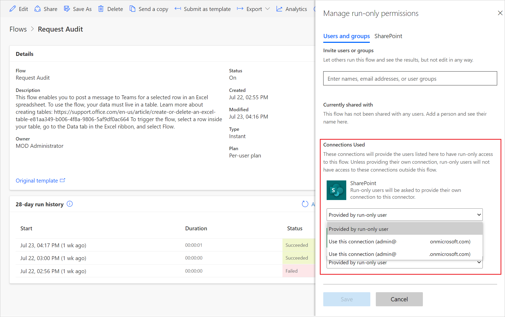
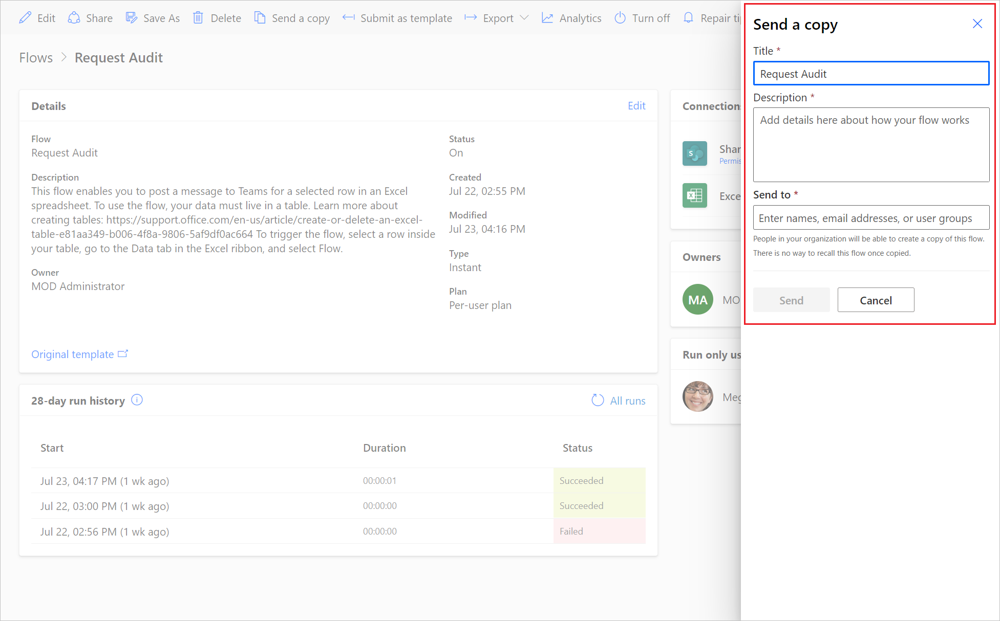

# Share a cloud flow

Share a cloud flow with others in your organization and guest users so they can also benefit from automation you've created. There are three primary ways to share a cloud flow in Power Automate:

- Add an owner to a cloud flow.
- Share a cloud flow with run-only privileges.
- Share a copy of a cloud flow.

## Prerequisites

- You must have either a [Power Automate license (except the free license)](https://make.powerautomate.com/pricing/) or a seeded license (Office 365, Dynamics 365 Enterprise plans, Dynamics 365 Professional plans, Dynamics 365 Team Member, Power Apps (Canvas and Model driven Apps)- Per App plans, Power Apps per user plan, Power Apps Plan 1 (grandfathered), Power Apps Plan 2 (grandfathered), Windows licenses) to share a cloud flow.
- You must be the creator or owner to add or remove owners from a cloud flow.

### About embedded and other connections

Connections used in a cloud flow fall into two categories:

- **Embedded**: These connections are used in the flow.
- **Other**: These connections have been defined for a cloud flow, but aren't used in it.

If you stop using a connection in a cloud flow, that connection appears in the **Other connections** list, where it remains until an owner includes it in the flow again. To make changes to embedded connections, follow the steps in [Modify a connection](#modify-a-connection), later in this article.

The list of connections appears under the list of owners in a cloud flow's properties.

## Add an owner to a cloud flow

Adding an owner to a cloud flow is the most common way to share a cloud flow. Any owner of a cloud flow can perform these actions:

- View the run history.
- Manage the properties of the flow (for example, start or stop the flow, add owners, or update credentials for a connection).
- Edit the definition of the flow (for example, add or remove an action or condition).
- Add or remove other owners (but not the flow's creator), including guest users.
- Delete the flow.

If you're the creator or an owner of a cloud flow, you'll find it listed on the **Team flows** tab in Power Automate.

>[!NOTE]
>Shared connections can be used *only* in the flow in which they were created.

Owners can use services in a cloud flow but can't modify the credentials for a connection that another owner created.

To add more owners to a cloud flow:

1. Sign in to [Power Automate](https://make.powerautomate.com), and then select **My flows**.
1. Select the flow that you want to share, select the vertical ellipsis (&vellip;), and then select **Share**.

1. Enter the name, email address, or group name for the person or group that you want to add as an owner.

    The user or group you've selected becomes an owner of the flow.

Congratulations&mdash;you've created your team flow!

## Add a list as a co-owner

You can add SharePoint lists as co-owners of a cloud flow so that everyone who has edit access to the list automatically gets edit access to the flow. After the flow is shared, you can simply distribute a link to it. More information: [Training: Create and set up a SharePoint list](https://support.microsoft.com/office/training-create-and-set-up-a-list-1ddc1f5a-a908-478b-bb6d-608f34b71f94)

Use a list when the flow is connected to SharePoint, and use a group in all other cases.

>[!IMPORTANT]
> - SharePoint users must have **Edit** permission or be a member of the **Members** or **Owners** group to run flows in SharePoint.
> - Adding a list as a co-owner is not available in GCC High and DoD tenants.

## Remove an owner

When you remove an owner whose credentials are used to access Power Automate services, you should update the credentials for those connections so that the flow will continue to run properly. To learn more, go to [Modify a connection](#modify-a-connection).

1. On the flow details page, in the **Owners** section, select **Edit**.

1. Select **Delete** (the trash can) for the owner you want to remove.

1. In the confirmation dialog box, select **Remove**.

Congratulations&mdash;the user or group that you removed is no longer listed as an owner of the flow.

## Modify a connection

You might need to change the owner of a connection in a cloud flow if you remove the existing owner or if you just want to use a different account to sign in to an action or trigger.

1. Go to the flow that you want to modify.

1. Select **Edit**.

1. Select the ellipsis (...) in the step where you want to edit the connection.

1. If you have a connection already, select it; if not, select **Add new connection** to create a new connection, and then select **Sign in** to create your new connection.

## Share a cloud flow with run-only permissions

Instant flows (that is, flows that use a manual trigger such as a button or an item being selected) can be shared by using run-only permissions. Any user who's added as a run-only user won't have access to edit or modify the flow in any way; they'll only have permissions to trigger the flow.

To add a run-only user:

1. On the flow details page, in the **Run only users** section, select **Edit**. 

1. In the **Manage run-only permissions** panel, specify the users and groups you want to provide run-only access to.

1. As an owner, you can specify whether run-only users will need to provide their own connections or you can choose use a connection that's already defined in the flow.

   

Congratulations&mdash;the user or group now has access to run the flow.

To remove a run-only user:

1. On the flow details page, in the **Run only users** section, select **Edit**. 

1. In the **Manage run-only permissions** panel, select **Delete** (the trash can) next to the user whose access you want to remove, and then select **Save**.

Congratulations&mdash;the user or group no longer has access to run this flow.

## Send a copy of a cloud flow

You can send a copy of a cloud flow to another user, who can then use the definition of the flow as a template. It provides a good way for you to share the general structure of a cloud flow without sharing any connections, while also allowing the recipient to modify their flow independently of yours, so they can make it fit their needs.

> [!NOTE]
> Sending a copy creates an independent instance of the flow for the recipient. You can't revoke access to the flow after you share it.

**To send a copy of a cloud flow**

1. On the flow details page command bar, select **Send a copy**.

1. On the **Send a copy** panel, you can edit the name and description of the flow you want to share, and specify the users with whom you want to share it.

   

1. The recipient will receive an email stating that you have shared a cloud flow template with them, and they can then create their own instance of that flow.

## FAQ

### Manage flows when the user who created a shared flow leaves the organization

If the shared flow still has an active owner, the flow continues to run.

>[!NOTE]
>If the flow uses any active or embedded connections that belong to the user who has left the organization, those specific actions might fail. To fix this, follow the steps in [Modify a connection](#modify-a-connection), earlier in this article to update the credentials.

 If there's no active owner for a flow, you should change the owner. To change the owner of a flow, make a copy of the flow, and then let the intended owner create the flow from the copy.

### Change the owner of a solution-aware cloud flow

[Edit the details](./change-cloud-flow-owner.md) to change the ownership of a solution-aware cloud flow. 

### Change the owner of a non-solution-aware cloud flow

To change the ownership of a non-solution-aware cloud flow, you must create a new flow via export/import, **Save as**, or **Send a copy**. In-place ownership change for non-solution-aware cloud flows is not available because the owner is part of the flow identity. 

### Share ownership of a solution-aware cloud flow with a user who isn't in Dataverse
When you share ownership of a solution-aware cloud flow with a user who isn't in Dataverse, that user gets added into Dataverse automatically to facilitate sharing. In a default environment, Microsoft Entra ID (Microsoft Entra ID) users have the EnvironmentMaker role. In a non-default environment, Microsoft Entra users and groups are added into Dataverse but they aren't assigned the EnvironmentMaker role automatically. Therefore, they may only be able to run the flow until an administrator assigns them a role. If the user doesn't have an appropriate role, they will see a detailed error message.

### Can connections be provided by the user that runs the flow? 
Yes. When a connection is configured to be **Provided by run-only user**, then that connection is provided by the user who runs (or invokes) the flow.

### Can a connection provided by run-only user be used by another user?
No. When a connection is configured to be **Provided by run-only user** then that connection is provided by the user that runs (or "invokes") the flow. Embedded connections are used by all users of the flow, but connections provided by a run-only user are used only by the user that provides them. When the flow connects to a service via a connector, then the **Provided by run-only user** connections will allow the flow to act as the run-only user and access the data that the user has access to. If the flow is exported, then the **Provided by run-only user** connections have a **RuntimeSource** value of **invoker**.

## Related information

- [Training: Share a cloud flow with Power Automate (module)](/training/modules/share-cloud-flow/)
- [Training: Share and collaborate with Power Automate (learning path)](/training/paths/share-collaborate-power-automate/)

 
[!INCLUDE[footer-include](includes/footer-banner.md)]