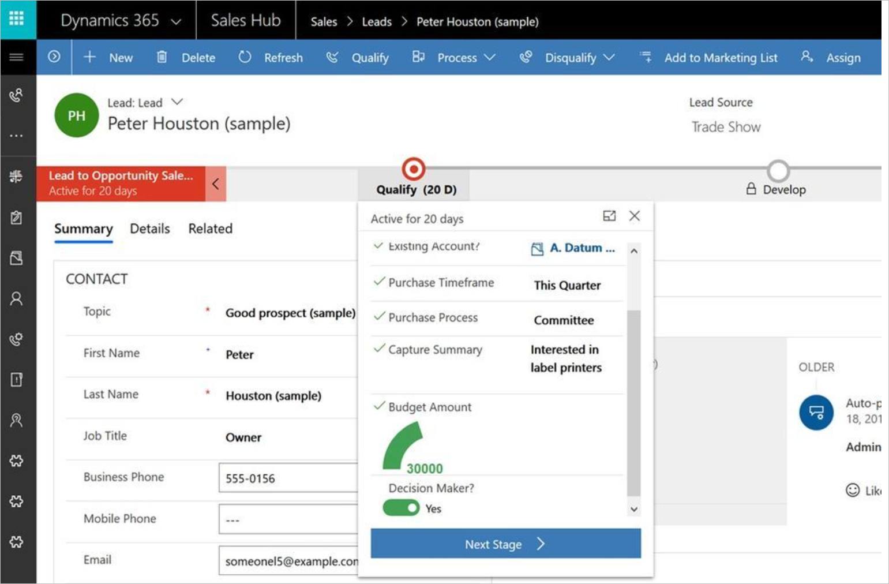

# Use custom controls in business process flows

Business process flows provide a guided way to get work done in the form of stages and steps. Stages tell you where you are in the process, while steps are action items that lead to a desired outcome. Steps in a business process are bound to fields in Common Data Service. In addition to the default visualizations of the field type (text boxes, dropdowns, and so on), you can use custom controls to add rich visualizations (such as sliders, radial knobs, the LinkedIn control, and more) to business process flows steps and deliver engaging experiences to those who use your business process.

## Adding custom controls to a business process

Let’s say that you’d like to add a radial knob for the **Estimated Budget** step and a flip switch for the **Identify Decision Maker** step of the Lead to Opportunity Sales process. 

Here are the steps you must follow to add custom controls to a business process flow:

1. Configure custom controls on a related table form.
1. Generate and exporting the business process flow form.
1. Copy custom control configurations to the business process flow form from the related table form.
1. Import the customizations back into Common Data Service.

Follow these steps for a [detailed walkthrough adding custom controls](https://powerusers.microsoft.com/t5/Power-Automate-Community-Blog/Preview-Custom-Controls-in-Business-Process-Flows/ba-p/263237) to business process flows steps.

[!INCLUDE[footer-include](includes/footer-banner.md)]