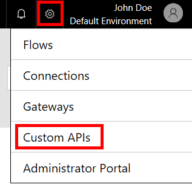
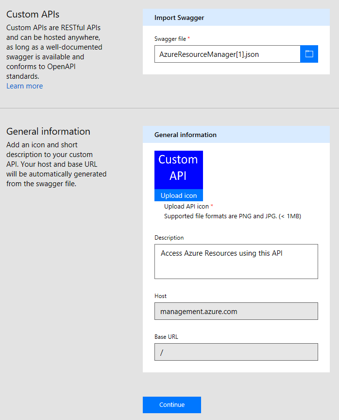
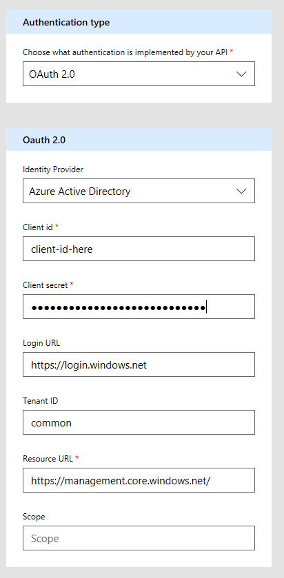
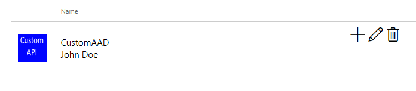

<properties
	pageTitle="Create a custom API using Azure Resource Manager | Microsoft Flow"
	description="Learn how to create a custom API using Azure Resource Manager and add the API to Microsoft Flow"
	services=""
    suite="powerapps"
	documentationCenter=""
	authors="camsoper"
	manager="AFTOwen"
	editor=""/>

<tags
   ms.service="powerapps"
   ms.devlang="na"
   ms.topic="article"
   ms.tgt_pltfrm="na"
   ms.workload="na"
   ms.date="10/26/2016"
   ms.author="casoper"/>

# Create a custom API using Azure Resource Manager in Microsoft Flow

This tutorial demonstrates how to register a Swagger file describing an [Azure Resource Manager (ARM) API](https://msdn.microsoft.com/library/azure/dn790568.aspx) and then connect to it in Microsoft Flow.

## Prerequisites

- An [Azure subscription](https://azure.microsoft.com/en-us/free/).
- A [Microsoft Flow account](https://flow.microsoft.com).
- The [sample Swagger file](http://pwrappssamples.blob.core.windows.net/samples/AzureResourceManager.json) used in this tutorial.

## Enable authentication in Azure Active Directory

First, we need to create an Azure Active Directory (AAD) application that will perform the authentication when calling the ARM API endpoint.

1. Sign in to the [Azure portal](https://portal.azure.com).  If you have more than one Azure Active Directory tenant, make sure you're logged into the correct directory by looking at your username in the upper-right corner.

    

2. On the left-hand menu, click **More services**.  In the **Filter** textbox, type **Azure Active Directory**, and then click **Azure Active Directory**.

    

    The Azure Active Directory blade opens.   

3. In the menu on the Azure Active Directory blade, click **App registrations**.

    

4. In the list of registered applications, click **Add**.

       

5. Type a name for your application, leave **Web app / API** selected, and then for **Sign-on URL** type `https://login.windows.net`.  Click **Create**.  

    

6. Click the new application in the list.

    

    The Registered app blade opens.  Make a note of the **Application ID**.  We'll need it later.

7. The Settings blade should have opened, as well.  If it didn't, click the **Settings** button.

    

8. In the Settings blade, click **Reply URLs**. In the list of URLs, add `https://msmanaged-na.consent.azure-apim.net/redirect` and click **Save**.

    

9. Back on the Settings blade, click **Required permissions**.  On the Required permissions blade, click **Add**.

    

    The Add API access blade opens.

10. Click **Select an API**. In the blade that opens, click the option for the Azure Service Management API and click **Select**.

    

11. Click **Select permissions**.  Under *Delegated permissions*, click **Access Azure Service Management as organization users**, and then click **Select**.

    

12. On the Add API access blade, click **Done**.

13. Back on the Settings blade, click **Keys**.  In the Keys blade, type a description for your key, select an expiration period, and then click **Save**.  Your new key will be displayed.  Make note of the key value, as we will need that later, too.  You may now close the Azure portal.

    

## Add the connection in Microsoft Flow

Now that the AAD application is configured, let's add the custom API.

1. In the [Microsoft Flow web app](https://flow.microsoft.com/), click the **Settings** button at the upper right of the page (it looks like a gear).  Then click **Custom APIs**.

	  

2. Click **Create custom API**.  

	You will be prompted for the properties of your API.  

	| Property | Description |
	|----------|-------------|
	| Name | At the top of the page, click **Untitled** and give your flow a name. |
	| Swagger file | Browse to the [sample ARM Swagger file](http://pwrappssamples.blob.core.windows.net/samples/AzureResourceManager.json). |
	| Upload API icon | Cick **Upload icon** to select an image file for the icon. Any PNG or JPG image less than 1 MB in size will work. |
	| Description | Type a description of your custom API (optional). |

	  

	Select **Continue**.

3. On the next screen, because the Swagger file uses our AAD application for authentication, we need to give Flow some information about our application.  Under **Client id**, type the AAD **Application ID** you noted earlier.  For client secret, use the **key**.  And finally, for **Resource URL**, type `https://management.core.windows.net/`.

    >[AZURE.IMPORTANT] Be sure to include the Resource URL exactly as written above, including the trailing slash.

    

	After entering security information, click the check mark (**&#x2713;**) next to the flow name at the top of the page to create the custom API.
	
4. Your custom API is now displayed under **Custom APIs**.
	
	  

5. Now that the custom API is registered, you must create a connection to the custom API so it can be used in your apps and flows.  Click the **+** to the right of the name of your custom API and then complete complete the sign-on screen.

>[AZURE.NOTE] The sample Swagger does not define the full set of ARM operations and currently only contains the [List all subscriptions](https://msdn.microsoft.com/library/azure/dn790531.aspx) operation.  You can edit this Swagger or create another Swagger file using the [online Swagger editor](http://editor.swagger.io/).
>
>This process can be used to access any RESTful API authenticated using AAD.

## Next steps

For more detailed information about how to create a flow, see [Start to build with Microsoft Flow](get-started-logic-flow.md).
