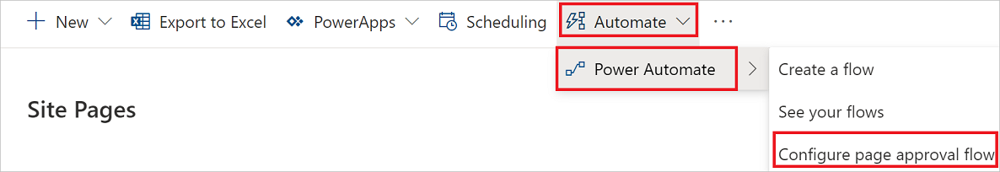
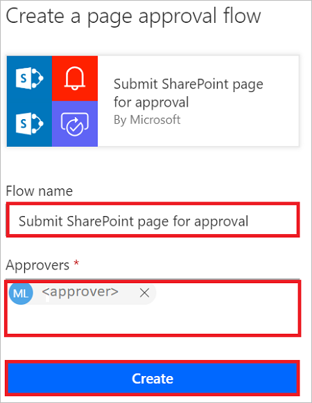
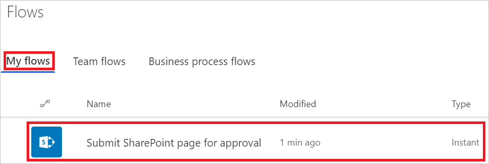

# Manage SharePoint page approvals with Power Automate

SharePoint site admins can use Power Automate to require new or updated site pages to be approved before being published.

In this article, you'll learn how to configure your SharePoint site to use a cloud flow to require changes to the site to be approved before they go live.

>[!NOTE]
>SharePoint approvals isn't available in all goverment cloud environments. 

## Configure SharePoint for page approvals

### Prerequisites 

You must be a SharePoint site admin to perform the activities in this article.

[!INCLUDE [sharepoint-detailed-docs](includes/sharepoint-detailed-docs.md)]

1. Sign in to SharePoint as a site admin.
1. Select **Pages** from the navigation bar.

    

1. Select **Automate** > **Power Automate** > **Configure page approval flow**.
    
    

1. Select **Create flow**.

1. Optionally, you might need to sign into the the services that this Power Automate template uses.

1. Select **Continue**.

1. Provide a **Flow name**, at least one name in the  **Approvers** box, and then select **Create**.
    
    

That's it! Now, each time a page is added or modified, an approval request goes to the **Approvers** you listed in the flow.

The page approval flow is just like any other flow, so it's listed in the **My flows** tab.

## Submit a page for approval

Now that you've created a page approval flow, anyone who adds or changes a page will need to do the following:

 - Make a change to the site (add a new page, for example) and then save the change.

     
     
 - Wait for someone to approve the change.
    
    
    
## Approve a page

Approvers receive an email whenever there's a page approval request. They can either approve the requests directly in the email (if their email client supports actionable messages) or open the page from the email to review, and then approve the page in SharePoint.

## Customize page approval flows

Because page approvals use Power Automate behind the scenes, the page approval flow is available for site owners to modify and add any custom business logic in the flow. To modify the flow, the site owner can select **Flows** and then select **See your flows** in the pages library to find the page approval flow.

## Learn more

- [Page approval flow](https://support.office.com/article/page-approval-flow-a8b2e689-d4a1-4639-8028-333c0ece30d9)
- [Configure page approval](https://support.office.com/article/configure-page-approval-14ce6976-a0a7-427b-b4ab-d28d344a5222)

[!INCLUDE[footer-include](includes/footer-banner.md)]