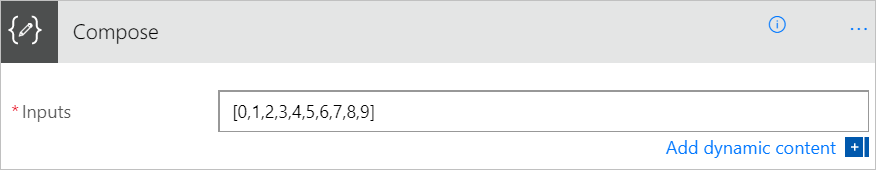
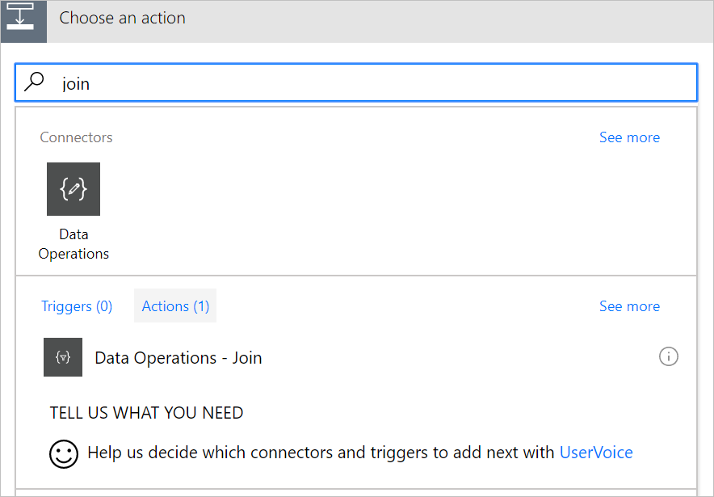
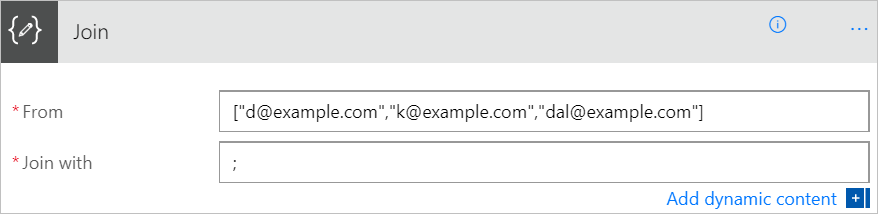
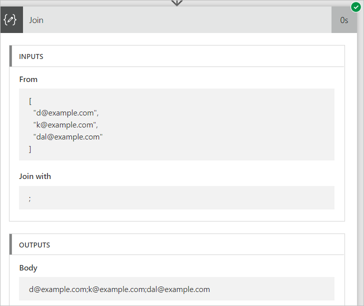
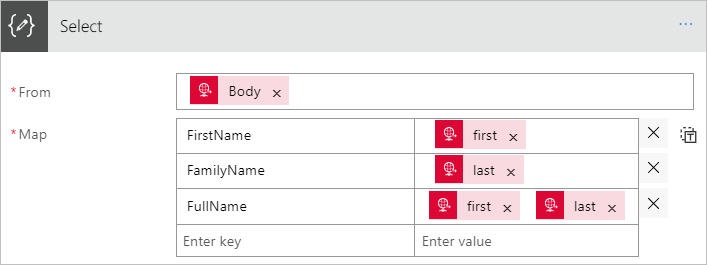
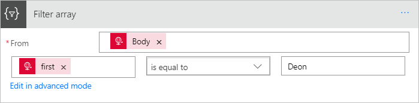
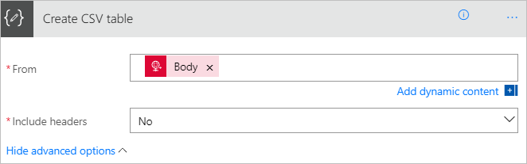
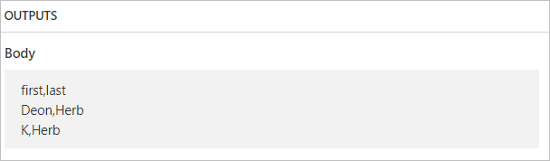

<properties
    pageTitle="Understand data operations | Microsoft Flow"
    description="Learn to perform operations, such as create HTML table, create CSV table, compose, join, selectm and filter array"
    services=""
    suite="flow"
    documentationCenter="na"
    authors="MSFTMan"
    manager="anneta"
    editor=""
    tags=""/>

<tags
   ms.service="flow"
   ms.devlang="na"
   ms.topic="article"
   ms.tgt_pltfrm="na"
   ms.workload="na"
   ms.date="07/27/2017"
   ms.author="deonhe"/>

# Use data operations with Microsoft Flow

In this walkthrough, you learn about some of the Microsoft Flow’s popular data operations, such as compose, join, select, filter array, create table, and parse JSON that are available to manipulate data when you create flows.

## Prerequisites

- Access to Microsoft Flow.

## Use the compose action

Use the **Compose** action to save yourself from entering identical data multiple times when you’re designing a flow. For example, if I need to enter an array of digits: ````[0,1,2,3,4,5,6,7,8,9]```` several times while you design your flow, you could use the **Data Operations - Compose** action to save the array like this:

1. Search for **Compose**, and then select the **Data Operations - Compose** (compose) action.

    

1. Enter the array into the **Inputs** box you want to reference later:

    

Now that you’ve added and configured the compose action, you can access its inputs (the array you added earlier) from any *actions* you add later. You access the contents of the compose action via the **outputs** token on the **Add dynamic content from the apps and connectors used in this flow** list.

To access the outputs from the compose action:

1. Add another action such as **Data Operations – Join**.

1. Select the control to which you’d like to add the inputs from the compose action.
1. On the **Add dynamic content from the apps and connectors used in this flow**, select the **Output** token that’s under the **Compose** category of the **Dynamic content** tab.

## Use the Join action

Use **Join** to delimit an array with a separator of your choice.
For example, if you have the following array of email addresses: ````[d@example.com, k@example.com, dal@example.com]```` that’s delimited with commas (,), but your email program requires addresses to be separated with a semicolon, you can use the **Data Operations - Join** action to change the comma delimiter in the array to a semicolon “;“.

1. Add a new action by searching for **Join**, and then selecting the **Data Operations - Join** (join) action.

    

1. Enter the array into the **From** box, and then enter the new delimiter that you want to use into the **Join with** box.

    Here I’ve used the semicolon (;) as the new delimiter.

    

1. After your flow runs, the output of the **Data Operations – Join** action will be:

    

## Use the Select action

Use **Data Operations – Select** (select) to transform the shape of the objects in an array. For example, you may add, remove, or rename elements in an array.

>[AZURE.NOTE]While you can add or remove elements using the select action, you cannot change the number of objects in the array.

For example, you can use the **Data Operations – Select** action if your data is in an array like this:

````[ { "first": "Deon", "last": "Herb" }, { "first": "K", "last": "Herb" } ]````

and you’d like to convert it to this array:

````[ { "FirstName": "Deon", "FamilyName": "Herb", "FullName": "Deon Herb" }, { "FirstName": "K", "FamilyName": "Herb", "FullName": "K Herb" } ]````

1. Add the **Request** action to your flow.

1. Select the **Use sample payload to generate schema** from the **Request** card > paste a sample of your source array into the **Request** action.

1. Select the **Done** button.

1. Add the **Data Operations – Select** (select) action, and then configure it like the following image.

    

    >[AZURE.NOTE]The output from the select action is an array. You can then use this array in any other action, such as the compose action discussed earlier in this walkthrough.

## Use the Filter array action

Use **Data Operations -- Filter array** (filter array) to reduce the number of objects in an array to a subset that matches the criteria you provide.

>[AZURE.NOTE]Filter array cannot be used to change the shape of the objects in an array. Also, filter text is case sensitive.

For example, you can use **Data Operations -- Filter array** to filter this array:

````[ { "first": "Deon", "last": "Herb" }, { "first": "K", "last": "Herb" } ]````

to a subset that contains only objects in which *first* is set to “Deon”.

1. Find, and then add the **Data Operations -- Filter array** (filter array) action to your flow.
1. Configure the **Filter array** action like the following image.

    

1. When your flow runs, assuming the input looks like this array:

    ````[ { "first": "Deon", "last": "Herb" }, { "first": "K", "last": "Herb" } ]````

the output looks like this array:

````[ { "first": "Deon", "last": "Herb" } ]````

## Use the create csv table action

Use **Data Operations - Create CSV table** to change a JSON array input into a comma separated value (CSV). Optionally, you can keep the headers visible in the CSV output.
For example, you can convert the following array into a CSV table by using the **Data Operations - Create CSV table** action:

````[ { "first": "Deon", "last": "Herb" }, { "first": "K", "last": "Herb" } ]````

1. Find, add, and then configure the **Data Operations - Create CSV table** (create csv table) action. The **Create CSV table** card should resemble the following image.

    

    Note: The **Body** token in this image comes from a **Request / Response – Response** action, however, you could get the input for the **Create CSV table** action from the output of any previous action in your flow.

When your flow runs, the CSV table output looks like this:



## Use the create html table action

Use **Data Operations - Create HTML table** to change a JSON array input into an HTML table. Optionally, you can keep the headers visible in the HTML output.
Follow the steps in the [create csv table section](data-operations.md/#use-the-create-csv-table-action) for a detailed example, however, use the **Data Operations - Create HTML table** action, instead of the **Data Operations - Create CSV table** action.