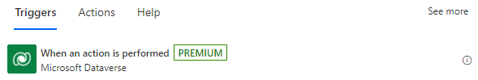
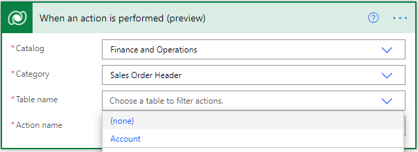
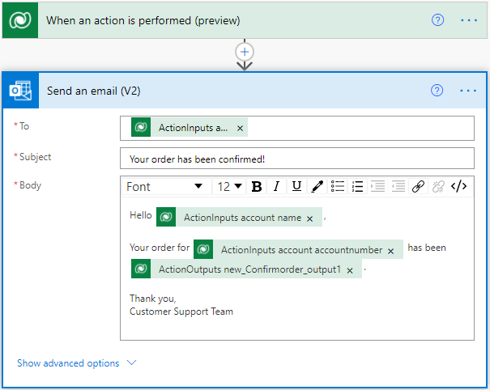
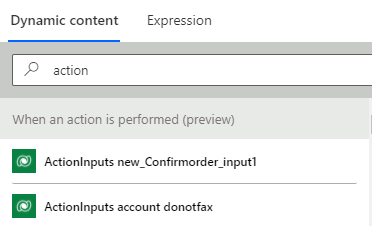

# Trigger flows with actions

You can create flows that trigger based on a Dataverse action that's included in both a [Catalog and a Category](/powerapps/developer/data-platform/catalog-catalogassignment). 

Additionally, your role needs [permissions](/power-platform/admin/database-security#assign-security-roles-to-users-in-an-environment-that-has-a-dataverse-database) to read it, which may require read access to the *sdkmessage*, *customapi*, or *workflows* tables in Dataverse.

As the name suggests, this trigger runs the flow whenever a specific Dataverse action is performed. A Dataverse action is distinct from a Power Automate action. In Dataverse, custom process actions, or simply actions, are a way of extending out of the box operations on data. You can use them to define reusable custom business logic. To learn more, see [Work with actions](/powerapps/maker/data-platform/actions) and [Use Custom Process Actions with code](/powerapps/developer/data-platform/workflow-custom-actions).
To learn how to run Dataverse actions from Power Automate, see [Perform bound or unbound actions](./bound-unbound.md).

Here are the input fields for the trigger.

- **Catalog** – used to organize and manage Dataverse actions, similar to the way you use folders to organize files.

- **Category** – used as a sub-classification within a catalog.

- **Table name** – used to filter the available actions by their associated table (bound actions), or to filter global actions (unbound actions). For unbound actions, select *(none)*.

- **Action name** – used to identify the action that triggers the flow each time it runs successfully. The list of available actions is filtered by the catalog, category, and table name.

    

## Using dynamic content and action inputs / outputs

A Dataverse custom action is meant for custom business logic, it accepts input parameters and returns output parameters. When this trigger runs, these parameters are available as dynamic content in the flow and can be used in subsequent steps.

Here's the naming scheme for the parameters.

- The prefixes *ActionInputs* and *ActionOutputs* specify whether it is an input or output parameter.

- The next literal is the name of the parameter.

- For complex data types such as an entity object, the last literal is the column name, for example, *donotfax*.

## Related information

- [Training: Use Dataverse triggers and actions in Power Automate (module)](/training/modules/use-dataverse-triggers-actions/)
- [Training: Integrate Power Automate with SharePoint HTTP actions (module)](/training/modules/integration-http-connector/)
