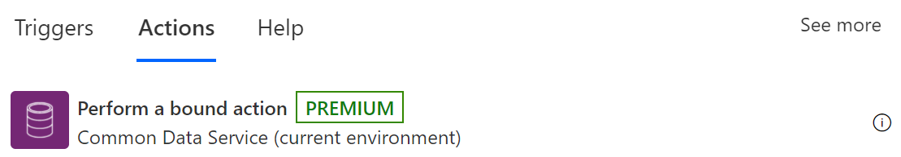

## Perform bound action or unbound actions

>[!IMPORTANT]
>In this acticle, the term "action" means a [Dataverse action](https://docs.microsoft.com/dynamics365/customer-engagement/web-api/actions?view=dynamics-ce-odata-9). Dataverse actions are not the same as Power Automate actions. In Dataverse, you use actions to extend out of the box operations on data. You can use these actions to define reusable custom business logic.

Flows can call [Dataverse actions](https://docs.microsoft.com/dynamics365/customer-engagement/web-api/actions?view=dynamics-ce-odata-9) that are available in the Microsoft Dataverse connector. These actions include everything from fulfilling a sales order to exporting a solution. 

Actions represent operations that might have side effects in the database, such as creating or updating rows. 

There are two types of Dataverse actions you can use in flows.

- [Bound actions](#bound-action).
- [Unbound actions](#unbound-action).

## Bound action

Bound actions target a single table or a set of rows from a single table.

To perform a bound action, add the **Perform a bound action** action to your flow. 

  

## Unbound action

Unbound actions aren’t bound to a table and are called as static operations. Unbound actions are performed on the entire environment, not on specific tables or rows.

   

   

