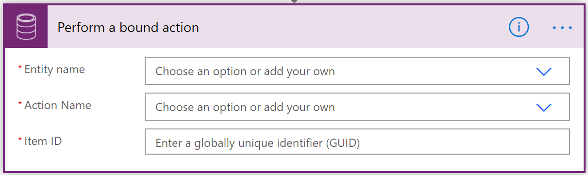
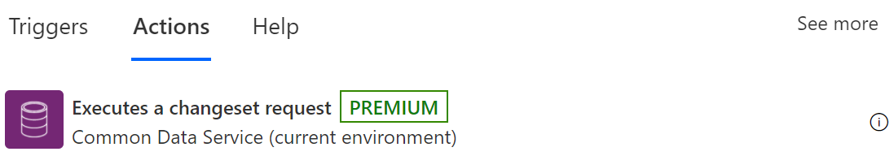
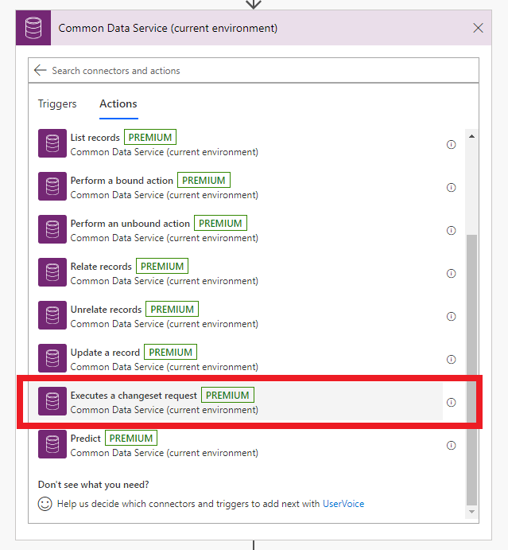
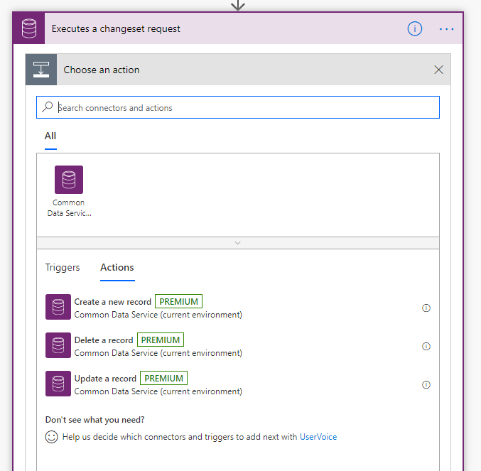
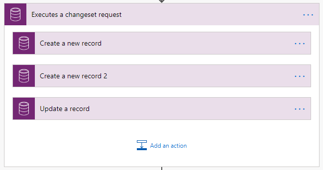

# Use a flow to perform a changeset request in Dataverse

Change sets provide a way to bundle several operations that either succeed or fail as a group. When multiple operations are contained in a change set, all the operations are considered *atomic*, which means that if any one of the operations fails, any completed operations are rolled back.

To get started with change sets, just add the **Executes a changeset request** scope to your flow.

You’ll notice that this is different from any other action you’ve added in the following ways.

- Instead of inputs and outputs, this is a container to which you can add actions.
- When you select **Add an action** you’ll see just the following three actions:

- Create a new row

- Delete a row

- Update a row

You cannot have additional built-in actions inside of a change set scope because all actions are evaluated together in Dataverse. You will see that there are no arrows between each of the actions, indicating that there are no dependencies between these actions (they’ll all run at once).

