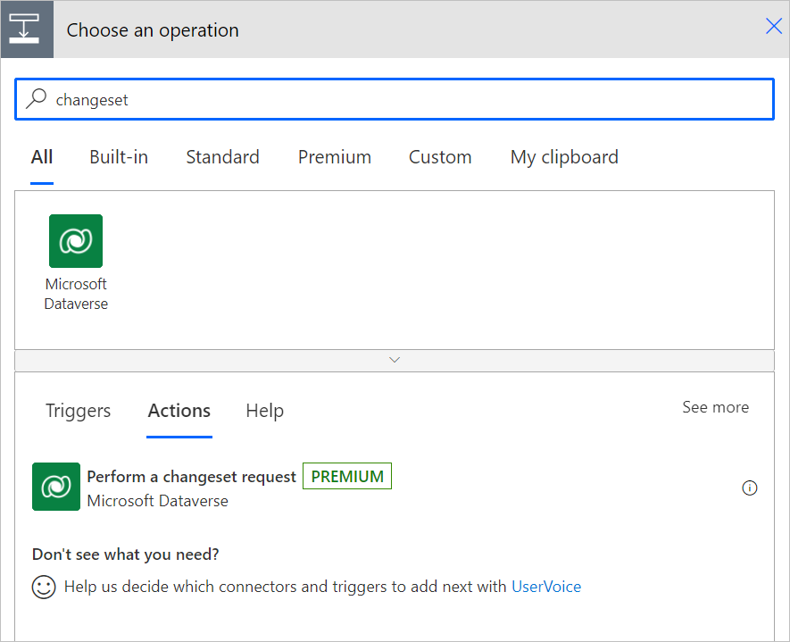
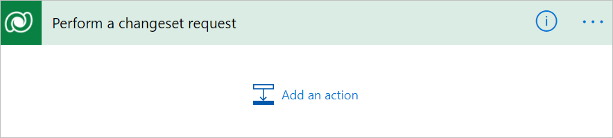
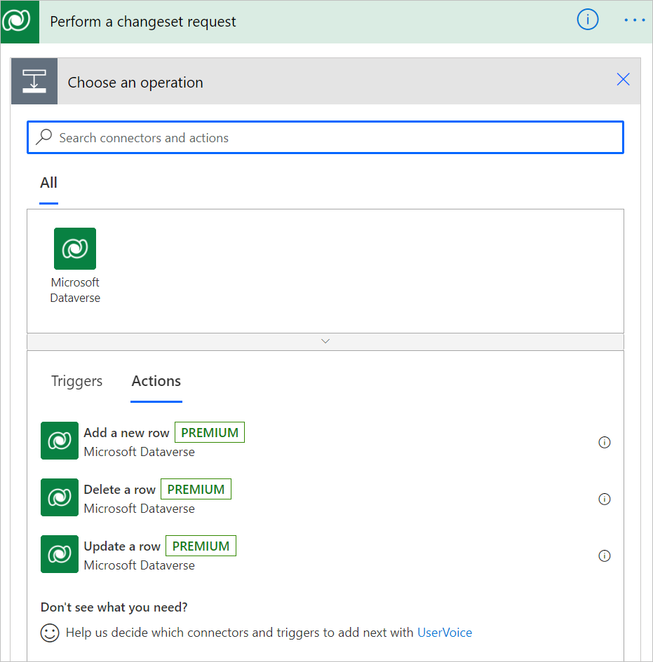

# Use a flow to perform a changeset request in Dataverse

*Change sets* provide a way to bundle several operations that either succeed or fail as a group. When multiple operations are contained in a changeset, all the operations are considered *atomic*, which means that if any one of the operations fails, any completed operations are rolled back.

Follow these steps to get started with change sets.

1. In your flow, select **New step**.

1. Enter **changeset** into the search box of the **Choose an operation** card.

   Notice that the operations list now only displays operations with the word "changeset" in its name.

1. Select the **Perform a changeset request** to add its scope to your flow.

   

1. Select **Add an action**.

   

    You’ll notice that this approach is different from any other action you’ve added in the following ways:

    - Instead of inputs and outputs, this is a container to which you can add actions.

    - When you select **Add an action**, you’ll see just the following three actions:

      - Add a new row
      - Delete a row
      - Update a row

    

    You can't have additional built-in actions in a changeset scope because all actions are evaluated together in Dataverse. You see that there are no arrows between each of the actions, indicating that there aren't dependencies between these actions (they all run at once).

1. Add all of the actions that you want to perform.

## Limitations

- The only supported actions in a changeset scope are **Add a new row**, **Delete a row**, and **Update a row**. For example, the **Apply to each** action isn't supported in a changeset.
- You can't reference an output of a previous action in the changeset scope.
- Perform a changeset request action (Dataverse) isn't supported yet in the [AI-powered cloud flows designer](../flows-designer.md#limitations-and-known-issues).
