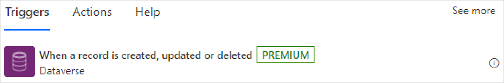
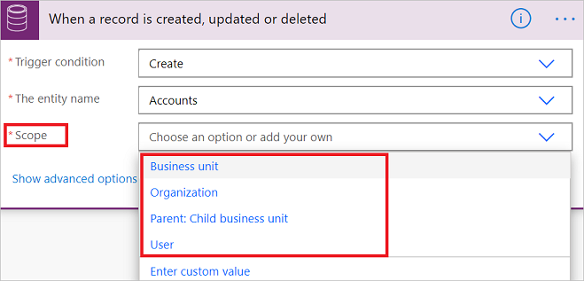
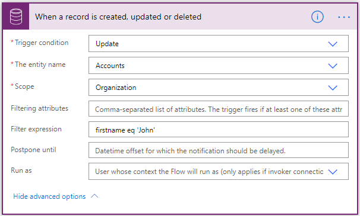
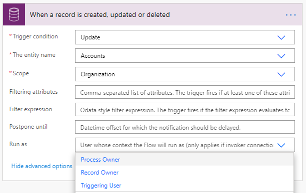

# Trigger flows when a record changes

The **When a record is created, updated or deleted** trigger runs a flow whenever a record of a selected entity and scope changes or is created. 

## Prerequisites

- To create a flow that triggers when you create, update, or delete a record, you must have user level permissions for create, read, write, and delete on the **Callback Registration** entity. 

- Additionally, depending on the scopes defined in the flow, you might need at least that level of read on the same entity. You can get more information about [environment security](https://docs.microsoft.com/power-platform/admin/database-security).

   

The following information is required to use the **When a record is created, updated or deleted** trigger.

- Trigger condition

- Entity name

- Scope

### Trigger condition

The trigger condition precisely defines which combination of changes to a record would run the flow.

   

### Entity name

The entity name filters the records to indicate precisely which kind of records should change before the flow triggers. See [entity overview](https://docs.microsoft.com/powerapps/maker/common-data-service/entity-overview).

   

### Scope

The scope field indicates whose records should be monitored to determine if the flow should be run.

   

Here’s what each scope means

| **Scope**| **Record ownership level**                                                                                                                                         |
|-----------------------------|------------------------------------------------------------------------------------------------------------------------------------------------------------------------------------|
| Business Unit               | Actions are taken on records owned by anyone in your [business unit](https://docs.microsoft.com/power-platform/admin/wp-security-cds#business-units)                          |
| Organization                | Actions are taken by anyone within the [environment](https://docs.microsoft.com/power-platform/admin/environments-overview)                                                    |
| Parent: Child business unit | Actions are taken on records that are owned by anyone in your [business unit or a child business unit](https://docs.microsoft.com/power-platform/admin/wp-security-cds#business-units) |
| User                        | Actions are taken on records owned by you.                                                                                                                     
### Advanced options

You can set additional properties to define more granularly when the flow runs, and the user profile under which it runs.

## Filter conditions

Use filter conditions to set conditions for when to trigger flows.

   

## Filtering attributes

Use the **filtering attributes** field to define a set of comma-separated, unique names for the entity, as shown in the following image. The flow runs only when these attributes change on the specific records. 

   

>[!NOTE]
>This property applies to the **Update** condition only. 
>**Create** and **Delete** apply to all attributes of a record.

### Filter expression

The filter expression provides a way for you to define an OData style filter expression to help you to define the trigger conditions even more precisely. The flow runs only when the expression evaluates to *true* after the change is saved in Dataverse. In the following, the flow triggers when the firstname is updated to John.

See the following examples, and [standard filter operators](https://docs.microsoft.com/powerapps/developer/common-data-service/webapi/query-data-web-api#standard-filter-operators)
and [query functions](https://docs.microsoft.com/powerapps/developer/common-data-service/webapi/query-data-web-api#standard-query-functions) to learn how to construct these filter expressions. 

>[!NOTE]
>Unlike the examples in the reference links, your expression must not contain the string **$filter=**. This string applies only when you use the APIs directly.

   

   

### Wait condition using Postpone Until**

Use an OData style time stamp in the **Postpone Until** property to delay the flow trigger until a specific UTC time. The key benefit of using this property instead of the standard **Delay Until** action is that **Postpone Until** never expires, allowing the flow run to wait for long periods of time.

   

### User impersonation using Run As

>[!IMPORTANT]
>The flow owner must have the Microsoft Dataverse privilege **Act on Behalf of Another User** (prvActOnBehalfOfAnotherUser). The **Delegate** security role includes this privilege by default. You can enable it on any security role. See [Impersonate another user](https://docs.microsoft.com/powerapps/developer/common-data-service/impersonate-another-user) for more details.

When you create flows with the **When a record is created, updated or deleted** trigger, you can set each Microsoft Dataverse action in the flow to be performed using the context of a user, other than the flow owner. 

Follow these steps to impersonate a user.

1. In the Power Automate flow definition, select **show advanced options** in the **When a record is created, updated or deleted** trigger.

1. Select a value for **Run as** to tell Microsoft Dataverse which user’s context you intend to use for subsequent Dataverse actions.

1. For each Dataverse action that you want to run as a different user, go to the **… menu** at the top right (as shown in the following image), and select the **Use invoker’s connection** setting. For the steps in which it is not selected, the default user is assumed. This would call the underlying APIs as per the selected user, and not as the flow owner.

   

If nothing is specified, it defaults to the flow owner that created the flow – essentially the author. Here are the other options – 

   - Flow owner – this is the user who created the flow.
   - Record owner – this is the user who owns the Microsoft Dataverse record which underwent a change, causing the flow to be triggered. If a record is owned by a team, then this option falls back to run as the flow owner.
   - Triggering user – this is the user that took the action on the Microsoft Dataverse record, causing the flow to get triggered.

   

Additionally, instant flows allow running the steps of any other [connector](https://docs.microsoft.com/connectors/) (such as [Microsoft Teams](https://docs.microsoft.com/connectors/teams/), [Microsoft 365
Outlook](https://docs.microsoft.com/connectors/office365/), or [SharePoint](https://docs.microsoft.com/connectors/sharepointonline/)) in the same flow using the invoker’s connection. To do so, follow these steps –

1. Go to the flow overview page.

1. Select **Edit** on the **Run only users** settings.

1. In the **Manage run-only permissions** pane, go to the **User and groups** tab, and select **Provided by run-only user** under the **Connections Used** list.
