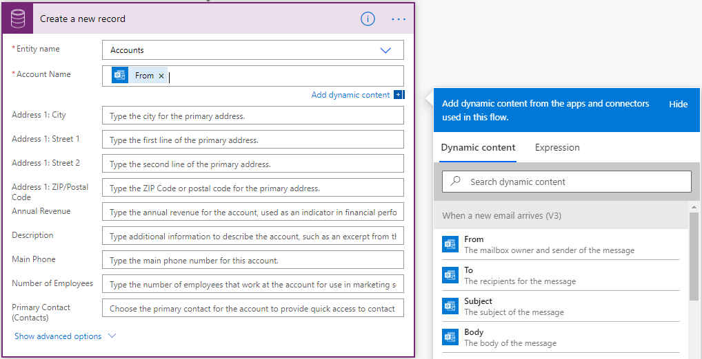

# Use a flow to add a row in Dataverse

Use the **Add a new row** action to add a new record in Microsoft Dataverse.

For example, you can set up a flow to add a new **Account** in Dataverse when you receive an email to your signup address, as shown in the following image.

After you select a table, new fields appear. Use these fields to set values for other fields. All mandatory fields display an asterisk (\*). It's not necessary to enter a value for optional fields.

If you do not see a column, you can select **Show advanced options** at the bottom of the card to view all columns.

You can use outputs directly from previous triggers and actions in the **Dynamic content** selector shown in the following image, or modify them by building an **Expression** as outlined in [Use expressions in flow actions](https://flow.microsoft.com/en-us/blog/use-expressions-in-actions/).

