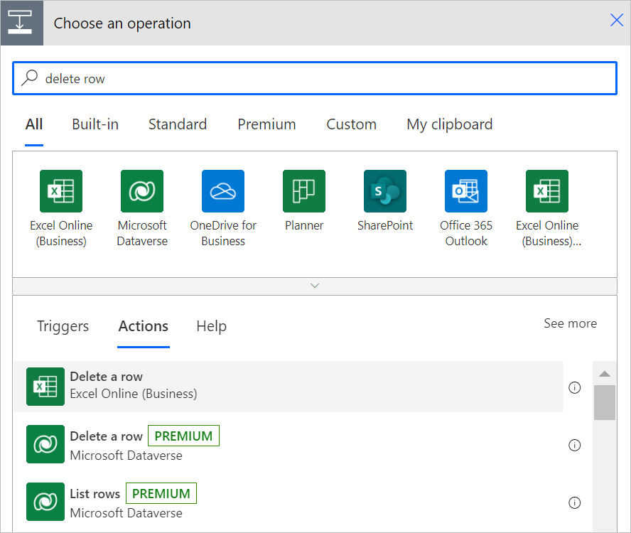
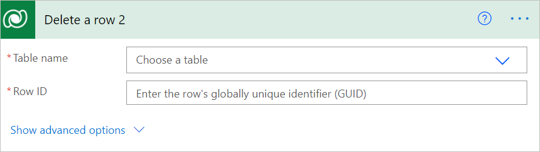
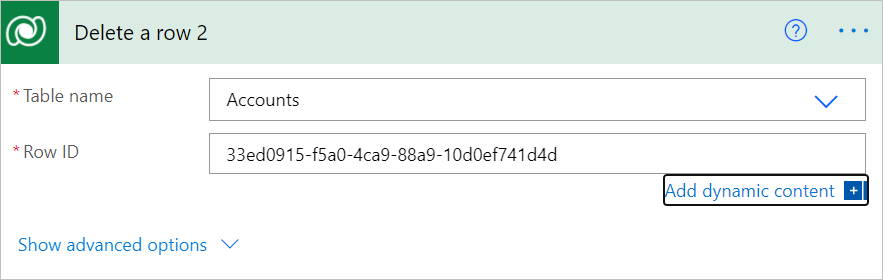

# Use a flow to delete a row from Dataverse

Follow these steps to delete a row from Dataverse.

1. Create a flow with the **When a new email arrives (V3)** trigger to your flow.

1. Select **New step** to add an action to your flow.

1. Enter **delete row** into the **Search connectors and actions** search box on the **Choose an operation** card.

1. Select **Microsoft Dataverse**.

   

1. Select **Delete a new row** action.

   

1. Select the table name, and then enter an ID in **Row ID**.

   

   The **Row ID** column is the unique ID of the row that you are deleting.

>[!TIP]
>You can retrieve the **Row ID** by using the dynamic content that's generated from earlier steps in your flow.
