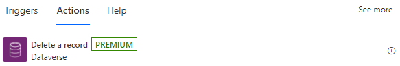
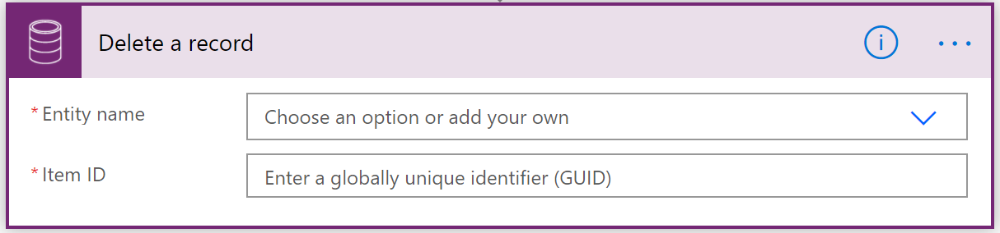

# Use a flow to delete a row from Dataverse

Use the **Delete a row** action to delete an existing row from Dataverse.

For example, you can delete a Dataverse row by selecting the table name and **Item ID**. The **Item ID** column is the unique ID of the row that you are retrieving, as shown in the following image.

