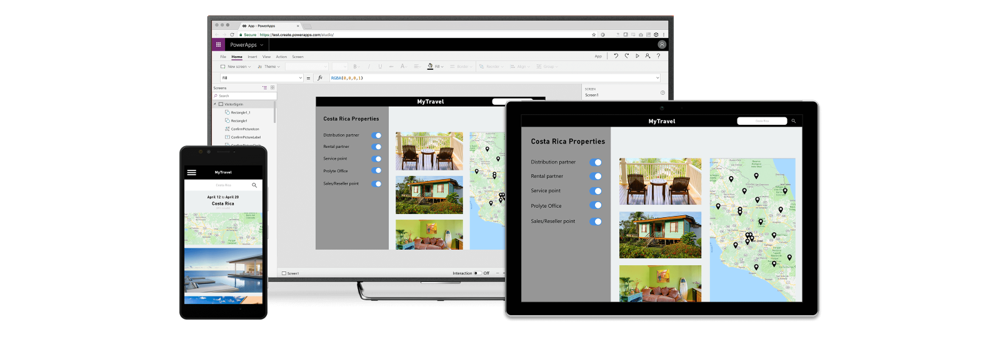
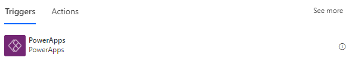
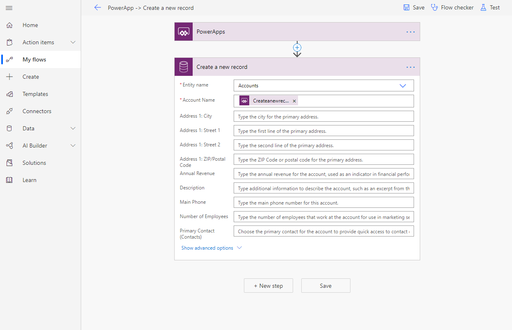

# Use Dataverse-based flows in Power Apps  

Power Apps is a suite of apps, services, connectors, and data platform that provides a rapid application development environment to build custom apps for your business needs. Use Power Apps, to quickly build custom business apps that connect to your business data that’s stored *either* in the underlying data
platform ([Microsoft Dataverse](https://docs.microsoft.com/powerapps/maker/common-data-service/data-platform-intro)) *or* in various cloud and on-premises data sources, such as SharePoint, Microsoft 365,
Dynamics 365, SQL Server, and so on. 

 

Apps built using Power Apps provide rich business logic and workflow capabilities to transform your manual business processes to digital, automated processes. Further, apps built using Power Apps have a responsive design, and can run seamlessly in browser or on mobile devices (phone or tablet). 

With Power Apps you can create [Canvas apps](https://docs.microsoft.com/powerapps/maker/canvas-apps/) and [Model-driven apps](https://docs.microsoft.com/powerapps/maker/model-driven-apps/), and both support using data stored in Microsoft Dataverse. You can use the Microsoft Dataverse connector in Power Automate to integrate your apps with an automated flow, setting them off whenever users push the associated button.

For more information about when to use Power Apps: 

- Watch [Power Apps demos](https://powerapps.microsoft.com/demo/) 

- Watch videos on the [Power Apps channel](https://www.youtube.com/channel/UCGfWR2ekfRFckLjev6eQYLg) on
    YouTube. 

 
## Canvas apps 

You can associate any button in a canvas app with a Power Automate flow that
uses the Microsoft Dataverse. Each time the canvas app user hits the button,
the associated flow runs in the background. 

1. Edit an existing canvas app, or create one by following the steps
    in [Create a canvas app from Microsoft Dataverse in Power Apps](https://docs.microsoft.com/powerapps/maker/canvas-apps/data-platform-create-app). Then go to the **Insert** menu and add a **Button** as shown here. 

   
 

1.  Select the button.

2.  Select the **Action** menu.

3.  Add a **Power Automate** flow by choosing an existing flow or creating a
    new one from the panel that appears on the right. If the flow requires any
    parameters, this step will prompt you to specify them in the formula bar. 

   

1. Be sure to use the Power Apps trigger as shown here. 

   

1.  Create the flow as shown here. 

   

