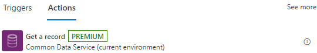
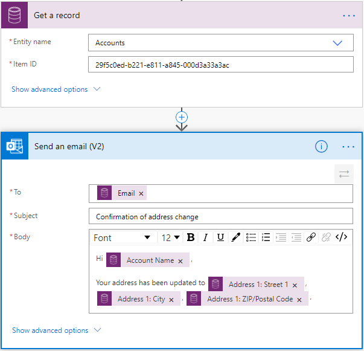
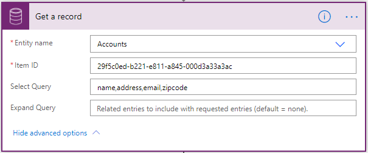
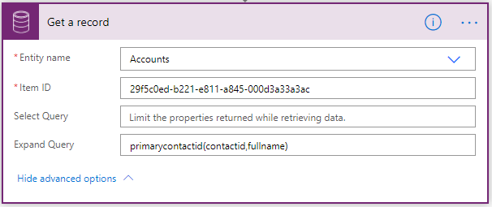

# Get a row by ID from Dataverse

Use **Get a row by ID** action to retrieve data from Dataverse, this action helps you retrieve the columns of a specific row when its unique ID is known.

For example, you can retrieve a Dataverse row as shown in the following image and reuse its columns in subsequent steps in a flow. The **Item ID** column is
the unique ID of the row that you are retrieving, as shown in the following image.

## Advanced options

You can set additional properties to define the information that should be returned.

## Select Query

Sometimes it is necessary to optimize the amount of data retrieved in a flow, especially if you are performing this step inside a loop. Instead of retrieving all columns, you can specify which ones you would like to retrieve by entering unique names of those columns separated by commas.

## Expand Query

Use **Expand Query** to define an OData style expression that defines which data from related tables is returned. There are two types of navigation properties:

- *Single-valued* navigation properties correspond to **Lookup** columns that
    support many-to-one relationships and allow you to set a reference to another table.

- *Collection-valued* navigation properties correspond to one-to-many or
    many-to-many relationships.

If you include only the name of the navigation property, you’ll receive all the properties for the related rows. To learn more, see [Retrieve related table rows with a query](https://docs.microsoft.com/en-us/powerapps/developer/common-data-service/webapi/retrieve-related-tables-query).
<!--todo this link is broken-->

To use expand query in a flow step, enter an Odata expression as shown in the following image. This example shows how to get the *contactid* and *fullname* columns for the *primarycontactid* of the *account*.

