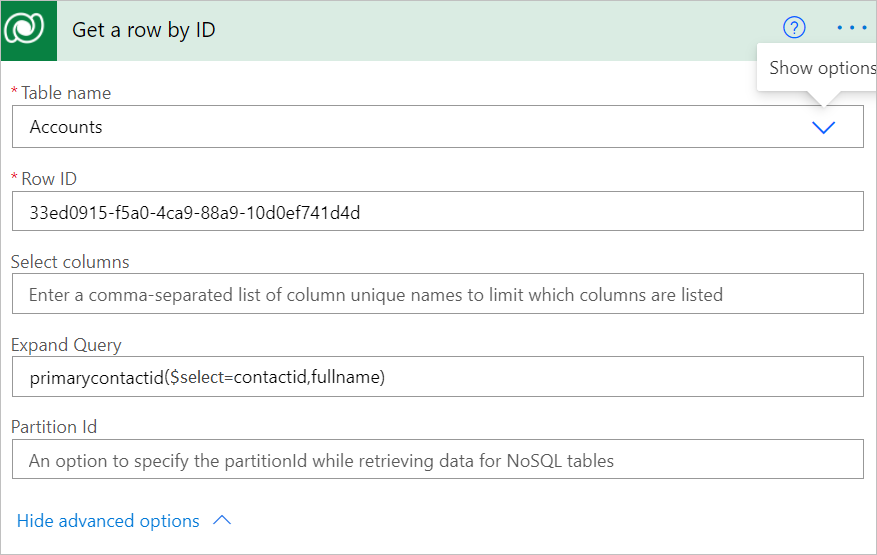

# Get a row by ID from Dataverse

Use the **Get a row by ID** action to retrieve data from Dataverse. This action helps you retrieve the columns of a specific row when its unique ID is known.

>[!TIP]
>After you get a row by ID, you can use the columns from that row in all steps that come later in your flow.

Follow these steps to use the **Row ID** to get a row from the Accounts table.

1. Select **New step** to add an action to your flow.
1. Enter **get row** into the **Search connectors and actions** search box on the **Choose an operation** card.
1. Select **Microsoft Dataverse**.

   

1. Select the **Get a row by ID** action.

   

1. Select the **Accounts** table from the **Table name** list, and then enter the **Row ID** for the row that you want to get from the Accounts table.

   

   >[!NOTE]
   >The **Item ID** column is the unique ID of the row that you are retrieving, as shown in the following image.

## Advanced options

Select **Show advanced options** to set additional properties that further define the information that should be returned.

   

The advanced options are:

- Select columns
- Expand Query
- Partition Id

## Select columns

Sometimes it is necessary to optimize the amount of data retrieved in a flow, especially if you are performing this step inside a loop. Instead of retrieving all columns, you can specify which ones you would like to retrieve by entering unique names of those columns separated by commas.

## Expand Query

Use **Expand Query** to define an OData style expression that defines which data from related tables is returned. There are two types of navigation properties:

- *Single-valued* navigation properties correspond to **Lookup** columns that
    support many-to-one relationships and allow you to set a reference to another table.

- *Collection-valued* navigation properties correspond to one-to-many or
    many-to-many relationships.

If you include only the name of the navigation property, you’ll receive all the properties for the related rows. To learn more, see [Retrieve related table rows with a query](https://docs.microsoft.com/powerapps/developer/data-platform/webapi/query-data-web-api#retrieve-related-entities-with-query).

To use expand a query in a flow step, enter an Odata expression as shown in the following image. This example shows how to get the *contactid* and *fullname* columns for the *primarycontactid* of the *account*.

