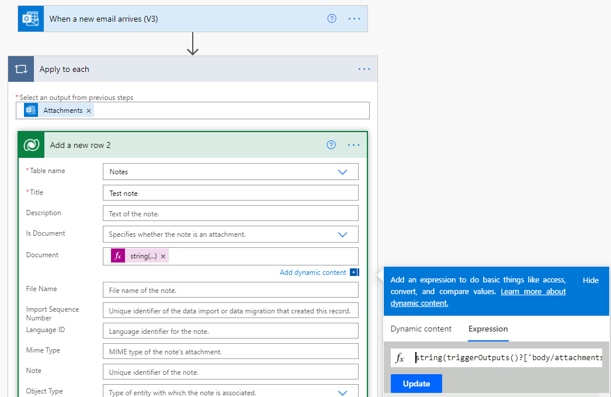

# Troubleshoot known issues with Dataverse

Here's a list of known issues with Microsoft Dataverse and Microsoft Power Automate.

- **Localization of metadata** – When you change the Power Automate language and regional locale settings, metadata like table and column names don't change. The metadata always displays in the language and regional locale settings of your Microsoft Dataverse environment. See [Languages](/power-apps/user/set-personal-options#languages-tab-options) to view your Dataverse settings.

- **Working with lookup fields** – When working with the [Add a new row](./create.md) and [Update a row](./update.md) actions, enter lookup fields in the following syntax – **entity_unique_name(Item_ID)**.

- **Working with multiselect fields** – When working with the [Add a new row](./create.md) and [Update a row](./update.md) actions, the user interface allows you to select only one option. To select multiple options, switch the input method to **custom**, and then enter a unique name for each option, separating each name with a comma.

- **Adding a row with attachments to the Notes table**– When you use an attachment from the dynamic output of a non-Dataverse step, you must use an expression to convert it to a string. For example, when you add a row inside an **Apply to each** loop over the output from the **When a new email arrives** trigger, use *string(triggerOutputs()?['body/attachments'])* instead of *items('Apply_to_each')?['contentBytes']*, as shown in the following image.

   

- **SharePoint and OneDrive document tables don't display inputs when you create a flow** - When you create a flow that triggers on the Dataverse SharePoint documents table or the OneDrive documents table, no data from these tables is passed to the editor and the flow inputs array is empty. This behavior occurs because these tables are virtual and their data isn't stored in Dataverse.

## Flow not triggering

If your Dataverse trigger flow isn't executing when expected, verify the following conditions:

- **Background processing is enabled** – Ensure that background processing is enabled in your environment and that admin-only mode is disabled. Flows depend on the Dataverse asynchronous service, which requires background processing to be active. If admin-only mode is enabled, disable it to allow background operations to run.

- **Filtering attributes are present in the update** – When the **[When a row is added, modified or deleted](create-update-delete-trigger.md)** trigger is configured with [filtering columns](create-update-delete-trigger.md#filter-columns), the record update must include a value from at least one of those columns for the flow to trigger. If the update doesn't modify any of the specified columns, the flow doesn't execute.

- **Record passes the filter expression** – If your **[When a row is added, modified or deleted](create-update-delete-trigger.md)** trigger includes a [filter expression](create-update-delete-trigger.md#filter-expression), verify that the record meets the criteria. You can check [System Jobs in the Power Platform admin center](/power-platform/admin/manage-dataverse-auditing#monitoring-system-jobs) to see if the validation failed. Adjust the filter expression or the record data to ensure the condition evaluates to true.

- **Flow is enabled and licensed** – [Verify that the flow is turned on](../disable-flow.md) and that the owner has the necessary licenses. If a flow is disabled or the owner's license expires, the flow doesn't trigger. Ensure the flow is active and properly licensed.

   > [!NOTE]
   > See [Settings](../getting-started.md#settings) to view the user's licences. [Learn more about types of Power Automate licenses](/power-platform/admin/power-automate-licensing/types)

- **Callback registration record exists** – Each Dataverse trigger creates a [Callback Registration](/power-apps/developer/data-platform/reference/entities/callbackregistration) record in Dataverse. If this record is missing or deleted, the flow doesn't trigger.

  To verify that a callback registration record exists for your flow, you can query the Dataverse API:

  ```http
  GET [Organization URI]/api/data/v9.2/callbackregistrations?$select=callbackregistrationid,name,entityname,sdkmessagename,filteringattributes,scope,runas,logicappsversion,createdon,softdeletestatus&$filter=entityname eq '[table_name]' and softdeletestatus eq 0
  ```

  Replace `[Organization URI]` with your Dataverse organization URL and `[table_name]` with the target table name (for example, `account` or `contact`). If no records are returned, the callback registration is missing. Turn the flow off and back on to recreate the callback registration record.

  > [!NOTE]
  > You can send `GET` requests by using the URL in your browser and view the results. For better experiences, try:
  > 
  > - [Use Insomnia with Dataverse Web API](/power-apps/developer/data-platform/webapi/insomnia)
  > - [Quick Start Web API with PowerShell and Visual Studio Code](/power-apps/developer/data-platform/webapi/quick-start-ps)


## Flow triggering multiple times

If your flow triggers multiple times for a single record change, investigate the following causes:

- **Duplicate callback registration records** – Multiple callback registration records for the same flow can cause duplicate triggering. This problem can occur if you turn the flow off and on multiple times, or if errors occur during the registration process.

  To check for duplicate callback registration records, you can query the Dataverse API using the following request:

  ```http
  GET [Organization URI]/api/data/v9.2/callbackregistrations?$select=callbackregistrationid,name,entityname,sdkmessagename,filteringattributes,scope,runas,logicappsversion,createdon,softdeletestatus&$filter=entityname eq '[table_name]' and softdeletestatus eq 0
  ```

  Replace `[Organization URI]` with your Dataverse organization URL and `[table_name]` with the target table name (for example, `account` or `contact`).

  To resolve this problem, identify and remove duplicate callback registration records. You can delete extra records by using the Dataverse API or by turning the flow off and back on, which recreates the registration.

- **Multiple updates to the same record** – If a record is updated multiple times in quick succession, each update can trigger the flow separately. Review the audit history of the record to identify what process or user causes the multiple updates. Consider implementing logic in your flow to handle duplicate triggers, or adjust the upstream process to reduce unnecessary updates.

## Flow triggering with delays

If your flow triggers correctly but with significant delays, consider the following factors:

- **Normal asynchronous processing delays** – Dataverse triggers run through the [asynchronous service](/power-apps/developer/data-platform/asynchronous-service), which typically processes jobs within seconds to a few minutes. Some delay is expected and normal.

- **Abnormal delays** – If you experience delays longer than five minutes, check [System Jobs in the Power Platform admin center](/power-platform/admin/manage-dataverse-auditing#monitoring-system-jobs) to see if multiple jobs are in a waiting state or if there's a backlog. A backlog indicates high load on the async service, which can be caused by:
  - High volume of operations in your environment
  - Other processes consuming async service resources
  - Temporary platform issues

  Most delays due to backlog are transient and resolve as the async service processes the queue. If delays persist or worsen, contact Microsoft support for assistance.

## Related information

- [Trigger flows when a row is added, modified, or deleted](create-update-delete-trigger.md)
- [Understanding Callback Registration for Dataverse triggers](powerautomate-cbr-flow.md)
- [Overview of how to integrate flows with Dataverse](overview.md)
